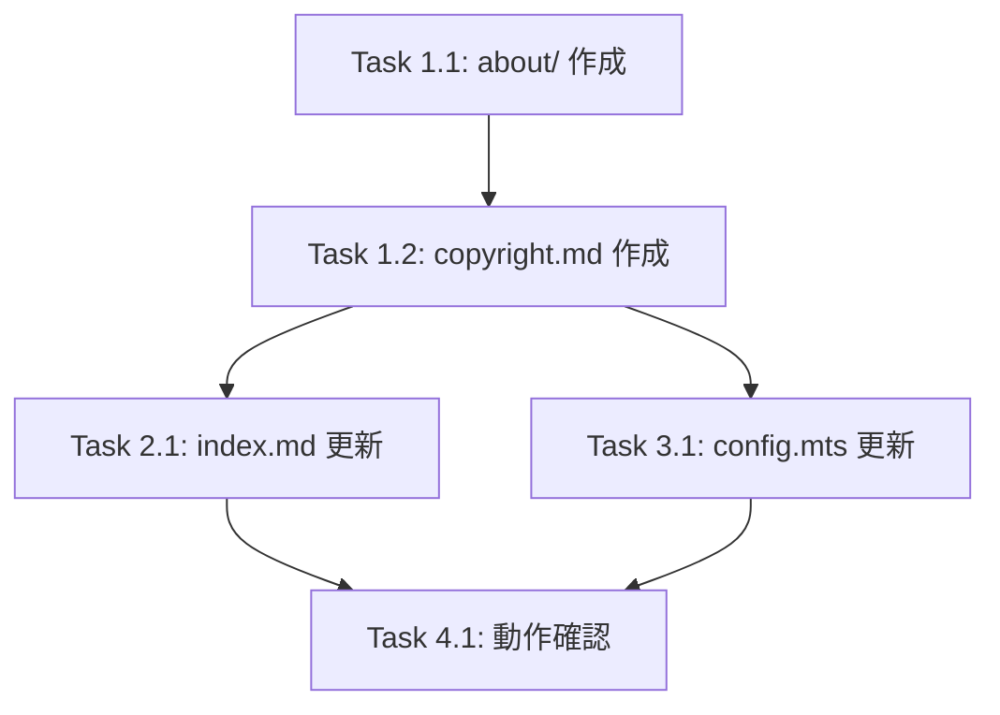

# Implementation Tasks: Copyright Page

## Phase 1: 詳細ページ作成

- [ ] **Task 1.1**: `docs/about/` ディレクトリを作成する
  - _Requirements: AC-2.1_

- [ ] **Task 1.2**: `docs/about/copyright.md` を作成する
  - コンテンツの作成方針（ISO 原文ベース、独自解釈）
  - ISO への問い合わせ経緯
  - JISC への問い合わせ内容と回答（引用部分）
  - 免責事項
  - 正規規格の入手先リンク
  - _Requirements: AC-1.2, AC-1.3, AC-1.4, AC-2.2, AC-2.3, AC-3.1_

## Phase 2: トップページ更新

- [ ] **Task 2.1**: `docs/index.md` に「本サイトのコンテンツについて」セクションを追加する
  - 要約（ISO 原文ベース、独自解釈、JISC 問い合わせ済み）
  - 詳細ページへのリンク
  - 正規規格の入手先リンク
  - _Requirements: AC-1.1, AC-1.2, AC-1.3, AC-1.4, AC-2.1_

## Phase 3: ナビゲーション更新

- [ ] **Task 3.1**: `docs/.vitepress/config.mts` のサイドバーに `/about/` を追加する
  - _Requirements: AC-2.1_

- [ ] **Task 3.2**: `ignoreDeadLinks` に `/about/` パターンを追加する（必要に応じて）
  - _Requirements: -_

## Phase 4: 動作確認

- [ ] **Task 4.1**: ローカルでビルド・プレビューして表示確認する
  - トップページのセクション表示
  - 詳細ページへのリンク動作
  - 外部リンク（ISO Store、JSA Webdesk）の動作
  - _Requirements: AC-1.1, AC-2.1, AC-3.1_

## Dependencies

## Completion Criteria

- [ ] トップページに「本サイトのコンテンツについて」セクションが表示される
- [ ] ISO・JISC への問い合わせ済みであることが明記されている
- [ ] ISO から購入した規格原文ベースであることが明記されている
- [ ] JISC コンテンツの流用ではないことが明記されている
- [ ] JISC の回答（要約作成は引用対象外）が引用されている
- [ ] 詳細ページへのリンクが動作する
- [ ] 正規規格の入手先リンクが表示される
- [ ] `npm run build` がエラーなく完了する
