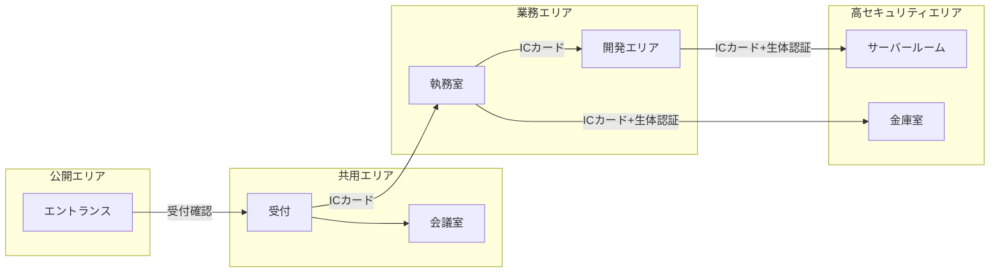
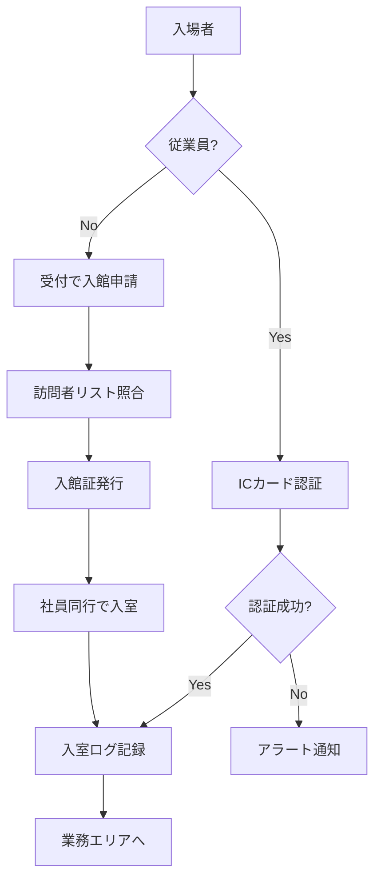

# Design: 物理的管理策テンプレート（A.7系）

## Architecture Overview

既存の管理策ページ構造に従い、`docs/controls/` ディレクトリに9つの Markdown ファイルを追加する。各ファイルは VitePress によって静的 HTML に変換され、サイドバーと管理策一覧ページからアクセス可能になる。

```
docs/controls/
├── index.md          # 更新: 物理的管理策セクションに詳細リンク追加
├── a-7-1.md          # 新規: 物理的セキュリティ境界
├── a-7-2.md          # 新規: 物理的入退
├── a-7-3.md          # 新規: オフィス、部屋及び施設のセキュリティ
├── a-7-4.md          # 新規: 物理的セキュリティの監視
├── a-7-6.md          # 新規: セキュリティを保つべき領域での作業
├── a-7-8.md          # 新規: 装置の設置及び保護
├── a-7-12.md         # 新規: ケーブル配線のセキュリティ
├── a-7-13.md         # 新規: 装置の保守
├── a-7-14.md         # 新規: 装置のセキュリティを保った処分又は再利用
└── (既存ファイル)
```

## Page Template Structure

各管理策ページは以下の構造に従う（既存ページ A.5.23 をベースに）：

```markdown
# A.7.X {管理策名}

## 管理策の概要

| 項目 | 内容 |
|------|------|
| 管理策タイプ | {予防的/検知的/是正的} |
| 情報セキュリティ特性 | {機密性、完全性、可用性の組み合わせ} |
| サイバーセキュリティ概念 | {識別/防御/検知/対応/復旧} |
| 運用能力 | {該当する運用能力} |
| セキュリティドメイン | {該当するドメイン} |

## 目的

{管理策の目的を1-2段落で説明}

## 実施のポイント

### {サブセクション1}

{説明}

### {サブセクション2}

{説明、表、Mermaid図など}

## 実装例

### {実装例タイトル}

{仮想組織を参考にした具体例}

## 関連する管理策

- [A.X.X 管理策名](/controls/a-x-x)

## 参考情報

{必要に応じて関連規格など}
```

## Data Model

### 管理策属性マッピング

| 管理策 | タイプ | 特性 | 概念 | 運用能力 | ドメイン |
|--------|--------|------|------|----------|----------|
| A.7.1 | 予防的 | C・I・A | 防御 | 物理的セキュリティ | 保護 |
| A.7.2 | 予防的 | C・I・A | 防御 | 物理的セキュリティ、アイデンティティ・アクセス管理 | 保護 |
| A.7.3 | 予防的 | C・I・A | 防御 | 物理的セキュリティ | 保護 |
| A.7.4 | 検知的 | C・I・A | 検知 | 物理的セキュリティ | 防御 |
| A.7.6 | 予防的 | C・I・A | 防御 | 物理的セキュリティ | 保護 |
| A.7.8 | 予防的 | C・I・A | 防御 | 物理的セキュリティ、資産管理 | 保護 |
| A.7.12 | 予防的 | C・A | 防御 | 物理的セキュリティ | 保護 |
| A.7.13 | 予防的 | C・I・A | 防御 | 物理的セキュリティ、資産管理 | 保護、レジリエンス |
| A.7.14 | 予防的 | C | 防御 | 物理的セキュリティ、資産管理 | 保護 |

## Navigation Structure

### Sidebar Configuration

```typescript
// docs/.vitepress/config.mts
'/controls/': [
  {
    text: '管理策 (Annex A)',
    items: [
      { text: '概要', link: '/controls/' }
    ]
  },
  {
    text: '組織的管理策 (詳細)',
    collapsed: true,
    items: [/* 既存 */]
  },
  {
    text: '物理的管理策 (詳細)',  // 新規追加
    collapsed: true,
    items: [
      { text: 'A.7.1 物理的セキュリティ境界', link: '/controls/a-7-1' },
      { text: 'A.7.2 物理的入退', link: '/controls/a-7-2' },
      { text: 'A.7.3 オフィス・施設のセキュリティ', link: '/controls/a-7-3' },
      { text: 'A.7.4 物理的セキュリティの監視', link: '/controls/a-7-4' },
      { text: 'A.7.6 セキュリティ領域での作業', link: '/controls/a-7-6' },
      { text: 'A.7.8 装置の設置及び保護', link: '/controls/a-7-8' },
      { text: 'A.7.12 ケーブル配線のセキュリティ', link: '/controls/a-7-12' },
      { text: 'A.7.13 装置の保守', link: '/controls/a-7-13' },
      { text: 'A.7.14 装置の処分又は再利用', link: '/controls/a-7-14' }
    ]
  },
  {
    text: '技術的管理策 (詳細)',
    collapsed: true,
    items: [/* 既存 */]
  }
]
```

### Index Page Update

`docs/controls/index.md` の物理的管理策セクション（#7-物理的管理策）に詳細ページへのリンクを追加：

```markdown
### 7.1 物理的セキュリティ境界 {#a-7-1}

> **詳細ページ**: [A.7.1 物理的セキュリティ境界](/controls/a-7-1)

**概要**: セキュリティを保つべき領域を保護するために、物理的セキュリティ境界を定義し、実装します。

**実施のポイント**:
- セキュリティゾーンの定義と区分け
- 境界の物理的強度の確保
- 入口の管理と監視

**属性**: 予防的 | C・I・A | 防御 | 物理的セキュリティ

---
```

## Diagrams

### セキュリティゾーン図（A.7.1 用）



### 入退室フロー（A.7.2 用）



## Error Handling

- リンク切れ: VitePress の `ignoreDeadLinks` 設定で未作成ページへのリンクは許容（既存設定を活用）
- Mermaid 構文エラー: ビルド時に検出、修正

## Testing Strategy

1. **ビルドテスト**: `npm run build` でエラーがないことを確認
2. **リンク検証**: 管理策一覧ページから各詳細ページへのリンクが機能することを確認
3. **Mermaid 検証**: 図が正しくレンダリングされることを確認
4. **一貫性確認**: 既存ページ（A.5.23 など）と同じフォーマットであることを確認
