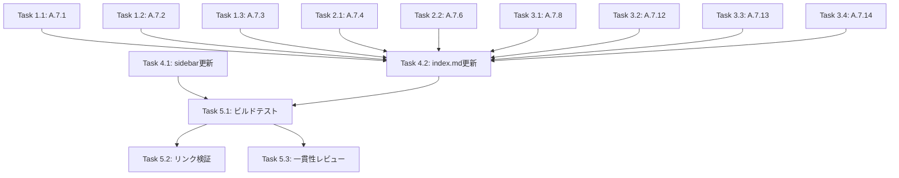

# Implementation Tasks: 物理的管理策テンプレート（A.7系）

## Phase 1: 管理策ページ作成（境界・入退管理）

- [x] **Task 1.1**: `docs/controls/a-7-1.md` を作成（物理的セキュリティ境界）
  - セキュリティゾーンの定義と実装
  - 境界の物理的強度、入口管理
  - Mermaid によるセキュリティゾーン図
  - _Requirements: AC-1.1, AC-1.3, AC-1.4, AC-3.1_

- [x] **Task 1.2**: `docs/controls/a-7-2.md` を作成（物理的入退）
  - 入退室管理の方法、認証方式
  - 訪問者管理、ログ記録
  - Mermaid による入退室フロー図
  - _Requirements: AC-1.2, AC-1.3, AC-1.4, AC-3.1_

- [x] **Task 1.3**: `docs/controls/a-7-3.md` を作成（オフィス・施設のセキュリティ）
  - オフィスレイアウトのセキュリティ考慮
  - 施設の物理的保護
  - _Requirements: AC-1.3, AC-1.4, AC-3.1_

## Phase 2: 管理策ページ作成（監視・作業管理）

- [x] **Task 2.1**: `docs/controls/a-7-4.md` を作成（物理的セキュリティの監視）
  - 監視カメラ、センサー、巡回
  - 監視記録の保存
  - _Requirements: AC-1.3, AC-1.4, AC-3.1_

- [x] **Task 2.2**: `docs/controls/a-7-6.md` を作成（セキュリティ領域での作業）
  - セキュリティエリアでの作業ルール
  - 立会い、記録
  - _Requirements: AC-1.3, AC-1.4, AC-3.1_

## Phase 3: 管理策ページ作成（装置管理）

- [x] **Task 3.1**: `docs/controls/a-7-8.md` を作成（装置の設置及び保護）
  - 装置の物理的保護
  - 環境条件（温度、湿度、電源）
  - _Requirements: AC-1.3, AC-1.4, AC-3.1_

- [x] **Task 3.2**: `docs/controls/a-7-12.md` を作成（ケーブル配線のセキュリティ）
  - ケーブル保護、ラベリング
  - 傍受防止
  - _Requirements: AC-1.3, AC-1.4, AC-3.1_

- [x] **Task 3.3**: `docs/controls/a-7-13.md` を作成（装置の保守）
  - 保守計画、記録
  - 外部保守業者の管理
  - _Requirements: AC-1.3, AC-1.4, AC-3.1_

- [x] **Task 3.4**: `docs/controls/a-7-14.md` を作成（装置の処分又は再利用）
  - データ消去方法
  - 処分・再利用の手順
  - _Requirements: AC-1.3, AC-1.4, AC-3.1_

## Phase 4: ナビゲーション更新

- [x] **Task 4.1**: VitePress sidebar 設定を更新
  - `docs/.vitepress/config.mts` に物理的管理策グループを追加
  - _Requirements: AC-2.2_

- [x] **Task 4.2**: `docs/controls/index.md` を更新
  - 物理的管理策セクション（7.1〜7.14）に詳細ページリンクを追加
  - 関連テンプレートリンクを追加（存在する場合）
  - _Requirements: AC-2.1, AC-2.2, AC-2.3_

## Phase 5: 検証

- [ ] **Task 5.1**: ビルドテスト
  - `npm run build` でエラーがないことを確認
  - Mermaid 図が正しくレンダリングされることを確認
  - _Requirements: NFR-4_

- [ ] **Task 5.2**: リンク検証
  - 管理策一覧から各詳細ページへのリンク確認
  - 関連管理策へのリンク確認
  - _Requirements: AC-2.1, AC-2.2_

- [ ] **Task 5.3**: 一貫性レビュー
  - 既存ページ（A.5.23 など）との形式統一を確認
  - 用語・表現の一貫性を確認
  - _Requirements: NFR-1_

## Dependencies

## Completion Criteria

- [x] 9つの管理策ページ（A.7.1, A.7.2, A.7.3, A.7.4, A.7.6, A.7.8, A.7.12, A.7.13, A.7.14）が作成されている
- [x] 各ページに管理策の概要、目的、実施のポイント、実装例、関連管理策が含まれている
- [x] VitePress sidebar に物理的管理策グループが追加されている
- [x] 管理策一覧ページから各詳細ページへのリンクが機能する
- [ ] VitePress ビルドが成功する
- [ ] Mermaid 図が正しくレンダリングされる

## Estimated Effort

| Phase | タスク数 | 推定時間 |
|-------|----------|----------|
| Phase 1 | 3 | 1.5時間 |
| Phase 2 | 2 | 1時間 |
| Phase 3 | 4 | 2時間 |
| Phase 4 | 2 | 30分 |
| Phase 5 | 3 | 30分 |
| **合計** | **14** | **約5.5時間** |

## GitHub Issue

Closes #39
