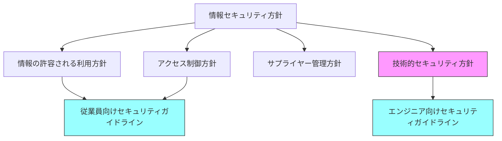
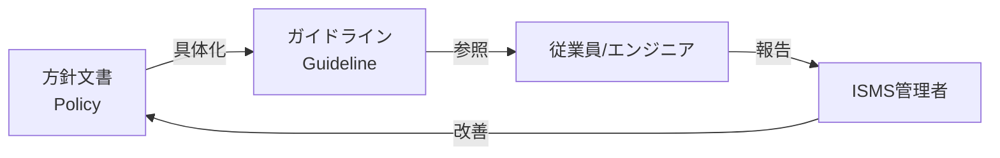

# Design: セキュリティガイドラインテンプレート追加

## Architecture Overview

```
docs/isms/
├── guidelines/                              # 新規ディレクトリ
│   ├── index.md                             # ガイドライン一覧
│   ├── employee-security-guideline.md       # 従業員向け
│   └── engineer-security-guideline.md       # エンジニア向け
├── policies/
│   ├── information-security-policy.md       # 既存
│   ├── acceptable-use-policy.md             # 既存
│   ├── access-control-policy.md             # 既存
│   ├── supplier-security-policy.md          # 既存
│   └── technical-security-policy.md         # 新規
└── ... (その他既存)
```

## 文書階層の関係



## File Specifications

### 1. 従業員向けセキュリティガイドライン

**ファイル**: `docs/isms/guidelines/employee-security-guideline.md`

```yaml
---
title: "従業員向けセキュリティガイドライン"
document_id: "GL-001"
version: "1.0"
effective_date: "{{発効日}}"
owner: "{{ISMS責任者}}"
iso_clause: ""
iso_control: "A.5.10, A.5.11, A.6.2, A.6.5, A.6.6, A.6.7, A.6.8, A.7.7, A.8.1"
status: "draft"
---
```

**構成**:

```markdown
# 従業員向けセキュリティガイドライン

## 1. 目的
## 2. 適用範囲
## 3. 入社時のセキュリティ責任
  ### 3.1 秘密保持義務 (A.6.6)
  ### 3.2 セキュリティ教育の受講 (A.6.3)
  ### 3.3 利用規約への同意 (A.6.2)
## 4. 在職中の遵守事項
  ### 4.1 情報の取扱い (A.5.12, A.5.13, A.5.14)
  ### 4.2 パスワード管理 (A.5.17)
  ### 4.3 クリアデスク・クリアスクリーン (A.7.7)
  ### 4.4 端末・デバイスの管理 (A.8.1)
  ### 4.5 リモートワーク (A.6.7)
  ### 4.6 記憶媒体の取扱い (A.7.10)
  ### 4.7 構外での資産管理 (A.7.9)
## 5. セキュリティ事象の報告 (A.6.8)
  ### 5.1 報告すべき事象
  ### 5.2 報告方法
  ### 5.3 報告後の対応
## 6. 退職・異動時の義務 (A.5.11, A.6.5)
  ### 6.1 資産の返却
  ### 6.2 アクセス権の返上
  ### 6.3 継続する秘密保持義務
## 7. 違反時の対応 (A.6.4)
## 8. 関連文書
## 改訂履歴
```

### 2. 技術的セキュリティ方針

**ファイル**: `docs/isms/policies/technical-security-policy.md`

```yaml
---
title: "技術的セキュリティ方針"
document_id: "POL-005"
version: "1.0"
effective_date: "{{発効日}}"
owner: "{{ISMS責任者}}"
iso_clause: ""
iso_control: "A.8.7, A.8.8, A.8.9, A.8.15, A.8.16, A.8.17, A.8.19, A.8.20, A.8.21, A.8.22, A.8.23, A.8.24, A.8.25, A.8.26, A.8.27, A.8.28, A.8.29, A.8.31, A.8.32"
status: "draft"
---
```

**構成**:

```markdown
# 技術的セキュリティ方針

## 1. 目的
## 2. 適用範囲
## 3. 暗号化方針 (A.8.24)
  ### 3.1 暗号化の原則
  ### 3.2 暗号アルゴリズムの選定
  ### 3.3 鍵管理
## 4. ネットワークセキュリティ方針 (A.8.20, A.8.21, A.8.22, A.8.23)
  ### 4.1 ネットワーク保護の原則
  ### 4.2 ネットワーク分離
  ### 4.3 ネットワークサービスのセキュリティ
  ### 4.4 ウェブフィルタリング
## 5. 開発セキュリティ方針 (A.8.25, A.8.26, A.8.27, A.8.28, A.8.29, A.8.31)
  ### 5.1 セキュア開発ライフサイクル
  ### 5.2 セキュリティ要求事項
  ### 5.3 セキュアアーキテクチャ原則
  ### 5.4 セキュアコーディング
  ### 5.5 セキュリティテスト
  ### 5.6 環境分離
## 6. 変更管理方針 (A.8.19, A.8.32)
  ### 6.1 変更管理プロセス
  ### 6.2 ソフトウェア導入
## 7. マルウェア対策方針 (A.8.7)
  ### 7.1 マルウェア対策の原則
  ### 7.2 対策ソフトウェアの導入
## 8. 脆弱性管理方針 (A.8.8)
  ### 8.1 脆弱性情報の収集
  ### 8.2 脆弱性評価
  ### 8.3 パッチ管理
## 9. 構成管理方針 (A.8.9)
  ### 9.1 構成管理の原則
  ### 9.2 セキュリティベースライン
## 10. ログ・監視方針 (A.8.15, A.8.16, A.8.17)
  ### 10.1 ログ取得
  ### 10.2 監視活動
  ### 10.3 時刻同期
## 11. 関連文書
## 改訂履歴
```

### 3. エンジニア向けセキュリティガイドライン

**ファイル**: `docs/isms/guidelines/engineer-security-guideline.md`

```yaml
---
title: "エンジニア向けセキュリティガイドライン"
document_id: "GL-002"
version: "1.0"
effective_date: "{{発効日}}"
owner: "{{ISMS責任者}}"
iso_clause: ""
iso_control: "A.8.2, A.8.3, A.8.4, A.8.5, A.8.6, A.8.7, A.8.8, A.8.9, A.8.10, A.8.11, A.8.12, A.8.15, A.8.16, A.8.17, A.8.18, A.8.19, A.8.20, A.8.21, A.8.22, A.8.23, A.8.24, A.8.25, A.8.26, A.8.27, A.8.28, A.8.29, A.8.30, A.8.31, A.8.32, A.8.33, A.8.34"
status: "draft"
---
```

**構成**:

```markdown
# エンジニア向けセキュリティガイドライン

## 1. 目的
## 2. 適用範囲
## 3. アクセス管理
  ### 3.1 特権アクセスの管理 (A.8.2)
  ### 3.2 情報へのアクセス制限 (A.8.3)
  ### 3.3 ソースコードへのアクセス (A.8.4)
  ### 3.4 認証の実装 (A.8.5)
  ### 3.5 特権ユーティリティの使用 (A.8.18)
## 4. 開発セキュリティ
  ### 4.1 セキュア開発ライフサイクル (A.8.25)
  ### 4.2 セキュリティ要求事項の定義 (A.8.26)
  ### 4.3 セキュアアーキテクチャ (A.8.27)
  ### 4.4 セキュアコーディング規約 (A.8.28)
  ### 4.5 セキュリティテスト (A.8.29)
  ### 4.6 外部委託開発の管理 (A.8.30)
## 5. 環境管理
  ### 5.1 開発・テスト・本番環境の分離 (A.8.31)
  ### 5.2 テストデータの管理 (A.8.33)
  ### 5.3 監査テスト時の保護 (A.8.34)
## 6. インフラセキュリティ
  ### 6.1 ネットワークセキュリティ (A.8.20, A.8.21, A.8.22)
  ### 6.2 ウェブフィルタリング (A.8.23)
  ### 6.3 暗号化の実装 (A.8.24)
## 7. 運用セキュリティ
  ### 7.1 変更管理 (A.8.32)
  ### 7.2 ソフトウェア導入 (A.8.19)
  ### 7.3 容量・能力の管理 (A.8.6)
## 8. 保護対策
  ### 8.1 マルウェア対策 (A.8.7)
  ### 8.2 脆弱性管理 (A.8.8)
  ### 8.3 構成管理 (A.8.9)
  ### 8.4 データ漏えい防止 (A.8.12)
## 9. データ管理
  ### 9.1 情報の削除 (A.8.10)
  ### 9.2 データマスキング (A.8.11)
## 10. 監視・ログ
  ### 10.1 ログ取得の実装 (A.8.15)
  ### 10.2 監視の実装 (A.8.16)
  ### 10.3 時刻同期 (A.8.17)
## 11. セキュリティチェックリスト
  ### 11.1 開発開始時チェックリスト
  ### 11.2 リリース前チェックリスト
  ### 11.3 運用開始後チェックリスト
## 12. 関連文書
## 改訂履歴
```

### 4. ガイドライン一覧ページ

**ファイル**: `docs/isms/guidelines/index.md`

```markdown
# ガイドライン

方針文書を具体的なルールに落とし込んだ、実践的なガイドライン文書です。

## 一覧

| ガイドライン | 対象者 | 概要 |
|-------------|--------|------|
| [従業員向けセキュリティガイドライン](./employee-security-guideline.md) | 全従業員 | 日常業務で守るべきセキュリティルール |
| [エンジニア向けセキュリティガイドライン](./engineer-security-guideline.md) | 開発者・運用者 | 技術的なセキュリティ要件とルール |

## 方針との関係

ガイドラインは、以下の方針文書に基づいて具体化されています：

- [情報セキュリティ方針](../policies/information-security-policy.md)
- [情報の許容される利用方針](../policies/acceptable-use-policy.md)
- [アクセス制御方針](../policies/access-control-policy.md)
- [技術的セキュリティ方針](../policies/technical-security-policy.md)
```

## Data Flow



## Interfaces

### 解説ページからのリンク（controls/index.md）

各管理策に関連テンプレートリンクを追加：

```markdown
### 6.2 雇用条件 {#a-6-2}

> **関連テンプレート**: [従業員向けセキュリティガイドライン - 3.3 利用規約への同意](/isms/guidelines/employee-security-guideline#_3-3-利用規約への同意)
```

### 適用宣言書からのリンク

実装文書列に新しいテンプレートへのリンクを追加：

```markdown
| A.6.2 | 雇用条件 | O | リスク対応として必要 | {{実施状況}} | [従業員向けセキュリティガイドライン](../guidelines/employee-security-guideline.md) |
```

## Error Handling

### バリデーション項目

- [x] フロントマターが正しい YAML 形式
- [x] 必須フィールド（title, document_id, iso_control）が存在
- [x] プレースホルダーが `{{}}` 形式で統一
- [x] プレースホルダーを含むセクションが `<div v-pre>` でラップ
- [x] 管理策番号が正しい形式（A.X.XX）
- [x] VitePress ビルドエラーなし

## Security Considerations

- テンプレートにはサンプルデータのみ含める
- 具体的な技術名（製品名等）は `{{製品名}}` としてプレースホルダー化
- 組織固有の IP アドレス範囲等は含めない

## File Mapping (Updated)

### 新規文書マッピング

| 要件 ID | ファイルパス |
|---------|-------------|
| FR-1 | `guidelines/employee-security-guideline.md` |
| FR-2 | `policies/technical-security-policy.md` |
| FR-3 | `guidelines/engineer-security-guideline.md` |
| FR-4 | `guidelines/index.md` |

### 管理策カバレッジ

新規テンプレートによりカバーされる管理策（適用宣言書で `-` だったもの）：

| 管理策 | 対応テンプレート |
|--------|------------------|
| A.5.11 | 従業員向けセキュリティガイドライン |
| A.6.1 | - （選考は人事部門の管轄） |
| A.6.2 | 従業員向けセキュリティガイドライン |
| A.6.5 | 従業員向けセキュリティガイドライン |
| A.6.6 | 従業員向けセキュリティガイドライン |
| A.7.1-A.7.14 | - （物理セキュリティは別途） |
| A.8.2-A.8.6 | エンジニア向けセキュリティガイドライン |
| A.8.7 | 技術的セキュリティ方針 + エンジニア向けガイドライン |
| A.8.8 | 技術的セキュリティ方針 + エンジニア向けガイドライン |
| A.8.9 | 技術的セキュリティ方針 + エンジニア向けガイドライン |
| A.8.10-A.8.12 | エンジニア向けセキュリティガイドライン |
| A.8.17-A.8.34 | 技術的セキュリティ方針 + エンジニア向けガイドライン |

## VitePress Sidebar Configuration

`docs/.vitepress/config.ts` の sidebar に追加が必要：

```typescript
{
  text: 'ガイドライン',
  collapsed: false,
  items: [
    { text: '一覧', link: '/isms/guidelines/' },
    { text: '従業員向けセキュリティガイドライン', link: '/isms/guidelines/employee-security-guideline' },
    { text: 'エンジニア向けセキュリティガイドライン', link: '/isms/guidelines/engineer-security-guideline' },
  ]
}
```
