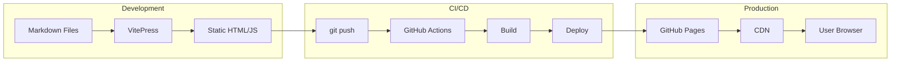
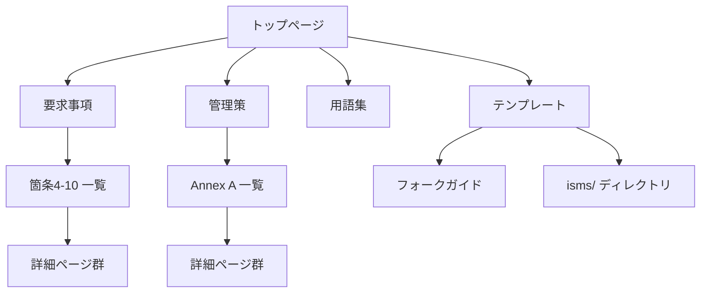

# Design: Site Setup

## Architecture Overview

VitePress をベースとした静的サイト。解説コンテンツ（docs）とフォーク用テンプレート（isms）を単一リポジトリで管理し、GitHub Pages でホスティングする。

```
┌─────────────────────────────────────────────────────────┐
│                    isms-guide リポジトリ                  │
├─────────────────────────────────────────────────────────┤
│  ┌─────────────┐   ┌─────────────┐   ┌─────────────┐   │
│  │   docs/     │   │   isms/     │   │   guide/    │   │
│  │  (VitePress │   │ (テンプレート) │   │ (フォーク   │   │
│  │   コンテンツ) │   │             │   │   ガイド)   │   │
│  └─────────────┘   └─────────────┘   └─────────────┘   │
│          │                                    │         │
│          └────────────┬───────────────────────┘         │
│                       ▼                                 │
│              ┌─────────────────┐                        │
│              │    VitePress    │                        │
│              │     Build       │                        │
│              └────────┬────────┘                        │
│                       ▼                                 │
│              ┌─────────────────┐                        │
│              │   .vitepress/   │                        │
│              │     dist/       │                        │
│              └────────┬────────┘                        │
└───────────────────────┼─────────────────────────────────┘
                        ▼
               ┌─────────────────┐
               │  GitHub Pages   │
               │  (isms-guide.jp)│
               └─────────────────┘
```

## Directory Structure

```
isms-guide/
├── .github/
│   └── workflows/
│       └── deploy.yml           # GitHub Actions デプロイ設定
│
├── .kiro/                       # 仕様駆動開発
│   ├── steering/
│   └── specs/
│
├── docs/                        # VitePress ソースルート
│   ├── .vitepress/
│   │   ├── config.mts           # VitePress 設定
│   │   ├── theme/
│   │   │   ├── index.ts         # カスタムテーマエントリー
│   │   │   ├── Layout.vue       # カスタムレイアウト（フッター全ページ表示）
│   │   │   └── custom.css       # カスタムスタイル
│   │   └── cache/               # ビルドキャッシュ（gitignore）
│   │
│   ├── index.md                 # トップページ
│   ├── requirements/            # 要求事項解説
│   │   ├── index.md             # 箇条4-10一覧
│   │   └── 6-1-2.md             # 詳細ページ
│   ├── controls/                # 管理策解説
│   │   ├── index.md             # Annex A 93項目一覧
│   │   └── a-5-23.md            # 詳細ページ
│   ├── glossary/                # 用語集（あいうえお順 + アルファベット順）
│   │   └── index.md             # 日本語ベース、略語はアルファベットセクション
│   └── public/                  # 静的アセット
│       ├── favicon.ico
│       └── og-image.png
│
├── isms/                        # フォーク対象テンプレート
│   ├── README.md                # テンプレート利用ガイド
│   ├── manual/
│   ├── soa/
│   ├── procedures/
│   └── records/
│
├── guide/                       # フォーク・カスタマイズ手順
│   └── index.md
│
├── .gitignore
├── package.json
├── LICENSE
└── DEVELOPMENT_PLAN.md
```

## Data Flow



## Configuration Files

### package.json

```json
{
  "name": "isms-guide",
  "version": "1.0.0",
  "private": true,
  "type": "module",
  "scripts": {
    "dev": "vitepress dev docs",
    "build": "vitepress build docs",
    "preview": "vitepress preview docs"
  },
  "devDependencies": {
    "vitepress": "^1.5.0",
    "vitepress-plugin-mermaid": "^2.0.17",
    "mermaid": "^11.4.0"
  }
}
```

### docs/.vitepress/config.mts

```typescript
import { defineConfig } from 'vitepress'
import { withMermaid } from 'vitepress-plugin-mermaid'

export default withMermaid(
  defineConfig({
    title: 'ISMS Guide',
    description: 'ISO 27001 認証取得のための実践ガイド',
    lang: 'ja-JP',

    head: [
      ['link', { rel: 'icon', href: '/favicon.ico' }],
      ['meta', { property: 'og:type', content: 'website' }],
      ['meta', { property: 'og:locale', content: 'ja_JP' }],
      ['meta', { property: 'og:site_name', content: 'ISMS Guide' }],
      ['meta', { property: 'og:image', content: '/og-image.png' }],
    ],

    themeConfig: {
      logo: '/logo.svg',

      nav: [
        { text: 'Home', link: '/' },
        { text: '要求事項', link: '/requirements/' },
        { text: '管理策', link: '/controls/' },
        { text: '用語集', link: '/glossary/' },
        { text: 'テンプレート', link: '/isms/' },
      ],

      sidebar: {
        '/requirements/': [
          {
            text: '要求事項（箇条4-10）',
            items: [
              { text: '概要', link: '/requirements/' },
              { text: '4. 組織の状況', link: '/requirements/#4' },
              { text: '5. リーダーシップ', link: '/requirements/#5' },
              { text: '6. 計画', link: '/requirements/#6' },
              { text: '7. 支援', link: '/requirements/#7' },
              { text: '8. 運用', link: '/requirements/#8' },
              { text: '9. パフォーマンス評価', link: '/requirements/#9' },
              { text: '10. 改善', link: '/requirements/#10' },
            ]
          },
          {
            text: '詳細解説',
            collapsed: true,
            items: [
              { text: '6.1.2 リスクアセスメント', link: '/requirements/6-1-2' },
              { text: '6.1.3 リスク対応', link: '/requirements/6-1-3' },
              { text: '7.5 文書化した情報', link: '/requirements/7-5' },
              { text: '9.2 内部監査', link: '/requirements/9-2' },
              { text: '9.3 マネジメントレビュー', link: '/requirements/9-3' },
            ]
          }
        ],
        '/controls/': [
          {
            text: '管理策（Annex A）',
            items: [
              { text: '概要', link: '/controls/' },
              { text: '5. 組織的管理策', link: '/controls/#5' },
              { text: '6. 人的管理策', link: '/controls/#6' },
              { text: '7. 物理的管理策', link: '/controls/#7' },
              { text: '8. 技術的管理策', link: '/controls/#8' },
            ]
          },
          {
            text: '詳細解説',
            collapsed: true,
            items: [
              { text: 'A.5.7 脅威インテリジェンス', link: '/controls/a-5-7' },
              { text: 'A.5.23 クラウドサービス', link: '/controls/a-5-23' },
              // ... その他の詳細ページ
            ]
          }
        ],
      },

      search: {
        provider: 'local',
        options: {
          translations: {
            button: { buttonText: '検索', buttonAriaLabel: '検索' },
            modal: {
              noResultsText: '結果が見つかりません',
              resetButtonTitle: 'クリア',
              footer: { selectText: '選択', navigateText: '移動' }
            }
          }
        }
      },

      outline: {
        level: [2, 3],
        label: '目次'
      },

      footer: {
        message: '<a href="https://github.com/btajp/isms-guide/blob/main/LICENSE">MIT</a> / <a href="https://github.com/btajp/isms-guide/blob/main/LICENSE">CC BY-NC 4.0</a> | <a href="/about/copyright">著作権・出典について</a>',
        copyright: '&copy; 2026 <a href="https://btajp.org">Business Technology Association Japan</a>'
      },

      editLink: {
        pattern: 'https://github.com/btajp/isms-guide/edit/main/docs/:path',
        text: 'このページを編集する'
      },

      lastUpdated: {
        text: '最終更新日',
        formatOptions: {
          dateStyle: 'long'
        }
      },

      darkModeSwitchLabel: 'テーマ',
      sidebarMenuLabel: 'メニュー',
      returnToTopLabel: 'トップに戻る',
      docFooter: {
        prev: '前のページ',
        next: '次のページ'
      }
    },

    sitemap: {
      hostname: 'https://isms-guide.jp'
    },

    lastUpdated: true,

    markdown: {
      lineNumbers: true
    }
  })
)
```

### docs/.vitepress/theme/index.ts

カスタムテーマのエントリーポイント。デフォルトテーマを拡張し、カスタムレイアウトとスタイルを適用。

```typescript
import DefaultTheme from 'vitepress/theme'
import Layout from './Layout.vue'
import './custom.css'

export default {
  extends: DefaultTheme,
  Layout
}
```

### docs/.vitepress/theme/Layout.vue

全ページにフッターを表示するためのカスタムレイアウト。VitePress の `layout-bottom` スロットを使用。

```vue
<script setup lang="ts">
import DefaultTheme from 'vitepress/theme'
import { useData } from 'vitepress'

const { Layout } = DefaultTheme
const { theme } = useData()
</script>

<template>
  <Layout>
    <template #layout-bottom>
      <footer class="custom-footer">
        <div class="footer-content">
          <p class="footer-message" v-html="theme.footer?.message"></p>
          <p class="footer-copyright" v-html="theme.footer?.copyright"></p>
        </div>
      </footer>
    </template>
  </Layout>
</template>

<style scoped>
.custom-footer {
  padding: 24px;
  background-color: var(--vp-c-bg);
}

.footer-content {
  max-width: 688px;
  margin: 0 auto;
  border-top: 1px solid var(--vp-c-divider);
  padding-top: 24px;
  text-align: center;
}
</style>
```

### docs/.vitepress/theme/custom.css

カスタムスタイル。ブランドカラーの設定とデフォルトフッターの非表示。

```css
:root {
  --vp-c-brand-1: #10b981;
  --vp-c-brand-2: #059669;
  --vp-c-brand-3: #047857;
}

/* デフォルトVitePressフッターを非表示（カスタムフッターを使用） */
.VPFooter {
  display: none !important;
}
```

### .github/workflows/deploy.yml

```yaml
name: Deploy to GitHub Pages

on:
  push:
    branches: [main]
  pull_request:
    branches: [main]

permissions:
  contents: read
  pages: write
  id-token: write

concurrency:
  group: pages
  cancel-in-progress: false

jobs:
  build:
    runs-on: ubuntu-latest
    steps:
      - name: Checkout
        uses: actions/checkout@v4
        with:
          fetch-depth: 0

      - name: Setup Node
        uses: actions/setup-node@v4
        with:
          node-version: 20
          cache: npm

      - name: Install dependencies
        run: npm ci

      - name: Build with VitePress
        run: npm run build

      - name: Upload artifact
        uses: actions/upload-pages-artifact@v3
        with:
          path: docs/.vitepress/dist

  deploy:
    if: github.ref == 'refs/heads/main'
    environment:
      name: github-pages
      url: ${{ steps.deployment.outputs.page_url }}
    needs: build
    runs-on: ubuntu-latest
    steps:
      - name: Deploy to GitHub Pages
        id: deployment
        uses: actions/deploy-pages@v4
```

### .gitignore

```
node_modules/
docs/.vitepress/cache/
docs/.vitepress/dist/
*.local
.DS_Store
*.log
```

## Navigation Design



## Error Handling

### Build Errors

- TypeScript 型エラー: VitePress の型定義に従う
- Markdown リンク切れ: ビルド時に検出、CI で失敗
- Mermaid 構文エラー: プレビュー時に確認

### Runtime Errors

- 404 エラー: カスタム 404 ページを表示
- JavaScript 無効: 基本的なコンテンツは表示可能（プログレッシブエンハンスメント）

## Security Considerations

- 外部スクリプトは使用しない（VitePress + Mermaid のみ）
- ユーザー入力なし（静的サイト）
- HTTPS 強制（GitHub Pages デフォルト）

## Performance Optimization

- VitePress のデフォルト最適化を活用
- 画像は public/ に配置し、適切なサイズで用意
- Mermaid は必要なページでのみ読み込み
