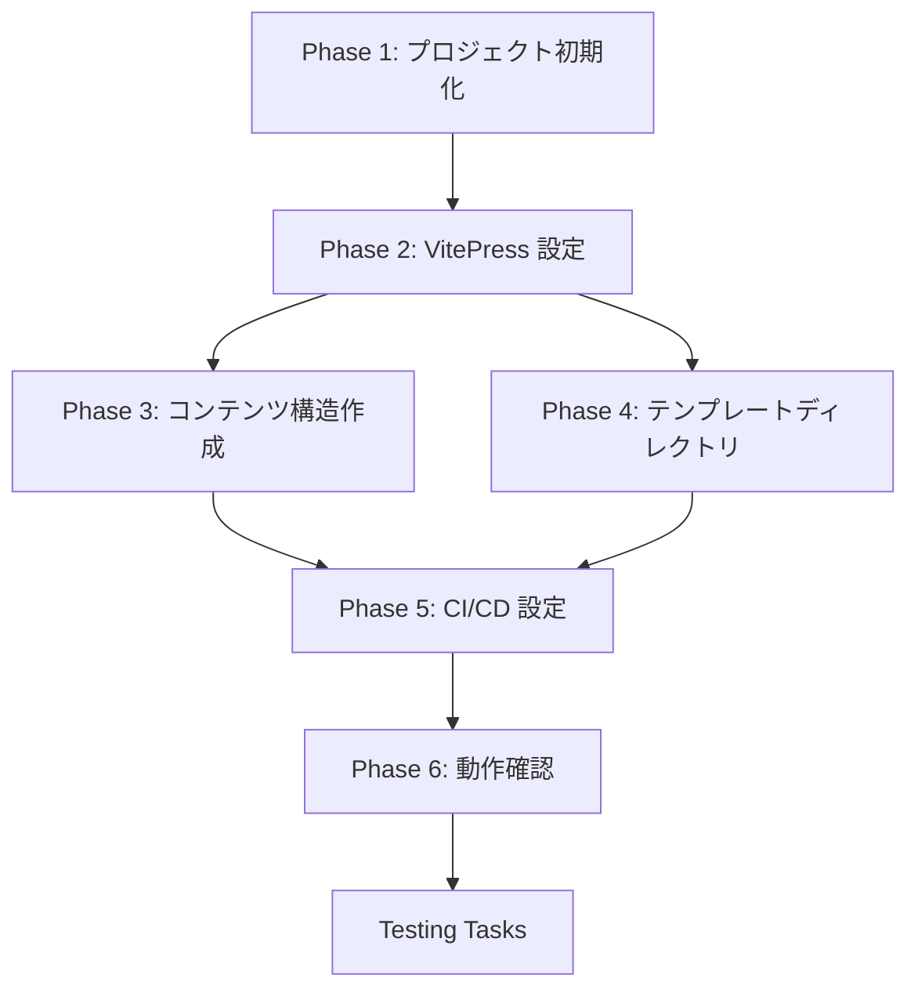

# Implementation Tasks: Site Setup

## Phase 1: プロジェクト初期化

- [x] **Task 1.1**: Node.js プロジェクトを初期化する
  - `npm init` で package.json を作成
  - _Requirements: AC-3.1_

- [x] **Task 1.2**: VitePress と依存パッケージをインストールする
  - vitepress, vitepress-plugin-mermaid, mermaid
  - _Requirements: AC-1.4, AC-3.1_

- [x] **Task 1.3**: npm scripts を設定する
  - dev, build, preview コマンド
  - _Requirements: AC-3.1_

- [x] **Task 1.4**: .gitignore を作成する
  - node_modules, .vitepress/cache, .vitepress/dist
  - _Requirements: NFR-9_

## Phase 2: VitePress 設定

- [x] **Task 2.1**: docs/.vitepress/config.mts を作成する
  - 基本設定（title, description, lang）
  - _Requirements: AC-1.1, NFR-7_

- [x] **Task 2.2**: Mermaid プラグインを設定する
  - vitepress-plugin-mermaid の統合
  - _Requirements: AC-1.4_

- [x] **Task 2.3**: ナビゲーションを設定する
  - nav（トップナビ）の設定
  - _Requirements: AC-1.1, AC-1.2, AC-1.3_

- [x] **Task 2.4**: サイドバーを設定する
  - 要求事項、管理策のサイドバー構造
  - _Requirements: AC-1.2, AC-1.3_

- [x] **Task 2.5**: 検索機能を設定する
  - ローカル検索の日本語設定
  - _Requirements: AC-1.5_

- [x] **Task 2.6**: メタタグ・OGP を設定する
  - head 設定、sitemap
  - _Requirements: NFR-7, NFR-8_

- [x] **Task 2.7**: 日本語 UI ラベルを設定する
  - footer, outline, docFooter 等の翻訳
  - _Requirements: AC-1.1_

- [x] **Task 2.8**: ダークモードを確認する
  - VitePress デフォルトのダークモード動作確認
  - _Requirements: AC-2.2_

## Phase 3: コンテンツ構造作成

- [x] **Task 3.1**: docs/index.md（トップページ）を作成する
  - Hero セクション、機能紹介
  - _Requirements: AC-1.1_

- [x] **Task 3.2**: docs/requirements/index.md のプレースホルダーを作成する
  - 要求事項一覧ページの骨格
  - _Requirements: AC-1.2_

- [x] **Task 3.3**: docs/controls/index.md のプレースホルダーを作成する
  - 管理策一覧ページの骨格
  - _Requirements: AC-1.3_

- [x] **Task 3.4**: docs/glossary/index.md のプレースホルダーを作成する
  - 用語集ページの骨格
  - _Requirements: AC-1.1_

- [x] **Task 3.5**: docs/public/ に静的アセットを配置する
  - favicon.ico, og-image.png（プレースホルダー）
  - _Requirements: NFR-7_

## Phase 4: テンプレートディレクトリ構造

- [x] **Task 4.1**: isms/ ディレクトリ構造を作成する
  - manual/, soa/, procedures/, records/
  - _Requirements: AC-4.1_

- [x] **Task 4.2**: isms/README.md を作成する
  - テンプレート利用の概要説明
  - _Requirements: AC-4.1, AC-4.2_

- [x] **Task 4.3**: guide/ ディレクトリを作成する
  - フォークガイドのプレースホルダー
  - _Requirements: AC-4.2_

## Phase 5: CI/CD 設定（Cloudflare Pages）

- [x] **Task 5.1**: .github/workflows/deploy.yml を作成する
  - GitHub Actions + Wrangler で Cloudflare Pages にデプロイ
  - _Requirements: AC-3.1, AC-3.2_

- [ ] **Task 5.2**: Cloudflare Pages のシークレットを設定する
  - GitHub リポジトリに `CLOUDFLARE_API_TOKEN` と `CLOUDFLARE_ACCOUNT_ID` を設定
  - _Requirements: AC-3.1_

- [x] **Task 5.3**: ビルドをテストする
  - ローカルでの `npm run build` 確認
  - _Requirements: AC-3.3_

## Phase 6: 動作確認

- [ ] **Task 6.1**: ローカル開発サーバーで動作確認する
  - `npm run dev` でプレビュー
  - _Requirements: AC-1.1, AC-1.2, AC-1.3, AC-1.4_

- [ ] **Task 6.2**: モバイル表示を確認する
  - レスポンシブデザインの動作確認
  - _Requirements: AC-2.1_

- [ ] **Task 6.3**: Mermaid 図のレンダリングを確認する
  - サンプル図を含むページで確認
  - _Requirements: AC-1.4_

- [ ] **Task 6.4**: 検索機能を確認する
  - 日本語検索の動作確認
  - _Requirements: AC-1.5_

## Testing Tasks

- [ ] **Lighthouse テスト**
  - パフォーマンス、アクセシビリティスコア確認
  - _Requirements: NFR-1, NFR-2, NFR-5_

- [x] **リンクチェック**
  - 内部リンクの整合性確認（ビルド時にデッドリンクチェック済み）
  - _Requirements: AC-1.2, AC-1.3_

- [x] **ビルドテスト**
  - ローカルでのビルド成功確認済み
  - _Requirements: AC-3.1, AC-3.3_

## Dependencies

## Completion Criteria

- [x] `npm run dev` でローカルプレビューが動作する（設定完了、手動確認待ち）
- [x] `npm run build` がエラーなく完了する
- [ ] GitHub Actions + Cloudflare Pages でデプロイが成功する（プッシュ後に確認）
- [x] トップページ、要求事項、管理策、用語集のプレースホルダーが表示される
- [x] Mermaid 図が正しくレンダリングされる（設定完了）
- [x] 日本語検索が動作する（設定完了）
- [x] ダークモード切り替えが動作する（VitePress デフォルト）
- [x] モバイル表示が正常に動作する（VitePress デフォルト）
