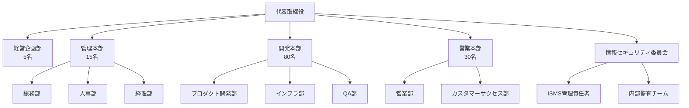
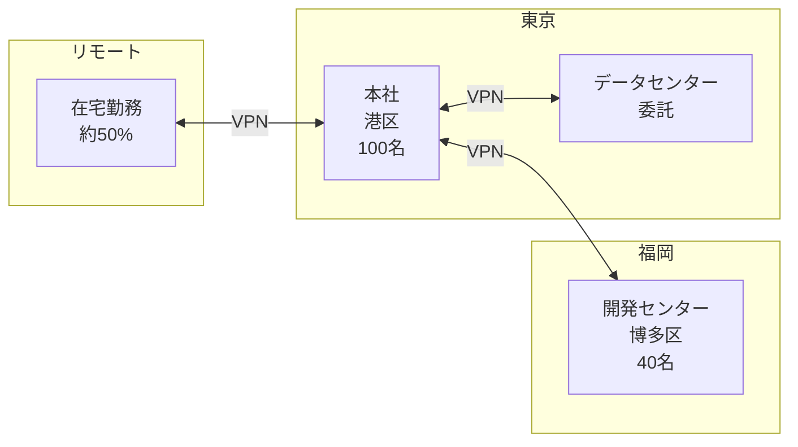
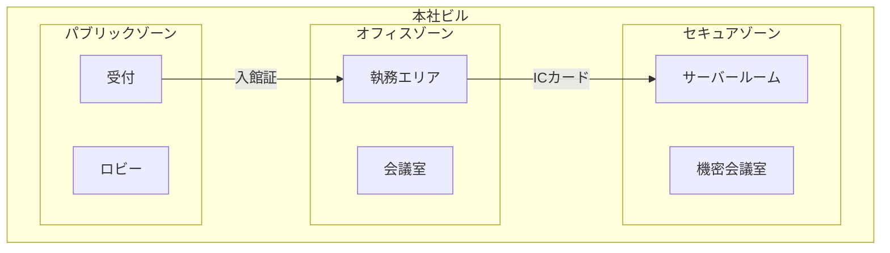

# Design: 仮想組織の設定

## Architecture Overview

仮想組織ドキュメントは、テンプレート作成の基盤となる組織設定を一元管理する。既存のテンプレートディレクトリ構造に統合し、サイト上で公開する。

```
docs/
├── templates/
│   ├── index.md              # テンプレート一覧
│   ├── fork-guide.md         # フォーク利用ガイド
│   └── virtual-organization.md  # 仮想組織設定（新規）
└── isms/
    └── ...                   # 既存テンプレート
```

## Document Structure

### virtual-organization.md の構成

```markdown
---
title: 仮想組織の設定
description: テンプレートで使用する仮想組織の設定
---

# 仮想組織の設定

## このドキュメントについて
{仮想組織がサンプル目的であることの説明}

## 1. 組織概要
### 1.1 基本情報
### 1.2 事業内容
### 1.3 経営理念・方針

## 2. 組織構造
### 2.1 組織図
### 2.2 部門・役職一覧
### 2.3 ISMS 推進体制

## 3. 拠点情報
### 3.1 本社
### 3.2 開発センター
### 3.3 データセンター
### 3.4 リモートワーク

## 4. 情報資産
### 4.1 情報資産分類
### 4.2 主要システム一覧
### 4.3 機密レベル定義

## 5. 物理的環境
### 5.1 オフィスレイアウト
### 5.2 セキュリティゾーン
### 5.3 入退室管理

## 6. カスタマイズガイド
### 6.1 置き換えチェックリスト
### 6.2 規模別の調整ポイント
```

## Data Model

### 組織基本情報

```typescript
interface VirtualOrganization {
  // 基本情報
  name: string;                    // 株式会社テクノソリューションズ
  nameEn: string;                  // Techno Solutions Inc.
  industry: string;                // IT サービス業
  foundedYear: number;             // 2015
  capital: string;                 // 5,000万円
  revenue: string;                 // 約20億円/年
  employeeCount: number;           // 150

  // 組織構造
  departments: Department[];
  locations: Location[];

  // ISMS 体制
  ismsScope: string;
  ismsManager: string;
  securityCommittee: Committee;
}
```

### 部門情報

```typescript
interface Department {
  name: string;                    // 開発本部
  headCount: number;               // 80
  manager: string;                 // 開発本部長
  subDepartments?: Department[];
  responsibilities: string[];
}
```

### 拠点情報

```typescript
interface Location {
  name: string;                    // 本社
  address: string;                 // 東京都港区...
  type: 'headquarters' | 'branch' | 'datacenter' | 'remote';
  headCount: number;
  facilities: Facility[];
  securityZones: SecurityZone[];
}
```

### 情報資産

```typescript
interface InformationAsset {
  category: string;                // 顧客情報
  examples: string[];              // ['顧客企業情報', '契約情報']
  confidentialityLevel: '極秘' | '秘密' | '社外秘' | '公開';
  owner: string;                   // 営業本部長
}
```

## Visual Elements

### 組織図（Mermaid）



### 拠点マップ（概念図）



### セキュリティゾーン



## Integration Points

### 既存テンプレートとの連携

| テンプレート | 参照する仮想組織情報 |
|-------------|----------------------|
| ISMS マニュアル | 組織概要、適用範囲 |
| 情報資産台帳 | 情報資産分類、システム一覧 |
| リスク台帳 | 拠点情報、資産情報 |
| 適用宣言書 | 全般 |
| 物理的管理策テンプレート（新規） | 拠点、セキュリティゾーン |
| 人的管理策テンプレート（新規） | 組織構造、部門 |

### プレースホルダーとの関係

| 種類 | 表記 | 例 |
|------|------|-----|
| 汎用プレースホルダー | `{{変数名}}` | `{{組織名}}` |
| 仮想組織固有値 | `【仮想】値` | `【仮想】株式会社テクノソリューションズ` |
| 仮想組織固有値（テーブル内） | 注釈マーク `*` | `本社 *` |

## Navigation Updates

### config.mts 更新

```typescript
// sidebar に追加
'/templates/': [
  {
    text: 'テンプレート',
    items: [
      { text: 'テンプレート一覧', link: '/templates/' },
      { text: 'フォーク利用ガイド', link: '/templates/fork-guide' },
      { text: '仮想組織の設定', link: '/templates/virtual-organization' }  // 新規
    ]
  }
]
```

### テンプレート一覧ページへのリンク追加

`docs/templates/index.md` に仮想組織ドキュメントへのリンクを追加：

```markdown
## 仮想組織の設定

テンプレートで使用しているサンプルデータは、[仮想組織の設定](/templates/virtual-organization)に基づいています。
フォーク時は、この設定を自組織の情報に置き換えてください。
```

## Error Handling

- 仮想組織ドキュメントが見つからない場合、テンプレート一覧から直接各テンプレートにアクセス可能
- 仮想組織情報と各テンプレートの整合性は手動で確認

## Accessibility

- 組織図は Mermaid で描画（テキストベース）
- 表形式のデータは見出し行を含む
- 略語には正式名称を併記
