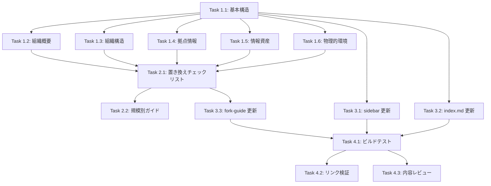

# Implementation Tasks: 仮想組織の設定

## Phase 1: ドキュメント作成

- [x] **Task 1.1**: `docs/templates/virtual-organization.md` を作成
  - フロントマター（title, description）
  - 「このドキュメントについて」セクション
  - _Requirements: AC-3.2_

- [x] **Task 1.2**: 組織概要セクションを作成
  - 基本情報（名称、業種、規模）
  - 事業内容
  - 経営理念・方針
  - _Requirements: AC-1.1, AC-2.2_

- [x] **Task 1.3**: 組織構造セクションを作成
  - 組織図（Mermaid）
  - 部門・役職一覧（表形式）
  - ISMS 推進体制
  - _Requirements: AC-1.2, AC-2.2_

- [x] **Task 1.4**: 拠点情報セクションを作成
  - 本社情報
  - 開発センター情報
  - データセンター情報
  - リモートワーク環境
  - _Requirements: AC-1.3, AC-2.2_

- [x] **Task 1.5**: 情報資産セクションを作成
  - 情報資産分類表
  - 主要システム一覧
  - 機密レベル定義
  - _Requirements: AC-1.4, AC-2.2_

- [x] **Task 1.6**: 物理的環境セクションを作成
  - オフィスレイアウト概要
  - セキュリティゾーン図（Mermaid）
  - 入退室管理の概要
  - _Requirements: AC-1.3, AC-2.2_

## Phase 2: カスタマイズガイド

- [x] **Task 2.1**: 置き換えチェックリストを作成
  - 組織基本情報の置き換え項目
  - 拠点情報の置き換え項目
  - 組織構造の置き換え項目
  - _Requirements: AC-2.1_

- [x] **Task 2.2**: 規模別の調整ポイントを作成
  - 小規模組織（〜50名）向けガイド
  - 中規模組織（50〜300名）向けガイド
  - 大規模組織（300名〜）向けガイド
  - _Requirements: AC-2.3_

## Phase 3: ナビゲーション・リンク

- [x] **Task 3.1**: VitePress sidebar 設定に仮想組織を追加
  - `docs/.vitepress/config.mts` を更新
  - _Requirements: AC-3.1_

- [x] **Task 3.2**: テンプレート一覧ページを更新
  - `docs/templates/index.md` に仮想組織への言及を追加
  - リンクを追加
  - _Requirements: AC-3.1_

- [x] **Task 3.3**: フォーク利用ガイドを更新
  - `docs/templates/fork-guide.md` に仮想組織への参照を追加
  - 置き換え手順の補足
  - _Requirements: AC-2.1_

## Phase 4: 検証

- [ ] **Task 4.1**: ビルドテスト
  - `npm run build` でエラーがないことを確認
  - Mermaid 図が正しくレンダリングされることを確認
  - _Requirements: NFR-1_

- [ ] **Task 4.2**: リンク検証
  - 仮想組織ドキュメントへのリンクが動作することを確認
  - 内部リンクの整合性を確認
  - _Requirements: AC-3.1_

- [ ] **Task 4.3**: 内容レビュー
  - 一貫性の確認（部門名、役職名、拠点名）
  - 現実性の確認（規模、構成が一般的か）
  - _Requirements: NFR-1, NFR-3_

## Dependencies

## Completion Criteria

- [x] `docs/templates/virtual-organization.md` が作成されている
- [x] 組織概要、組織構造、拠点情報、情報資産、物理的環境が定義されている
- [x] Mermaid による組織図・セキュリティゾーン図が含まれている
- [x] 置き換えチェックリストが含まれている
- [x] 規模別の調整ポイントが含まれている
- [x] VitePress sidebar から仮想組織ドキュメントにアクセスできる
- [x] テンプレート一覧ページから仮想組織ドキュメントへのリンクがある
- [ ] VitePress ビルドが成功する

## GitHub Issue

Closes #38
