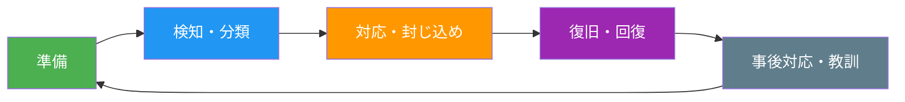

# A.5.24 情報セキュリティインシデント管理の計画と準備

> **関連テンプレート**:
> - [インシデント対応手順 - 3. 対応フロー](/isms/procedures/incident-response-procedure#_3-対応フロー) - 対応プロセスの詳細手順
> - [インシデント報告書 - 4. インシデント詳細](/isms/records/incident-report#_4-インシデント詳細) - 報告の記録書式

## 管理策の概要

| 項目 | 内容 |
|------|------|
| 管理策タイプ | 是正的 |
| 情報セキュリティ特性 | 機密性、完全性、可用性 |
| サイバーセキュリティ概念 | 対応、復旧 |
| 運用能力 | ガバナンス、情報セキュリティ事象管理 |
| セキュリティドメイン | 防御 |

## 目的

情報セキュリティインシデント管理のプロセス、役割、責任を定義、確立、周知することで、情報セキュリティインシデントへの迅速かつ効果的で一貫した秩序ある対応を確保し、情報セキュリティ事象に関するコミュニケーションを適切に行います。

## 実施のポイント

### インシデント管理プロセスの確立

組織は、適切な情報セキュリティインシデント管理プロセスを確立し、インシデント管理手順を実行するための役割と責任を決定し、内部および外部の関係者に効果的に周知する必要があります。

### 考慮すべき事項

#### 1. 報告体制の確立

情報セキュリティ事象を報告するための共通の方法と連絡窓口を確立します（参照：A.6.8）。

#### 2. インシデント管理プロセス

以下の機能を提供するプロセスを確立します。

| 機能 | 内容 |
|------|------|
| 管理 | インシデントの全体的な管理・調整 |
| 文書化 | インシデントの記録と文書の維持 |
| 検知 | インシデントの検知と特定 |
| トリアージ | 初期評価と分類 |
| 優先度付け | 対応の優先順位決定 |
| 分析 | 原因と影響の詳細分析 |
| コミュニケーション | 関係者への報告と連絡 |
| 関係者調整 | 内部・外部の関係者との連携 |

#### 3. インシデント対応プロセス

以下の機能を提供するプロセスを確立します。

- 情報セキュリティインシデントの評価
- インシデントへの対応
- インシデントからの教訓の学習

#### 4. 人的体制

- インシデント関連の問題を処理する担当者は有能な人員に限定
- 担当者には手順書を提供し、定期的な訓練を実施
- 対応要員の研修、認定、継続的な専門能力開発のプロセスを確立

### インシデント管理手順の要件

#### 目標の合意

インシデント管理の目標について経営層と合意し、担当者がインシデント処理の優先順位を理解していることを確認します。これには潜在的な影響と深刻度に基づく解決時間の枠組みも含まれます。

#### インシデント管理ライフサイクル



経営層は、さまざまなシナリオを考慮したインシデント管理計画を作成し、以下の活動に対する手順を策定・実装することを確保する必要があります。

| 活動 | 内容 |
|------|------|
| 事象の評価 | 情報セキュリティインシデントに該当するかの基準に基づく評価 |
| 監視・検知・分類・分析・報告 | セキュリティ事象・インシデントの監視、検知、分類、分析、報告（人的・自動手段） |
| インシデント管理 | 対応、エスカレーション、危機管理の発動、継続計画の発動、復旧、内部・外部関係者への連絡を含む、完了までの管理 |
| 関係者との調整 | 当局、外部利害関係者グループ、供給者、顧客との連携 |
| 活動の記録 | インシデント管理活動のログ記録 |
| 証拠の取り扱い | 証拠の適切な取り扱いと保全 |
| 根本原因分析 | 原因の特定と分析、または事後検証手順 |
| 教訓の特定 | 教訓の特定とインシデント管理手順または情報セキュリティ管理策全般の改善点の把握 |

### 報告手順

報告手順には以下を含める必要があります。

1. **事象発生時の行動**
   - すべての関連する詳細情報の即時記録（システム障害、画面上のメッセージなど）
   - 連絡窓口への即時報告
   - 調整された行動のみを実施

2. **インシデント報告書式**
   - 必要なすべての行動を実行できるようにする報告用フォームの使用

3. **フィードバックプロセス**
   - 事象報告者に対する、問題対処・終了後の結果通知（可能な範囲で）

4. **インシデント報告書の作成**
   - 記録と文書化のための報告書作成

### 外部報告要件

インシデント管理手順の実装時には、規定された期限内に関係者への報告を求める外部要件（規制当局への侵害通知要件など）を考慮する必要があります。

## 実装例

### インシデント対応チームの体制例

```yaml
インシデント対応体制:
  
  CSIRT（Computer Security Incident Response Team）:
    チームリーダー:
      役割: 全体統括、経営層への報告
      権限: 緊急時の意思決定権限
    
    技術担当:
      役割: 技術的分析、封じ込め、復旧
      スキル: システム管理、フォレンジック
    
    コミュニケーション担当:
      役割: 社内外への連絡調整
      連絡先: 広報、法務、外部機関
    
    記録担当:
      役割: タイムライン、証拠の文書化
      ツール: インシデント管理システム
  
  エスカレーションパス:
    レベル1: 情報セキュリティ担当者（初期対応）
    レベル2: CSIRT（本格対応）
    レベル3: 経営層・危機管理委員会（重大インシデント）
```

### インシデント分類基準例

| レベル | 分類 | 基準 | 対応時間目安 |
|--------|------|------|-------------|
| 重大 | レベル4 | 業務停止、大量の情報漏えい | 即時対応 |
| 高 | レベル3 | 重要システムへの影響、限定的な情報漏えい | 1時間以内 |
| 中 | レベル2 | 一部システムへの影響、軽微なインシデント | 4時間以内 |
| 低 | レベル1 | 影響軽微、単発の事象 | 24時間以内 |

### インシデント報告テンプレート例

```yaml
インシデント報告書:
  基本情報:
    報告日時: ________________
    報告者: ________________
    検知日時: ________________
    発生場所/システム: ________________
  
  インシデント種別:
    - マルウェア
    - 不正アクセス
    - 情報漏えい
    - サービス妨害
    - その他
  
  影響範囲:
    影響を受けたシステム: ________________
    影響を受けた情報: ________________
    影響を受けた人数: ________________
  
  対応状況:
    初期対応: ________________
    現在の状況: 封じ込め中 / 復旧中 / 復旧完了 / 監視中
  
  エスカレーション:
    レベル: 1 / 2 / 3 / 4
  
  次のアクション: ________________
```

## 関連する管理策

- [A.5.25 情報セキュリティ事象の評価と決定](/controls/#a-5-25)
- [A.5.26 情報セキュリティインシデントへの対応](/controls/#a-5-26)
- [A.5.27 情報セキュリティインシデントからの学習](/controls/#a-5-27)
- [A.5.28 証拠の収集](/controls/#a-5-28)
- [A.6.8 情報セキュリティ事象の報告](/controls/#a-6-8)
- [A.8.15 ログ取得](/controls/#a-8-15)
- [A.8.16 監視活動](/controls/#a-8-16)

## 参考情報

- 情報セキュリティインシデントは組織や国境を越える可能性があります。このようなインシデントに対応するためには、外部組織との対応調整と情報共有が有益です。
- インシデント管理に関する詳細なガイダンスは、ISO/IEC 27035シリーズに記載されています。
