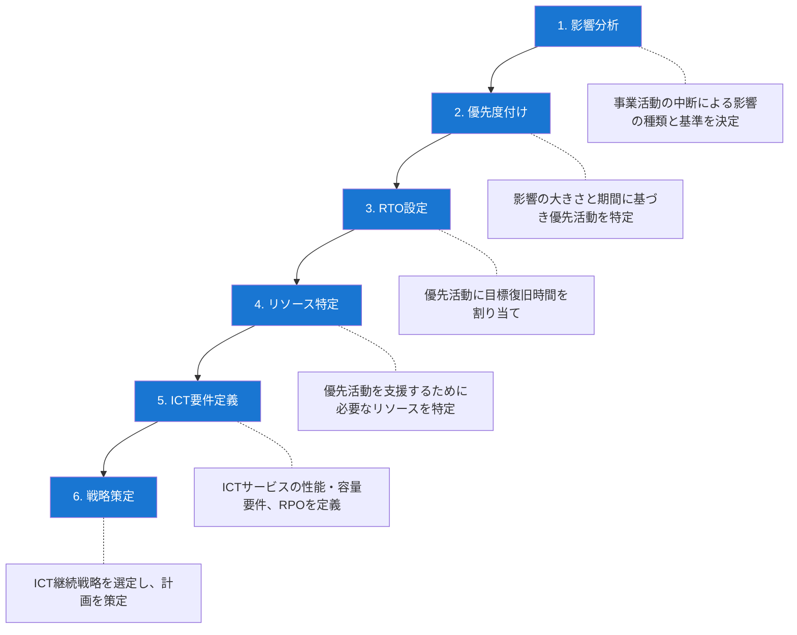
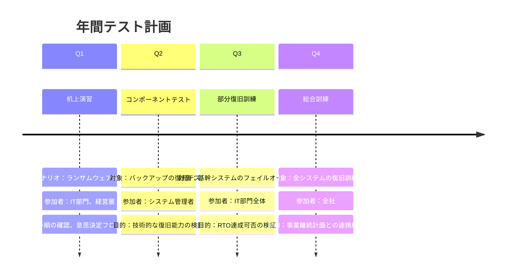

# A.5.30 事業継続のためのICTの備え

> **関連テンプレート**: [事業継続計画 - 6. ICT継続計画](/isms/plans/business-continuity-plan#_6-ict継続計画) - 事業継続のためのICTの備えを含む計画

## 管理策の概要

| 項目 | 内容 |
|------|------|
| 管理策タイプ | 是正的 |
| 情報セキュリティ特性 | 可用性 |
| サイバーセキュリティ概念 | 対応 |
| 運用能力 | 継続性 |
| セキュリティドメイン | レジリエンス |

## 目的

事業継続目標とICT継続要件に基づいて、ICTの備えを計画、実装、維持、およびテストすることで、中断発生時に組織の情報およびその他の関連資産の可用性を確保します。

## 実施のポイント

### ICT継続性の位置づけ

事業継続のためのICTの備えは、事業継続管理と情報セキュリティ管理の両方において重要な構成要素です。これにより、中断発生時でも組織の目標を継続的に達成できるようにします。

### ビジネスインパクト分析（BIA）

ICT継続要件は、ビジネスインパクト分析（BIA）の結果から導き出されます。

#### BIAからICT継続計画への流れ



#### 主要な用語の定義

| 用語 | 定義 |
|------|------|
| RTO（目標復旧時間） | 中断発生後、事業活動やリソースを復旧させるまでの目標時間 |
| RPO（目標復旧時点） | データの復旧において許容できるデータ損失の時間量 |
| BIA（ビジネスインパクト分析） | 事業活動の中断が組織に与える影響を分析するプロセス |

### ICT継続戦略の策定

BIAとリスクアセスメントの結果に基づき、組織はICT継続戦略を特定・選択する必要があります。戦略は以下の3つの時点でのオプションを考慮します。

| 時点 | 考慮事項 |
|------|----------|
| 中断前 | 予防策、冗長化、バックアップ体制 |
| 中断中 | 代替手段、最低限のサービス維持 |
| 中断後 | 復旧手順、通常運用への復帰 |

### 組織が確保すべき事項

#### 1. 組織体制

中断への準備、軽減、対応を行うため、以下を備えた適切な組織体制を整備します。

- 必要な責任を持つ人員
- 必要な権限を持つ人員
- 必要な能力を持つ人員

#### 2. ICT継続計画

ICT継続計画は、以下を満たす必要があります。

- **演習とテスト**: 定期的な演習を通じて評価する
- **経営層の承認**: 経営層によって承認される

#### 3. ICT継続計画に含めるべき情報

ICT継続計画には、以下の情報を含める必要があります。

| 項目 | 内容 |
|------|------|
| 性能・容量仕様 | BIAで指定された事業継続要件・目標を満たすための仕様 |
| RTO | 各優先ICTサービスのRTOと復旧手順 |
| RPO | 情報として定義された優先ICTリソースのRPOと情報復旧手順 |

## 実装例

### ICT継続計画の構成例

```yaml
ICT継続計画:
  
  計画情報:
    文書番号: ICP-001
    版数: 1.0
    承認者: IT担当役員
    最終更新日: 2024-XX-XX
    次回レビュー日: 2025-XX-XX
  
  対象システムと目標:
    基幹業務システム:
      RTO: 4時間
      RPO: 1時間
      優先度: 最高
      復旧戦略: ホットスタンバイ
    
    メールシステム:
      RTO: 8時間
      RPO: 4時間
      優先度: 高
      復旧戦略: クラウドフェイルオーバー
    
    ファイルサーバ:
      RTO: 24時間
      RPO: 24時間
      優先度: 中
      復旧戦略: バックアップからの復元
  
  復旧チーム:
    統括責任者: IT部長
    インフラ担当: システム管理者チーム
    アプリケーション担当: 開発チーム
    連絡調整: 総務部
```

### ICTサービスの復旧優先度マトリクス

| 優先度 | システム区分 | RTO目標 | RPO目標 | 復旧戦略 |
|--------|-------------|---------|---------|----------|
| 1（最高） | 基幹業務システム | 4時間以内 | 1時間以内 | ホットスタンバイ |
| 2（高） | 顧客向けサービス | 8時間以内 | 4時間以内 | ウォームスタンバイ |
| 3（中） | 社内業務システム | 24時間以内 | 24時間以内 | コールドスタンバイ |
| 4（低） | 開発・テスト環境 | 72時間以内 | 1週間 | バックアップ復元 |

### ICT継続性のテスト計画例



### ICT継続性チェックリスト

| 確認項目 | 確認内容 | 状況 |
|----------|----------|------|
| BIA実施 | 直近1年以内にBIAを実施しているか | □ Yes / □ No |
| RTO/RPO設定 | 主要システムのRTO/RPOが定義されているか | □ Yes / □ No |
| 継続計画 | ICT継続計画が文書化されているか | □ Yes / □ No |
| 経営層承認 | 計画が経営層により承認されているか | □ Yes / □ No |
| 復旧手順 | 詳細な復旧手順が文書化されているか | □ Yes / □ No |
| テスト実施 | 直近1年以内にテストを実施しているか | □ Yes / □ No |
| 役割と責任 | 復旧チームの役割と責任が明確か | □ Yes / □ No |
| 連絡体制 | 緊急連絡先リストが最新か | □ Yes / □ No |

## 関連する管理策

- [A.5.29 中断中の情報セキュリティ](/controls/a-5-29)
- [A.5.24 情報セキュリティインシデント管理の計画と準備](/controls/a-5-24)
- [A.8.13 情報のバックアップ](/controls/a-8-13)
- [A.8.14 情報処理施設の冗長性](/controls/a-8-14)

## 参考情報

ICT継続性の管理は、事業継続要件の中で可用性を確保するための重要な部分であり、以下を可能にします。

- 原因を問わず、ICTサービスの中断に対応し、復旧する
- 必要なICTサービスによって支えられる優先活動の継続を確保する
- ICTサービスの中断につながる可能性のあるインシデントの検知時に、中断発生前に対応する

事業継続のためのICTの備えに関する詳細なガイダンスは以下の規格を参照してください。

- ISO/IEC 27031（事業継続のためのICTの備え）
- ISO 22301（事業継続マネジメントシステム）
- ISO 22313（事業継続マネジメントシステムのガイダンス）
- ISO/TS 22317（ビジネスインパクト分析）
