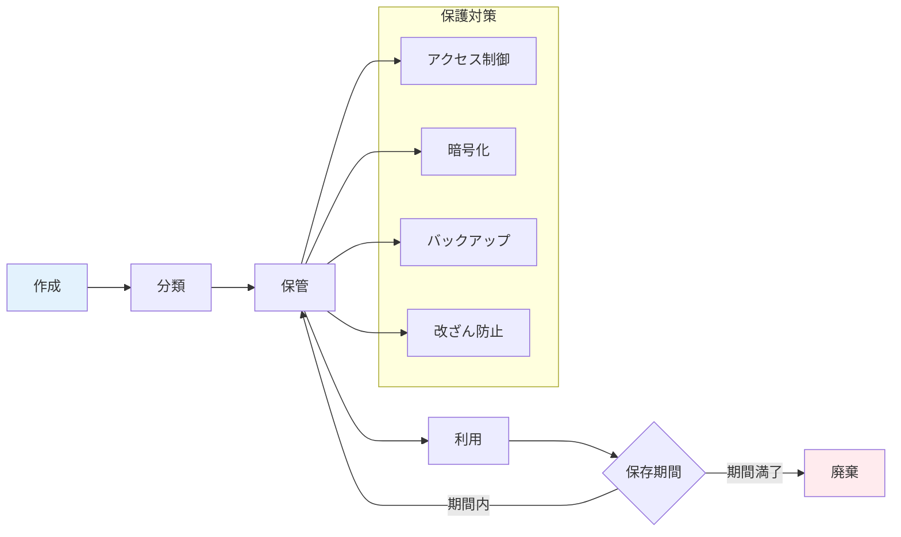

# A.5.33 記録の保護

## 管理策の概要

| 項目 | 内容 |
|------|------|
| 管理策タイプ | 予防的 |
| 情報セキュリティ特性 | 機密性、完全性、可用性 |
| サイバーセキュリティ概念 | 識別、防御 |
| 運用能力 | 情報保護、法的・規制・契約要件 |
| セキュリティドメイン | 防御 |

## 目的

記録を、紛失、破壊、改ざん、不正アクセス、不正な公開から保護します。法的・規制・契約・事業上の要件に従い、記録を適切に作成、保管、廃棄します。

## 実施のポイント

### 記録の種類と保存要件

| 記録の種類 | 保存期間の根拠 | 一般的な保存期間 |
|-----------|---------------|-----------------|
| 会計記録 | 法人税法、会社法 | 7〜10年 |
| 人事記録 | 労働基準法 | 3〜5年（退職後） |
| 契約書 | 民法（時効） | 契約終了後10年 |
| セキュリティログ | 業界基準、社内規程 | 1〜5年 |
| 監査記録 | ISMS要求事項 | 3年以上 |
| 個人情報 | 個人情報保護法 | 利用目的達成まで |

### 記録のライフサイクル管理



### 記録の保護要件

| 保護要件 | 対策例 |
|---------|--------|
| 機密性 | アクセス制御、暗号化、物理的施錠 |
| 完全性 | 改ざん検知、電子署名、チェックサム |
| 可用性 | バックアップ、冗長化、災害対策 |
| 真正性 | タイムスタンプ、電子署名、監査証跡 |

## 実装例

### 記録管理台帳

```yaml
記録管理台帳:

  ISMS関連記録:
    リスクアセスメント記録:
      分類: ISMS
      機密レベル: 社外秘
      保存期間: 3年
      保管場所: 文書管理システム
      管理責任者: 情報セキュリティ担当
      廃棄方法: システムから削除

    内部監査記録:
      分類: ISMS
      機密レベル: 社外秘
      保存期間: 3年
      保管場所: 文書管理システム
      管理責任者: 内部監査室
      廃棄方法: システムから削除

    マネジメントレビュー記録:
      分類: ISMS
      機密レベル: 社外秘
      保存期間: 3年
      保管場所: 文書管理システム
      管理責任者: ISMS事務局
      廃棄方法: システムから削除

  セキュリティログ:
    アクセスログ:
      分類: セキュリティ
      機密レベル: 社外秘
      保存期間: 1年
      保管場所: ログサーバー
      管理責任者: インフラ部門
      廃棄方法: 自動ローテーション

    認証ログ:
      分類: セキュリティ
      機密レベル: 社外秘
      保存期間: 1年
      保管場所: ログサーバー
      管理責任者: インフラ部門
      廃棄方法: 自動ローテーション

  法定保存記録:
    会計帳簿:
      分類: 財務
      機密レベル: 秘密
      保存期間: 10年
      保管場所: 会計システム、金庫
      管理責任者: 経理部長
      廃棄方法: シュレッダー/完全消去
      法的根拠: 法人税法、会社法

    雇用関連記録:
      分類: 人事
      機密レベル: 秘密
      保存期間: 退職後5年
      保管場所: 人事システム、施錠棚
      管理責任者: 人事部長
      廃棄方法: シュレッダー/完全消去
      法的根拠: 労働基準法
```

### 記録保護基準

```yaml
記録保護基準:

  物理的保護:
    紙媒体:
      保管場所: 施錠可能なキャビネット
      アクセス管理: 鍵管理台帳で管理
      環境条件: 温度20-25℃、湿度40-60%

    電子媒体:
      保管場所: 耐火金庫
      暗号化: AES-256
      ラベリング: 機密レベルを明記

  論理的保護:
    アクセス制御:
      認証: 多要素認証
      認可: 役割ベースアクセス制御
      ログ: 全アクセスを記録

    暗号化:
      保存時: AES-256
      転送時: TLS 1.3

    バックアップ:
      頻度: 日次
      保管: オフサイト
      テスト: 四半期ごとにリストアテスト

  改ざん防止:
    電子署名: 重要記録には電子署名を付与
    タイムスタンプ: 認定タイムスタンプ局を利用
    ハッシュ値: 記録作成時にハッシュ値を保存
    WORM: 変更不可媒体での保存（必要に応じて）
```

### 記録廃棄手順

| 廃棄方法 | 対象 | 手順 |
|---------|------|------|
| シュレッダー | 紙媒体 | クロスカットシュレッダーで細断 |
| 溶解処理 | 大量の紙媒体 | 委託業者による溶解、証明書取得 |
| データ消去 | HDD | NIST SP 800-88準拠の上書き消去 |
| 物理破壊 | SSD、媒体 | 破砕処理、証明書取得 |
| システム削除 | クラウドデータ | 完全削除、監査ログで確認 |

### 記録廃棄記録

```yaml
記録廃棄記録:

  基本情報:
    廃棄日: YYYY-MM-DD
    廃棄担当者:
    立会者:

  廃棄対象:
    - 記録名:
      保存期間:
      保存開始日:
      廃棄理由: 保存期間満了

  廃棄方法:
    方法: シュレッダー / 溶解処理 / データ消去 / 物理破壊
    委託業者: （該当する場合）
    証明書番号: （該当する場合）

  承認:
    承認者:
    承認日:
```

## 関連する管理策

- [A.5.12 情報の分類](/controls/#a-5-12) - 情報の分類
- [A.5.13 情報のラベル付け](/controls/#a-5-13) - ラベル付け
- [A.7.14 装置のセキュリティを保った処分又は再利用](/controls/a-7-14) - 媒体の廃棄
- [A.8.10 情報の削除](/controls/#a-8-10) - データ削除

## 参考情報

- 法人税法（記録の保存期間）
- 会社法（記録の保存期間）
- 労働基準法（人事記録の保存）
- e-文書法（電子保存の要件）
- JIPDEC 電子署名・タイムスタンプガイドライン
