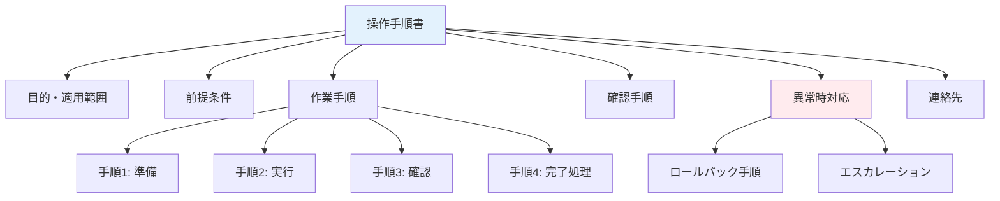

# A.5.37 操作手順書

## 管理策の概要

| 項目 | 内容 |
|------|------|
| 管理策タイプ | 予防的 |
| 情報セキュリティ特性 | 機密性、完全性、可用性 |
| サイバーセキュリティ概念 | 防御 |
| 運用能力 | 資産管理、物理的セキュリティ |
| セキュリティドメイン | 運用 |

## 目的

情報処理設備および通信の運用に関する操作手順書を文書化し、必要とする担当者に提供します。これにより、一貫した運用、ミスの防止、属人化の解消を実現します。

## 実施のポイント

### 操作手順書が必要な業務

| カテゴリ | 対象業務例 |
|---------|-----------|
| システム運用 | サーバー起動/停止、バックアップ、監視対応 |
| ネットワーク運用 | 機器設定変更、障害対応 |
| セキュリティ運用 | パッチ適用、脆弱性対応、インシデント対応 |
| ユーザー管理 | アカウント作成/削除、権限変更 |
| データ管理 | バックアップ/リストア、データ移行 |

### 操作手順書の構成



### 作成・管理のポイント

1. **明確で簡潔な記述**: 誰が読んでも同じ操作ができる
2. **スクリーンショットの活用**: 視覚的に分かりやすく
3. **チェックリスト形式**: 手順漏れを防止
4. **バージョン管理**: 変更履歴を追跡可能に
5. **定期的なレビュー**: 最新の状態を維持

## 実装例

### 操作手順書テンプレート

```yaml
操作手順書:

  文書情報:
    文書ID: OPR-001
    文書名: サーバーバックアップ手順書
    バージョン: 1.0
    作成日: YYYY-MM-DD
    作成者:
    承認者:
    最終更新日:
    次回レビュー日:

  変更履歴:
    - バージョン: 1.0
      日付: YYYY-MM-DD
      変更者:
      変更内容: 初版作成

  目的:
    本手順書は、本番サーバーの日次バックアップを実施するための
    手順を定義する。

  適用範囲:
    - 対象システム: 本番Webサーバー（srv-web-01, srv-web-02）
    - 対象者: インフラ運用担当者
    - 実施タイミング: 毎日 AM 3:00（自動実行）、手動実行時

  前提条件:
    - バックアップサーバーが稼働していること
    - ネットワーク接続が正常であること
    - バックアップ用ストレージに十分な空き容量があること

  準備物:
    - 管理者アカウント
    - バックアップサーバーへのアクセス権
    - 本手順書

  作業手順:
    1_準備:
      説明: バックアップ実行前の確認
      手順:
        - [ ] バックアップサーバーにログイン
        - [ ] ディスク空き容量を確認（最低100GB必要）
            コマンド: df -h /backup
        - [ ] 前回バックアップの完了を確認
            コマンド: ls -la /backup/daily/

    2_実行:
      説明: バックアップの実行
      手順:
        - [ ] バックアップスクリプトを実行
            コマンド: /opt/scripts/backup.sh
        - [ ] 実行ログを確認
            コマンド: tail -f /var/log/backup.log
        - [ ] 完了メッセージを確認
            期待値: "Backup completed successfully"

    3_確認:
      説明: バックアップ結果の確認
      手順:
        - [ ] バックアップファイルの存在を確認
            コマンド: ls -la /backup/daily/YYYYMMDD/
        - [ ] ファイルサイズが妥当か確認
            基準: 前回比±10%以内
        - [ ] チェックサムを確認
            コマンド: sha256sum -c /backup/daily/YYYYMMDD/checksum.txt

    4_完了処理:
      説明: 作業完了後の処理
      手順:
        - [ ] 作業記録を記入
        - [ ] 古いバックアップの削除（30日以上前）
            コマンド: /opt/scripts/cleanup.sh
        - [ ] 作業完了を報告

  異常時対応:
    バックアップ失敗時:
      症状: エラーメッセージが表示される
      対応:
        1. エラーログを確認: /var/log/backup.log
        2. ディスク容量を確認
        3. ネットワーク接続を確認
        4. 解決しない場合はエスカレーション

    ディスク容量不足時:
      症状: "No space left on device"
      対応:
        1. 不要な古いバックアップを削除
        2. 一時ファイルを削除
        3. 運用責任者に報告

  エスカレーション:
    レベル1: 運用担当リーダー（内線: XXXX）
    レベル2: インフラ部門長（内線: XXXX）
    レベル3: ベンダーサポート（電話: XX-XXXX-XXXX）

  関連文書:
    - バックアップ運用規程
    - 障害対応手順書
    - システム構成図
```

### 操作手順書一覧

| 文書ID | 文書名 | 対象システム | 最終更新 | 次回レビュー |
|--------|--------|-------------|----------|-------------|
| OPR-001 | サーバーバックアップ手順書 | 本番サーバー | 2025-01-01 | 2025-07-01 |
| OPR-002 | サーバー起動/停止手順書 | 本番サーバー | 2025-01-01 | 2025-07-01 |
| OPR-003 | ユーザーアカウント管理手順書 | AD/IdP | 2025-01-01 | 2025-07-01 |
| OPR-004 | パッチ適用手順書 | 全サーバー | 2025-01-01 | 2025-07-01 |
| OPR-005 | 監視アラート対応手順書 | 監視システム | 2025-01-01 | 2025-07-01 |
| OPR-006 | 障害対応手順書 | 全システム | 2025-01-01 | 2025-07-01 |

### 手順書レビューチェックリスト

```yaml
手順書レビューチェックリスト:

  内容の正確性:
    - [ ] 手順通りに実行して正常に完了するか
    - [ ] コマンド、パラメータは正確か
    - [ ] スクリーンショットは最新か

  完全性:
    - [ ] 前提条件は明記されているか
    - [ ] 全ての手順が記載されているか
    - [ ] 確認手順が含まれているか
    - [ ] 異常時対応が記載されているか

  分かりやすさ:
    - [ ] 新人でも理解できる記述か
    - [ ] 専門用語に説明があるか
    - [ ] 手順の順序は論理的か

  管理:
    - [ ] バージョン情報は更新されているか
    - [ ] 変更履歴は記録されているか
    - [ ] 承認者の承認を得ているか
```

## 関連する管理策

- [A.5.1 情報セキュリティのための方針群](/controls/a-5-1) - 方針文書
- [A.5.10 情報およびその他の関連資産の利用の許容範囲](/controls/a-5-10) - 利用規則
- [A.8.9 構成管理](/controls/a-8-9) - システム構成の管理
- [A.8.32 変更管理](/controls/a-8-32) - 変更管理プロセス

## 参考情報

- ITIL (IT Infrastructure Library) - サービス運用
- 運用設計のベストプラクティス
