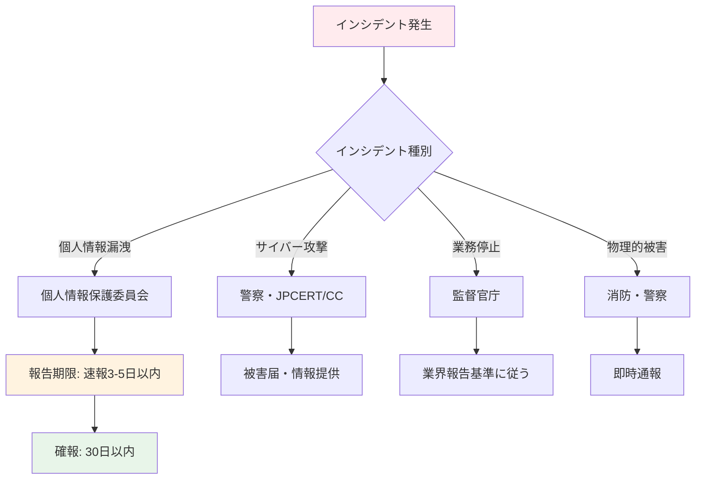

# A.5.5 関係当局との連絡

## 管理策の概要

| 項目 | 内容 |
|------|------|
| 管理策タイプ | 予防的、是正的 |
| 情報セキュリティ特性 | 機密性、完全性、可用性 |
| サイバーセキュリティ概念 | 識別、防御、対応、復旧 |
| 運用能力 | ガバナンス |
| セキュリティドメイン | ガバナンスとエコシステム、レジリエンス |

## 目的

関連する当局（規制機関、法執行機関、監督機関等）との適切な連絡体制を確立し、維持します。これにより、法的義務の遵守、インシデント発生時の迅速な対応、最新の規制動向の把握が可能になります。

## 実施のポイント

### 連絡すべき当局の特定

組織の事業内容や所在地に応じて、連絡すべき当局を特定します。

| 当局の種類 | 具体例 | 連絡が必要な場面 |
|-----------|--------|------------------|
| 個人情報保護 | 個人情報保護委員会 | 個人データ漏洩時 |
| サイバーセキュリティ | 警察（サイバー犯罪対策課）、NISC | サイバー攻撃被害時 |
| 業界監督 | 金融庁、厚生労働省等 | 業界固有のインシデント |
| 消防・防災 | 消防署、自治体 | 物理的災害時 |
| 労働安全 | 労働基準監督署 | 労働災害発生時 |

### 連絡体制の構築



### 連絡手順の確立

1. **連絡先リストの作成**: 当局の連絡先、担当窓口、連絡方法を文書化
2. **報告基準の明確化**: どのような事象で連絡が必要かを定義
3. **報告内容の標準化**: 報告書のテンプレートを準備
4. **責任者の指定**: 当局との連絡担当者を明確化
5. **定期的な更新**: 連絡先情報を定期的に確認・更新

## 実装例

### 関係当局連絡先一覧

```yaml
関係当局連絡先:

  個人情報保護:
    機関名: 個人情報保護委員会
    連絡先: 03-6457-9680
    報告窓口: https://www.ppc.go.jp/personalinfo/legal/leakAction/
    報告期限:
      速報: 発覚から3〜5日以内
      確報: 発覚から30日以内（不正アクセス等は60日以内）
    報告基準:
      - 要配慮個人情報の漏洩
      - 財産的被害のおそれ
      - 不正アクセス等による漏洩
      - 1,000人超の漏洩

  サイバーセキュリティ:
    警察:
      機関名: 警視庁サイバー犯罪対策課
      連絡先: 03-3581-4321（代表）
      オンライン相談: https://www.npa.go.jp/cyber/soudan.html

    JPCERT/CC:
      機関名: JPCERTコーディネーションセンター
      連絡先: info@jpcert.or.jp
      インシデント報告: https://www.jpcert.or.jp/form/

    IPA:
      機関名: 情報処理推進機構
      連絡先: 03-5978-7509
      届出窓口: https://www.ipa.go.jp/security/todokede/

  業界監督（例: IT企業）:
    機関名: 経済産業省
    連絡先: 03-3501-1511（代表）
    関連部署: 商務情報政策局

  消防・防災:
    消防署: 119（緊急）
    最寄り消防署: [要記入]
    自治体防災課: [要記入]
```

### インシデント報告フロー

| フェーズ | 時間目安 | 実施事項 | 担当 |
|---------|---------|----------|------|
| 初動 | 発生直後 | 状況把握、エスカレーション | 発見者→情報セキュリティ担当 |
| 判断 | 1時間以内 | 報告要否の判断、当局選定 | CISO/情報セキュリティ委員会 |
| 速報 | 3-5日以内 | 当局への第一報 | 法務部/情報セキュリティ担当 |
| 調査 | 継続 | 原因調査、影響範囲特定 | インシデント対応チーム |
| 確報 | 30日以内 | 詳細報告、再発防止策 | CISO/法務部 |

### 報告書テンプレート

```yaml
インシデント報告書:

  基本情報:
    報告日: YYYY-MM-DD
    報告者:
    報告先当局:
    報告種別: 速報 / 確報

  インシデント概要:
    発生日時:
    発覚日時:
    事象の概要:

  影響範囲:
    影響を受けた情報:
    影響を受けた人数:
    二次被害の有無:

  原因:
    直接原因:
    根本原因: （調査中の場合はその旨記載）

  対応状況:
    実施済みの対応:
    今後の対応予定:
    再発防止策:

  添付資料:
    -
```

## 関連する管理策

- [A.5.6 専門組織との連絡](/controls/a-5-6) - 専門組織との連携
- [A.5.24 インシデント管理の計画及び準備](/controls/a-5-24) - インシデント対応
- [A.5.26 情報セキュリティインシデントへの対応](/controls/#a-5-26) - インシデント対応手順

## 参考情報

- 個人情報保護委員会「漏えい等報告・本人通知の義務化」
- JPCERT/CC「インシデント対応マニュアル」
- 警察庁「サイバー犯罪に係る相談窓口」
