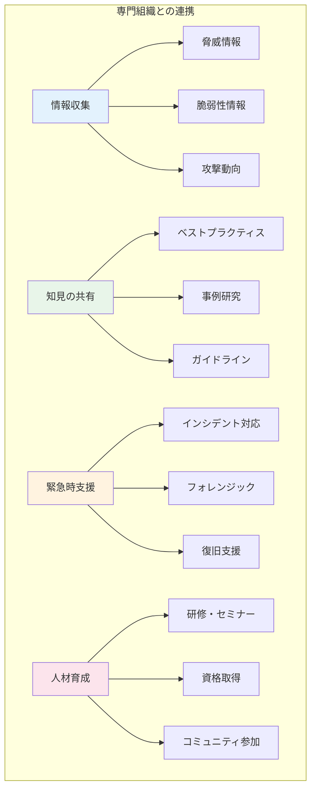

# A.5.6 専門組織との連絡

## 管理策の概要

| 項目 | 内容 |
|------|------|
| 管理策タイプ | 予防的、是正的 |
| 情報セキュリティ特性 | 機密性、完全性、可用性 |
| サイバーセキュリティ概念 | 防御、対応、復旧 |
| 運用能力 | ガバナンス |
| セキュリティドメイン | ガバナンスとエコシステム |

## 目的

セキュリティに関する専門組織、フォーラム、業界団体との連絡体制を確立し、維持します。これにより、最新の脅威情報の入手、ベストプラクティスの共有、インシデント発生時の支援を受けることが可能になります。

## 実施のポイント

### 専門組織の種類

| 組織タイプ | 役割 | 具体例 |
|-----------|------|--------|
| CSIRT/CERT | インシデント対応支援 | JPCERT/CC、業界CSIRT |
| ISAC | 業界内の情報共有 | 金融ISAC、ICT-ISAC |
| セキュリティ団体 | 啓発・標準化 | JNSA、ISACA |
| ベンダー | 製品サポート・脆弱性情報 | 各製品ベンダー |
| 学術機関 | 研究・人材育成 | 大学、研究機関 |

### 連携のメリット



### 参加・連携のポイント

1. **組織の選定**: 自社の業種・規模に適した組織を選ぶ
2. **担当者の指定**: 連絡窓口となる担当者を明確化
3. **積極的な参加**: 情報を受け取るだけでなく、提供も行う
4. **機密性の確保**: 共有する情報の範囲を適切に管理
5. **継続的な関与**: 定期的なミーティング・イベントへの参加

## 実装例

### 専門組織連絡先一覧

```yaml
専門組織連絡先:

  CSIRT/CERT:
    JPCERT/CC:
      概要: 日本のナショナルCSIRT
      会員種別: 一般（無料）
      連絡先: info@jpcert.or.jp
      提供サービス:
        - インシデント報告受付
        - 脆弱性情報の提供
        - 早期警戒情報
      URL: https://www.jpcert.or.jp/

    日本シーサート協議会:
      概要: 企業CSIRTの連携組織
      会員種別: 正会員（要審査）
      連絡先: info@nca.gr.jp
      提供サービス:
        - CSIRT間の情報共有
        - 合同演習
        - ノウハウ共有
      URL: https://www.nca.gr.jp/

  ISAC（業界別）:
    金融ISAC:
      対象業界: 金融機関
      URL: https://www.f-isac.jp/

    ICT-ISAC:
      対象業界: 情報通信
      URL: https://www.ict-isac.jp/

    電力ISAC:
      対象業界: 電力
      URL: https://www.electricity-isac.jp/

  セキュリティ団体:
    JNSA:
      正式名称: NPO日本ネットワークセキュリティ協会
      会員種別: 正会員・賛助会員
      年会費: 正会員10万円〜
      提供サービス:
        - セキュリティ調査・研究
        - ガイドライン策定
        - イベント・セミナー
      URL: https://www.jnsa.org/

    ISACA東京支部:
      概要: 情報システム監査の国際団体
      提供サービス:
        - CISA/CISM資格
        - 研修・セミナー
      URL: https://www.isaca.gr.jp/

  ベンダーサポート:
    - 名称: [主要ベンダー名]
      サポート窓口: [連絡先]
      契約種別: [サポート契約内容]
      SLA: [対応時間等]
```

### 情報共有の管理

| 共有レベル | 定義 | 共有範囲 |
|-----------|------|----------|
| TLP:RED | 参加者限定 | 会議参加者のみ |
| TLP:AMBER | 組織内限定 | 自社内のみ |
| TLP:GREEN | コミュニティ内 | 同業他社まで |
| TLP:WHITE | 制限なし | 公開可能 |

### 年間活動計画

```yaml
専門組織活動計画:

  定期活動:
    月次:
      - JPCERT/CCメーリングリスト確認
      - ベンダーセキュリティアドバイザリ確認

    四半期:
      - ISAC定例会議参加
      - JNSA部会参加

    年次:
      - セキュリティカンファレンス参加（CODE BLUE、JSAC等）
      - CSIRT演習参加
      - 会員資格更新

  担当者:
    主担当: 情報セキュリティ担当
    副担当: インフラ部門リーダー

  予算:
    会費: 年間XX万円
    イベント参加費: 年間XX万円
    研修費: 年間XX万円
```

## 関連する管理策

- [A.5.5 関係当局との連絡](/controls/a-5-5) - 当局との連携
- [A.5.7 脅威インテリジェンス](/controls/a-5-7) - 脅威情報の活用
- [A.5.24 インシデント管理の計画及び準備](/controls/a-5-24) - インシデント対応体制

## 参考情報

- JPCERT/CC 公式サイト
- 日本シーサート協議会 公式サイト
- FIRST (Forum of Incident Response and Security Teams)
- Traffic Light Protocol (TLP) ガイドライン
