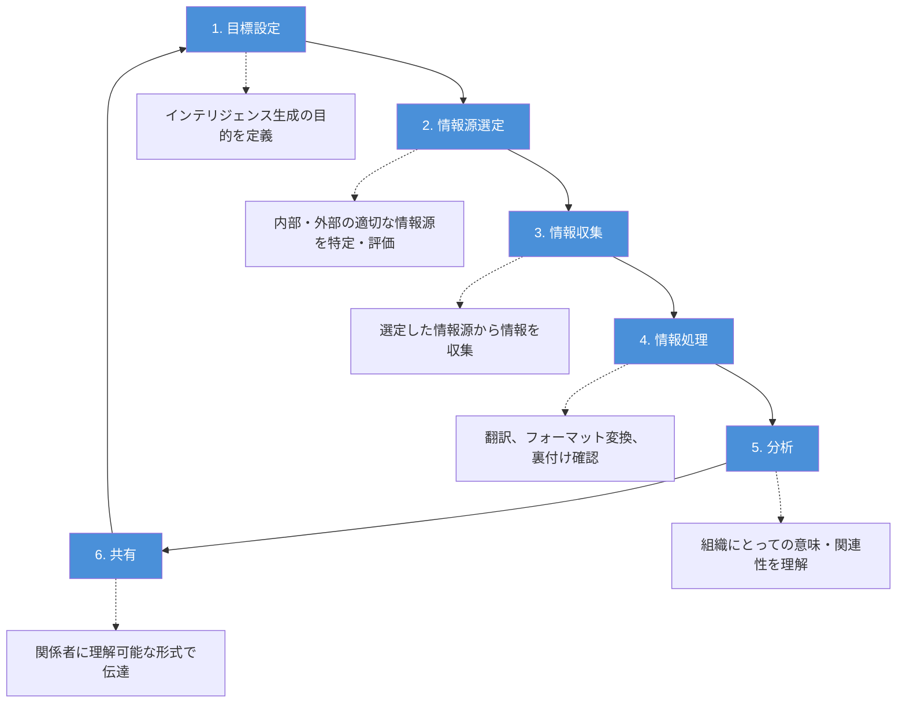

# A.5.7 脅威インテリジェンス

## 管理策の概要

| 項目 | 内容 |
|------|------|
| 管理策タイプ | 予防的、検知的、是正的 |
| 情報セキュリティ特性 | 機密性、完全性、可用性 |
| サイバーセキュリティ概念 | 識別、検知、対応 |
| 運用能力 | 脅威・脆弱性管理 |
| セキュリティドメイン | 防御、レジリエンス |

## 目的

情報セキュリティ上の脅威に関する情報を収集・分析し、脅威インテリジェンスとして活用することで、組織を取り巻く脅威環境を把握し、適切な軽減策を講じられるようにします。

## 実施のポイント

### 脅威インテリジェンスの3つのレイヤー

効果的な脅威インテリジェンスを構築するには、以下の3つのレイヤーすべてを考慮する必要があります。

#### 1. 戦略的脅威インテリジェンス

脅威環境の全体的な変化に関する高レベルの情報を扱います。

- 攻撃者の種類（国家支援型、犯罪組織、内部者など）
- 攻撃の種類やトレンドの変化
- 業界全体への影響分析

#### 2. 戦術的脅威インテリジェンス

攻撃者の手法、ツール、技術に関する情報を扱います。

- 攻撃手法（TTPs: Tactics, Techniques, Procedures）
- 使用されるマルウェアの種類
- 攻撃ツールやフレームワーク

#### 3. 運用的脅威インテリジェンス

特定の攻撃に関する詳細情報を扱います。

- 技術的指標（IoC: Indicators of Compromise）
- 悪意あるIPアドレス、ドメイン
- マルウェアのハッシュ値
- 攻撃の具体的なシグネチャ

### 脅威インテリジェンスの品質要件

収集・分析した脅威インテリジェンスは、以下の特性を備えている必要があります。

| 特性 | 説明 |
|------|------|
| 関連性 | 自組織の保護に関係する情報であること |
| 洞察力 | 脅威環境を正確かつ詳細に理解できること |
| 文脈性 | 時期、場所、過去の経験、類似組織での発生状況などの状況的背景があること |
| 実行可能性 | 情報に基づいて迅速かつ効果的に行動できること |

### 脅威インテリジェンス活動のプロセス



### 脅威インテリジェンスの活用方法

収集・分析した脅威インテリジェンスは、以下のように活用します。

1. **リスク管理への統合**
   - 情報セキュリティリスクアセスメントの入力情報として活用
   - リスク対応策の優先度付けに反映

2. **技術的対策への適用**
   - ファイアウォールのルール更新
   - 侵入検知システム（IDS）のシグネチャ更新
   - マルウェア対策ソリューションの設定

3. **セキュリティテストへの活用**
   - ペネトレーションテストのシナリオ設計
   - レッドチーム演習の参考情報

### 情報共有の推奨

組織は、全体的な脅威インテリジェンスを向上させるため、他の組織と相互に情報を共有することが推奨されます。

## 実装例

### 脅威インテリジェンスプログラムの構成例

```yaml
脅威インテリジェンスプログラム:
  情報源:
    外部:
      - 商用脅威インテリジェンスサービス
      - 政府機関（JPCERT/CC、IPA等）
      - ISACなどの業界団体
      - オープンソースインテリジェンス（OSINT）
    内部:
      - セキュリティ機器のログ
      - インシデント報告
      - 脆弱性スキャン結果
  
  収集・分析体制:
    担当: セキュリティオペレーションチーム
    頻度: 日次収集、週次分析レポート
    ツール: 
      - TIP（Threat Intelligence Platform）
      - SIEM連携
  
  配布先:
    - 経営層: 月次サマリーレポート
    - IT部門: 技術的指標の即時共有
    - 全従業員: 重大な脅威に関するアラート
```

### 脅威インテリジェンスの評価基準

| 評価項目 | 評価基準 |
|----------|----------|
| 情報の鮮度 | 72時間以内の情報を優先 |
| 信頼性 | 複数ソースでの裏付け確認 |
| 関連性スコア | 自社業界・システムへの該当度 |
| 対応優先度 | 影響度×緊急度で算出 |

## 関連する管理策

- [A.5.25 情報セキュリティ事象の評価と決定](/controls/#a-5-25)
- [A.8.7 マルウェアに対する保護](/controls/#a-8-7)
- [A.8.16 監視活動](/controls/#a-8-16)
- [A.8.23 ウェブフィルタリング](/controls/a-8-23)

## 参考情報

- 脅威インテリジェンスは独立したプロバイダー、政府機関、または共同の脅威インテリジェンスグループから提供されることが一般的です
- 多くの組織は自ら脅威インテリジェンスを生成するよりも、他のソースから受け取って活用しています
- 関連する管理策（A.5.25、A.8.7、A.8.16、A.8.23など）の有効性は、利用可能な脅威インテリジェンスの品質に依存します
