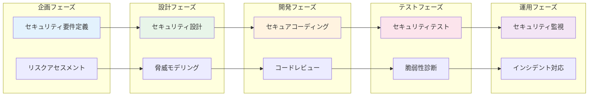

# A.5.8 プロジェクトマネジメントにおける情報セキュリティ

## 管理策の概要

| 項目 | 内容 |
|------|------|
| 管理策タイプ | 予防的 |
| 情報セキュリティ特性 | 機密性、完全性、可用性 |
| サイバーセキュリティ概念 | 識別、防御 |
| 運用能力 | ガバナンス |
| セキュリティドメイン | ガバナンスとエコシステム |

## 目的

情報セキュリティをプロジェクトマネジメントに統合します。プロジェクトの種類（IT、非IT）を問わず、計画段階からセキュリティを考慮することで、後付けによるコスト増加やリスクを防止します。

## 実施のポイント

### セキュリティ・バイ・デザイン

プロジェクトの各フェーズでセキュリティを組み込みます。



### プロジェクトタイプ別のセキュリティ考慮事項

| プロジェクトタイプ | セキュリティ考慮事項 |
|-------------------|---------------------|
| システム開発 | 認証・認可、データ保護、セキュアコーディング |
| インフラ構築 | ネットワーク分離、アクセス制御、監視 |
| クラウド移行 | 責任共有モデル、データ暗号化、コンプライアンス |
| 業務改善 | 情報の取扱い、アクセス権、監査証跡 |
| オフィス移転 | 物理セキュリティ、入退室管理、配線 |

### セキュリティゲートレビュー

プロジェクトのマイルストーンでセキュリティレビューを実施します。

| ゲート | タイミング | レビュー内容 |
|--------|-----------|-------------|
| Gate 0 | 企画承認時 | セキュリティ要件の妥当性 |
| Gate 1 | 設計完了時 | セキュリティ設計の適切性 |
| Gate 2 | 開発完了時 | 実装のセキュリティ品質 |
| Gate 3 | リリース前 | 脆弱性対応、運用準備 |
| Gate 4 | 運用移行後 | 運用状況、残存リスク |

## 実装例

### プロジェクトセキュリティチェックリスト

```yaml
プロジェクトセキュリティチェックリスト:

  企画フェーズ:
    セキュリティ要件:
      - [ ] 取り扱う情報の機密レベルを特定したか
      - [ ] 適用される法規制・基準を特定したか
      - [ ] セキュリティ要件を文書化したか

    リスクアセスメント:
      - [ ] 想定される脅威を洗い出したか
      - [ ] リスク評価を実施したか
      - [ ] リスク対応計画を策定したか

    体制:
      - [ ] セキュリティ担当者をアサインしたか
      - [ ] セキュリティレビュー計画を立てたか

  設計フェーズ:
    セキュリティ設計:
      - [ ] 認証・認可の設計は適切か
      - [ ] データの暗号化方針を決定したか
      - [ ] ログ・監査証跡の設計を行ったか

    脅威モデリング:
      - [ ] 脅威モデリングを実施したか
      - [ ] 対策を設計に反映したか

    外部連携:
      - [ ] 外部サービスとの連携のセキュリティを検討したか
      - [ ] APIセキュリティを検討したか

  開発フェーズ:
    セキュアコーディング:
      - [ ] セキュアコーディング規約に従っているか
      - [ ] 入力検証を実装したか
      - [ ] 機密情報のハードコーディングがないか

    コードレビュー:
      - [ ] セキュリティ観点のコードレビューを実施したか
      - [ ] 静的解析ツールを実行したか

  テストフェーズ:
    セキュリティテスト:
      - [ ] 脆弱性診断を実施したか
      - [ ] ペネトレーションテストを実施したか（必要な場合）
      - [ ] 指摘事項を是正したか

    データ保護:
      - [ ] テストデータに本番データを使用していないか
      - [ ] テスト環境のアクセス制御は適切か

  リリースフェーズ:
    運用準備:
      - [ ] セキュリティ運用手順を作成したか
      - [ ] インシデント対応手順を準備したか
      - [ ] 監視設定を行ったか

    ドキュメント:
      - [ ] セキュリティ設計書を最終化したか
      - [ ] 残存リスクを文書化したか
```

### セキュリティ要件定義書テンプレート

```yaml
セキュリティ要件定義書:

  プロジェクト情報:
    プロジェクト名:
    プロジェクトID:
    作成日:
    作成者:
    セキュリティ担当:

  取り扱い情報:
    情報資産:
      - 資産名: 顧客個人情報
        機密レベル: 秘密
        保護要件: 暗号化必須、アクセスログ必須

      - 資産名: 業務データ
        機密レベル: 社外秘
        保護要件: アクセス制御

  適用法規制・基準:
    - 個人情報保護法
    - 業界ガイドライン
    - 社内セキュリティポリシー

  セキュリティ要件:
    認証・認可:
      - 多要素認証の導入
      - 役割ベースのアクセス制御
      - セッション管理

    データ保護:
      - 保存データの暗号化（AES-256）
      - 通信の暗号化（TLS 1.3）
      - データマスキング

    監査・ログ:
      - アクセスログの取得
      - 操作ログの取得
      - ログの保存期間: 1年

    可用性:
      - 目標稼働率: 99.9%
      - バックアップ: 日次
      - 復旧目標時間: 4時間

  リスク評価結果:
    高リスク:
      - リスク: 不正アクセスによるデータ漏洩
        対策: WAF導入、脆弱性診断の実施

    中リスク:
      - リスク: 内部者による不正利用
        対策: 職務分離、操作ログ監視
```

### セキュリティレビュー記録

| 項目 | 内容 |
|------|------|
| プロジェクト名 | |
| レビュー日 | |
| レビューゲート | Gate 0 / 1 / 2 / 3 / 4 |
| レビュー参加者 | |
| レビュー結果 | 合格 / 条件付き合格 / 不合格 |
| 指摘事項 | |
| 是正期限 | |
| 次回レビュー予定 | |

## 関連する管理策

- [A.5.1 情報セキュリティのための方針群](/controls/a-5-1) - セキュリティ方針
- [A.8.25 セキュリティに配慮した開発のライフサイクル](/controls/a-8-25) - 開発ライフサイクル
- [A.8.28 セキュアコーディング](/controls/a-8-28) - セキュアコーディング

## 参考情報

- OWASP Software Assurance Maturity Model (SAMM)
- Microsoft Security Development Lifecycle (SDL)
- NIST SP 800-64 (Security Considerations in the SDLC)
