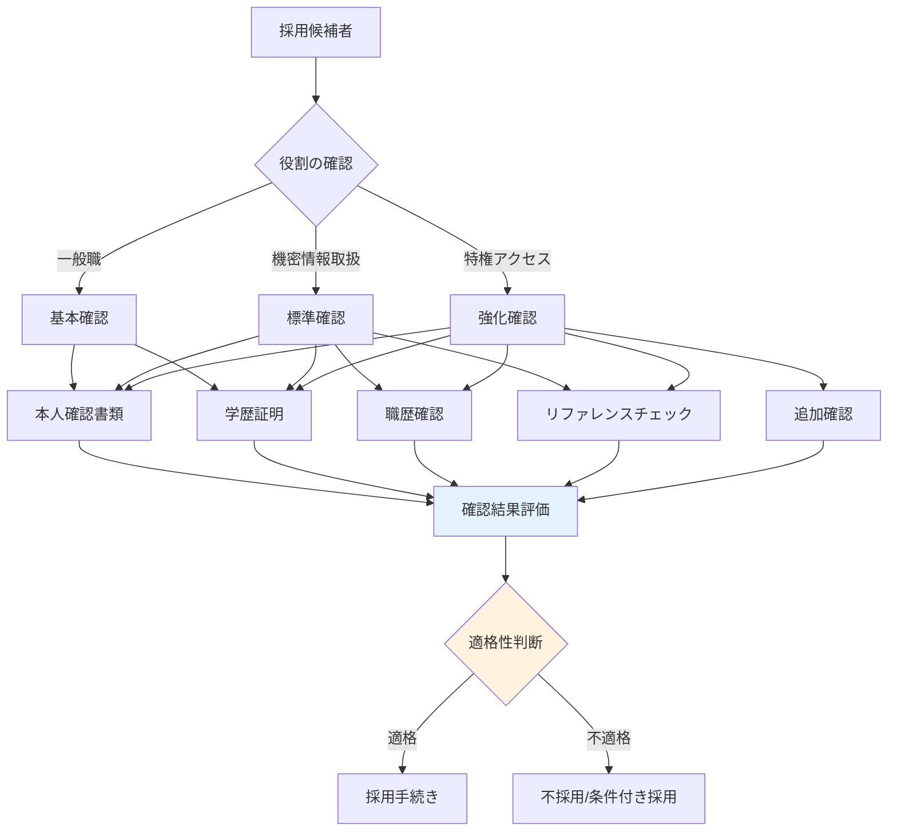

# A.6.1 選考

## 管理策の概要

| 項目 | 内容 |
|------|------|
| 管理策タイプ | 予防的 |
| 情報セキュリティ特性 | 機密性、完全性、可用性 |
| サイバーセキュリティ概念 | 防御 |
| 運用能力 | 人的セキュリティ |
| セキュリティドメイン | ガバナンスとエコシステム |

## 目的

すべての採用候補者について、関連する法令、規制、倫理に従い、その役割の重要性や取り扱う情報の分類に応じた経歴確認を行います。これにより、組織の情報資産にアクセスする人員の適格性を確保します。

## 実施のポイント

### 経歴確認の範囲

役割や取り扱う情報の機密性に応じて、経歴確認のレベルを設定します。

| 確認レベル | 対象 | 確認内容 |
|-----------|------|----------|
| 基本 | 一般従業員 | 本人確認、学歴確認 |
| 標準 | 機密情報取扱者 | 基本 + 職歴確認、リファレンスチェック |
| 強化 | 特権アクセス者、管理職 | 標準 + 信用調査（法的に許可される範囲） |

### 経歴確認のフロー



### 法的・倫理的考慮事項

経歴確認を実施する際は、以下の点に注意します。

| 項目 | 内容 |
|------|------|
| 同意の取得 | 候補者から書面による同意を取得 |
| 個人情報保護 | 個人情報保護法に準拠した取り扱い |
| 差別の禁止 | 職務に関係のない情報での判断禁止 |
| 情報の保管 | 確認結果の適切な保管と廃棄 |
| 外部委託 | 信頼できる調査会社の利用 |

## 実装例

### 採用時セキュリティチェック手順

```yaml
採用時セキュリティチェック手順:

  目的:
    採用候補者の経歴確認を通じて、組織の情報セキュリティリスクを
    低減し、適格な人材を採用する。

  適用範囲:
    - 正社員の新規採用
    - 契約社員・派遣社員の受入
    - 役員の就任
    - 重要ポジションへの異動

  確認レベルの定義:
    レベル1_基本:
      対象:
        - 一般職（機密情報へのアクセスなし）
        - 短期アルバイト
      確認項目:
        - 本人確認（運転免許証、マイナンバーカード等）
        - 最終学歴の確認

    レベル2_標準:
      対象:
        - 機密情報へアクセスする職種
        - 顧客情報を取り扱う職種
        - IT部門
      確認項目:
        - レベル1の全項目
        - 職歴確認（直近3社）
        - リファレンスチェック（前職上司等）

    レベル3_強化:
      対象:
        - 管理職・役員
        - システム管理者（特権アクセス保持者）
        - 財務・経理部門の責任者
      確認項目:
        - レベル2の全項目
        - 信用調査（法的に許可される範囲）
        - 反社会的勢力との関係確認

  手順:
    1_同意取得:
      担当: 人事部
      内容:
        - 経歴確認の目的と範囲を説明
        - 書面による同意を取得
        - 同意書を保管

    2_本人確認:
      担当: 人事部
      確認書類:
        - 運転免許証
        - パスポート
        - マイナンバーカード
        - 住民票（発行3ヶ月以内）

    3_学歴確認:
      担当: 人事部
      確認方法:
        - 卒業証明書または卒業証書の写し
        - 必要に応じて学校への照会

    4_職歴確認:
      担当: 人事部または外部調査会社
      確認方法:
        - 職務経歴書の内容確認
        - 前職の在籍確認
        - 退職理由の確認

    5_リファレンスチェック:
      担当: 採用担当マネージャー
      確認方法:
        - 候補者が指定する推薦者への連絡
        - 職務遂行能力、勤務態度の確認

    6_結果評価:
      担当: 人事部、採用部門責任者
      評価基準:
        - 提出書類の真正性
        - 職歴の一貫性
        - リファレンスの評価
```

### 経歴確認同意書

```yaml
経歴確認同意書:

  候補者情報:
    氏名:
    生年月日:
    応募職種:

  同意内容:
    私は、株式会社〇〇（以下「会社」）が、私の採用選考にあたり、
    以下の経歴確認を行うことに同意します。

    確認項目:
      - [ ] 本人確認（身分証明書による）
      - [ ] 学歴の確認
      - [ ] 職歴の確認
      - [ ] リファレンスチェック
      - [ ] その他（具体的に記載: ）

    確認方法:
      - 提出書類による確認
      - 前職への照会
      - 教育機関への照会
      - 候補者指定の推薦者への照会

  個人情報の取り扱い:
    - 取得した情報は採用選考目的のみに使用します
    - 採用に至らなかった場合、情報は速やかに廃棄します
    - 採用となった場合、人事記録として保管します
    - 第三者への提供は法令に基づく場合を除き行いません

  同意日:
  署名:
```

### 経歴確認チェックリスト

| 確認項目 | 確認方法 | 確認日 | 確認者 | 結果 |
|---------|---------|--------|--------|------|
| 本人確認 | 身分証明書 | | | □適合 □不適合 |
| 学歴確認 | 卒業証明書 | | | □適合 □不適合 |
| 職歴確認 | 在籍確認 | | | □適合 □不適合 |
| リファレンス | 推薦者への連絡 | | | □適合 □不適合 |
| **総合判定** | | | | □採用可 □条件付き □不可 |

### 不適合時の対応フロー

```yaml
不適合時の対応:

  軽微な不一致:
    例: 在籍期間の軽微なずれ
    対応:
      - 候補者に確認・説明を求める
      - 合理的な説明があれば許容
      - 記録を残す

  重大な不一致:
    例: 学歴詐称、重要な職歴の隠蔽
    対応:
      - 採用プロセスの中止
      - 候補者への通知
      - 不採用理由の記録

  判断に迷う場合:
    - 人事部長へエスカレーション
    - 必要に応じて法務部門に相談
    - 判断基準を明確にして決定
```

## 関連する管理策

- [A.6.2 雇用条件](/controls/#a-6-2) - 雇用契約における責任
- [A.6.6 秘密保持契約又は守秘義務契約](/controls/#a-6-6) - 機密保持の義務
- [A.5.19 供給者関係における情報セキュリティ](/controls/#a-5-19) - 外部要員の管理

## 参考情報

- 個人情報保護法（採用選考における個人情報の取り扱い）
- 職業安定法（公正な採用選考）
- 厚生労働省「公正な採用選考の基本」
