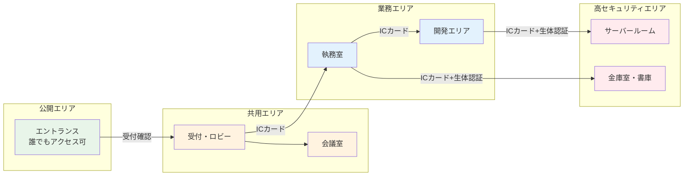

# A.7.1 物理的セキュリティ境界

## 管理策の概要

| 項目 | 内容 |
|------|------|
| 管理策タイプ | 予防的 |
| 情報セキュリティ特性 | 機密性、完全性、可用性 |
| サイバーセキュリティ概念 | 防御 |
| 運用能力 | 物理的セキュリティ |
| セキュリティドメイン | 保護 |

## 目的

機密情報や重要な情報処理施設を含む領域を保護するために、物理的セキュリティ境界を定義し、実装します。セキュリティ境界は、組織が保護すべき領域と外部との間に明確な区分を設け、不正なアクセスや侵入を防止します。

## 実施のポイント

### セキュリティゾーンの定義

組織は、情報資産の重要度に基づいてセキュリティゾーンを定義する必要があります。一般的には以下のようなゾーン分けが行われます。



### 境界の物理的強度

セキュリティ境界は、以下の要素を考慮して設計します。

| 要素 | 考慮事項 |
|------|----------|
| 壁 | 床から天井まで連続した構造、必要に応じて耐火・防音性能 |
| 扉 | 施錠可能、耐火性能、自動閉鎖機構 |
| 窓 | 施錠可能、外部からの視認防止、必要に応じて防犯ガラス |
| 天井・床 | 侵入経路とならないよう注意（天井裏、OAフロア） |

### 入口の管理

- 入口は必要最小限に制限
- 各入口に適切な認証手段を設置
- 緊急時の避難経路を確保しつつ、セキュリティを維持
- 搬入口は業務エリアと分離

## 実装例

### セキュリティゾーン定義書（例）

```yaml
セキュリティゾーン定義:

  ゾーン1_公開エリア:
    対象: エントランス、駐車場
    アクセス権限: 制限なし
    監視: 監視カメラ

  ゾーン2_共用エリア:
    対象: 受付、来客用会議室、ロビー
    アクセス権限: 受付確認後
    監視: 監視カメラ、受付担当者

  ゾーン3_業務エリア:
    対象: 執務室、社内会議室、休憩室
    アクセス権限: 従業員（ICカード認証）
    監視: 入退室ログ

  ゾーン4_高セキュリティエリア:
    対象: サーバールーム、金庫室、書類保管庫
    アクセス権限: 許可された従業員のみ（ICカード+生体認証）
    監視: 監視カメラ、入退室ログ、アラーム
```

### 境界強度チェックリスト

| チェック項目 | 確認内容 | 結果 |
|------------|----------|------|
| 壁の構造 | 床から天井まで連続しているか | □ |
| 扉の施錠 | すべての扉が施錠可能か | □ |
| 窓の防護 | 1階・アクセス可能な窓に防犯対策があるか | □ |
| 天井裏 | 侵入経路となる隙間がないか | □ |
| OAフロア | 区画間の遮断があるか | □ |
| 搬入口 | 業務エリアと分離されているか | □ |
| 緊急出口 | 内側からのみ開く構造か | □ |

## 関連する管理策

- [A.7.2 物理的入退](/controls/a-7-2) - 入退室管理の詳細
- [A.7.3 オフィス、部屋及び施設のセキュリティ](/controls/a-7-3) - 施設内のセキュリティ
- [A.7.4 物理的セキュリティの監視](/controls/a-7-4) - 監視システム

## 参考情報

- [仮想組織の設定 - 物理的環境](/templates/virtual-organization#物理的環境) - セキュリティゾーンの具体例
