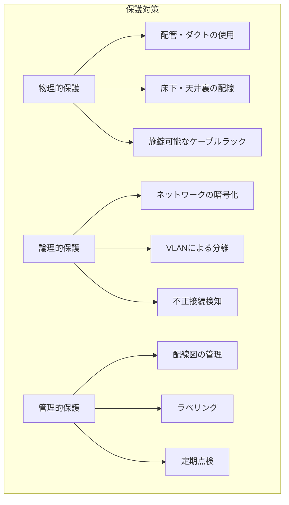

# A.7.12 ケーブル配線のセキュリティ

## 管理策の概要

| 項目 | 内容 |
|------|------|
| 管理策タイプ | 予防的 |
| 情報セキュリティ特性 | 機密性、可用性 |
| サイバーセキュリティ概念 | 防御 |
| 運用能力 | 物理的セキュリティ |
| セキュリティドメイン | 保護 |

## 目的

電力供給およびデータ伝送用のケーブルを、傍受、妨害、損傷から保護します。ケーブル配線の適切な管理により、通信の機密性と可用性を確保します。

## 実施のポイント

### ケーブルの種類と脅威

| ケーブル種類 | 主な脅威 | 影響 |
|-------------|----------|------|
| 電源ケーブル | 切断、過負荷 | 電源喪失、火災 |
| LANケーブル | 傍受、切断 | 情報漏洩、通信断 |
| 光ファイバー | 切断、曲げ | 通信断 |
| 電話線 | 傍受、切断 | 盗聴、通信断 |

### 配線の保護対策



### 配線設計のポイント

| 項目 | 推奨事項 |
|------|----------|
| 電源と通信の分離 | 電源ケーブルと通信ケーブルは別経路で配線 |
| 配管の使用 | 露出配線を避け、配管・ダクトで保護 |
| アクセス制限 | 配線経路（天井裏、床下）へのアクセスを制限 |
| 冗長化 | 重要な通信回線は異なる経路で冗長化 |
| ラベリング | すべてのケーブルに識別ラベルを付与 |

### 傍受対策

- **物理的対策**: 配管、シールドケーブル、光ファイバーの使用
- **論理的対策**: 通信の暗号化（TLS、IPsec等）
- **監視**: 不正な接続や盗聴デバイスの検知

## 実装例

### ケーブル配線基準

```yaml
ケーブル配線基準:

  一般原則:
    - 電源ケーブルと通信ケーブルは30cm以上離す
    - 露出配線は原則禁止（配管・モールを使用）
    - すべてのケーブルにラベルを付与

  サーバールーム:
    配線方式: 床下配線（OAフロア）
    電源: 専用配線、二重化
    通信: カテゴリ6A以上、光ファイバー推奨
    整線: ケーブルマネジメントアームを使用

  オフィスエリア:
    配線方式: 天井裏配線 + フロアコンセント
    電源: OAタップ使用、たこ足配線禁止
    通信: 壁面コンセント、未使用ポートはブランクカバー

  会議室:
    配線方式: 壁面・床面コンセント
    通信: 有線LAN + 無線AP
    映像: HDMI、会議システム専用配線
```

### ケーブルラベリング規則

| 対象 | ラベル形式 | 例 |
|------|----------|-----|
| 電源ケーブル | PWR-[場所]-[番号] | PWR-SVR-001 |
| LANケーブル | LAN-[場所]-[番号] | LAN-SVR-001 |
| 光ファイバー | FIB-[場所]-[番号] | FIB-SVR-001 |
| 電話線 | TEL-[内線番号] | TEL-1234 |

### 配線点検チェックリスト

| チェック項目 | 確認内容 | 結果 |
|------------|----------|------|
| ラベル | すべてのケーブルにラベルがあるか | □ |
| 損傷 | ケーブルに損傷・劣化がないか | □ |
| 整線 | ケーブルが整理されているか | □ |
| 配管 | 配管・モールに破損がないか | □ |
| 分離 | 電源と通信が適切に分離されているか | □ |
| 未使用ポート | 未使用のポートにカバーがあるか | □ |
| 配線図 | 配線図が最新の状態か | □ |

### 配線図管理

```yaml
配線図管理:

  管理対象:
    - サーバールーム配線図
    - オフィス配線図（フロアごと）
    - ネットワーク構成図

  管理方法:
    保管場所: 社内ファイルサーバー（機密区分: 社外秘）
    更新契機: 配線変更時、年次棚卸時
    承認: インフラ部長

  機密管理:
    - 外部への持出禁止
    - 印刷物は使用後シュレッダー処理
    - 外部業者への開示は最小限
```

## 関連する管理策

- [A.7.8 装置の設置及び保護](/controls/a-7-8) - 装置の物理的保護
- [A.7.11 サポートユーティリティ](/controls/a-7-11) - 電源・空調の保護
- [A.8.20 ネットワークのセキュリティ](/controls/a-8-20) - ネットワーク全体の保護

## 参考情報

- JIS X 5150（構内情報配線システム）
- データセンター配線規格（TIA-942）
