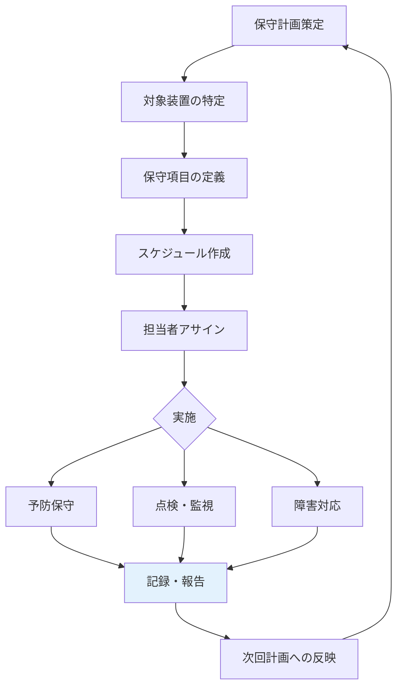

# A.7.13 装置の保守

## 管理策の概要

| 項目 | 内容 |
|------|------|
| 管理策タイプ | 予防的 |
| 情報セキュリティ特性 | 機密性、完全性、可用性 |
| サイバーセキュリティ概念 | 防御 |
| 運用能力 | 物理的セキュリティ、資産管理 |
| セキュリティドメイン | 保護、レジリエンス |

## 目的

装置を正しく保守し、可用性、完全性を確保します。適切な保守により、装置の故障を予防し、障害発生時の迅速な復旧を可能にします。

## 実施のポイント

### 保守の種類

| 保守種類 | 目的 | 頻度 |
|----------|------|------|
| 予防保守 | 故障の予防、性能維持 | 定期的（月次、年次等） |
| 是正保守 | 故障の修復 | 故障発生時 |
| 適応保守 | 環境変化への対応 | 必要時 |
| 完全化保守 | 性能改善、機能追加 | 計画的 |

### 保守計画の策定



### 保守作業時のセキュリティ

| 項目 | 対策 |
|------|------|
| データ保護 | 保守前にバックアップ、機密データへのアクセス制限 |
| アクセス管理 | 保守担当者の身元確認、作業範囲の制限 |
| 立会い | 外部業者の作業には社員が立会い |
| 記録 | 作業内容、変更点を詳細に記録 |
| 検証 | 保守後の動作確認、セキュリティ設定の確認 |

### 外部保守業者の管理

- **契約**: 秘密保持契約（NDA）の締結
- **身元確認**: 作業者の身分証明書確認
- **立会い**: 作業中は必ず社員が立会い
- **記録**: 作業報告書の提出を義務付け
- **検証**: 作業後のセキュリティチェック

## 実装例

### 保守管理台帳

| 装置名 | 資産番号 | 設置場所 | 保守契約 | 次回保守予定 | 担当 |
|--------|----------|----------|----------|--------------|------|
| メインサーバー1 | SVR-001 | サーバールーム | ○（ベンダーA） | 2025-04 | インフラ部 |
| メインサーバー2 | SVR-002 | サーバールーム | ○（ベンダーA） | 2025-04 | インフラ部 |
| UTM | UTM-001 | サーバールーム | ○（ベンダーB） | 2025-06 | インフラ部 |
| 複合機 | PRT-001 | 執務室 | ○（リース会社） | 毎月点検 | 総務部 |
| UPS | UPS-001 | サーバールーム | ○（ベンダーC） | 2025-07 | インフラ部 |

### 定期保守チェックリスト（サーバー）

| カテゴリ | チェック項目 | 結果 | 備考 |
|----------|------------|------|------|
| **ハードウェア** | ファン動作音に異常はないか | □ | |
| | LED表示に異常はないか | □ | |
| | 温度は正常範囲か | □ | |
| | ケーブル接続に緩みはないか | □ | |
| **ストレージ** | ディスク使用率は正常か | □ | |
| | RAID状態は正常か | □ | |
| | S.M.A.R.T.エラーはないか | □ | |
| **ソフトウェア** | OSパッチは最新か | □ | |
| | ファームウェアは最新か | □ | |
| | ログにエラーはないか | □ | |
| **バックアップ** | バックアップは正常に完了しているか | □ | |
| | リストアテストを実施したか | □ | |

### 保守作業報告書

```yaml
保守作業報告書:

  基本情報:
    作業日: 2025-01-27
    対象装置: メインサーバー1（SVR-001）
    作業種別: 定期予防保守
    作業者: ベンダーA 技術者 佐藤
    立会者: インフラ部 山田

  作業内容:
    - ハードウェア点検（ファン、電源、ケーブル）
    - ファームウェア更新（v2.1 → v2.2）
    - ログ確認、不要ログの削除
    - 動作確認テスト

  発見事項:
    - ファンユニット1に軽微な異音（経過観察）
    - ディスク使用率75%（増設検討を推奨）

  交換部品:
    なし

  次回推奨作業:
    - ファンユニットの交換検討（6ヶ月後）
    - ストレージ増設の検討

  添付資料:
    - 点検チェックリスト
    - ファームウェア更新ログ
```

### 保守契約管理

```yaml
保守契約管理:

  契約種別:
    フルメンテナンス:
      対象: サーバー、UTM
      内容: 部品代、技術料込み、24時間対応
      費用: 年間契約

    スポット保守:
      対象: クライアントPC、周辺機器
      内容: 都度依頼、部品代別途
      費用: 作業ごと

  連絡先:
    ベンダーA（サーバー）:
      電話: 0120-XXX-XXX
      受付: 24時間365日
      SLA: 4時間以内にオンサイト

    ベンダーB（ネットワーク）:
      電話: 03-XXXX-XXXX
      受付: 平日9:00-18:00
      SLA: 翌営業日対応

  契約更新:
    - 契約満了3ヶ月前にレビュー
    - 費用対効果の検証
    - 代替ベンダーの検討
```

## 関連する管理策

- [A.7.8 装置の設置及び保護](/controls/a-7-8) - 装置の物理的保護
- [A.7.14 装置のセキュリティを保った処分又は再利用](/controls/a-7-14) - 装置の処分
- [A.5.19 供給者関係における情報セキュリティ](/controls/a-5-19) - 外部業者管理
- [A.8.32 変更管理](/controls/a-8-32) - 変更の管理

## 参考情報

- ITIL（ITサービスマネジメント）の保守管理プラクティス
- メーカー推奨の保守手順・スケジュール
