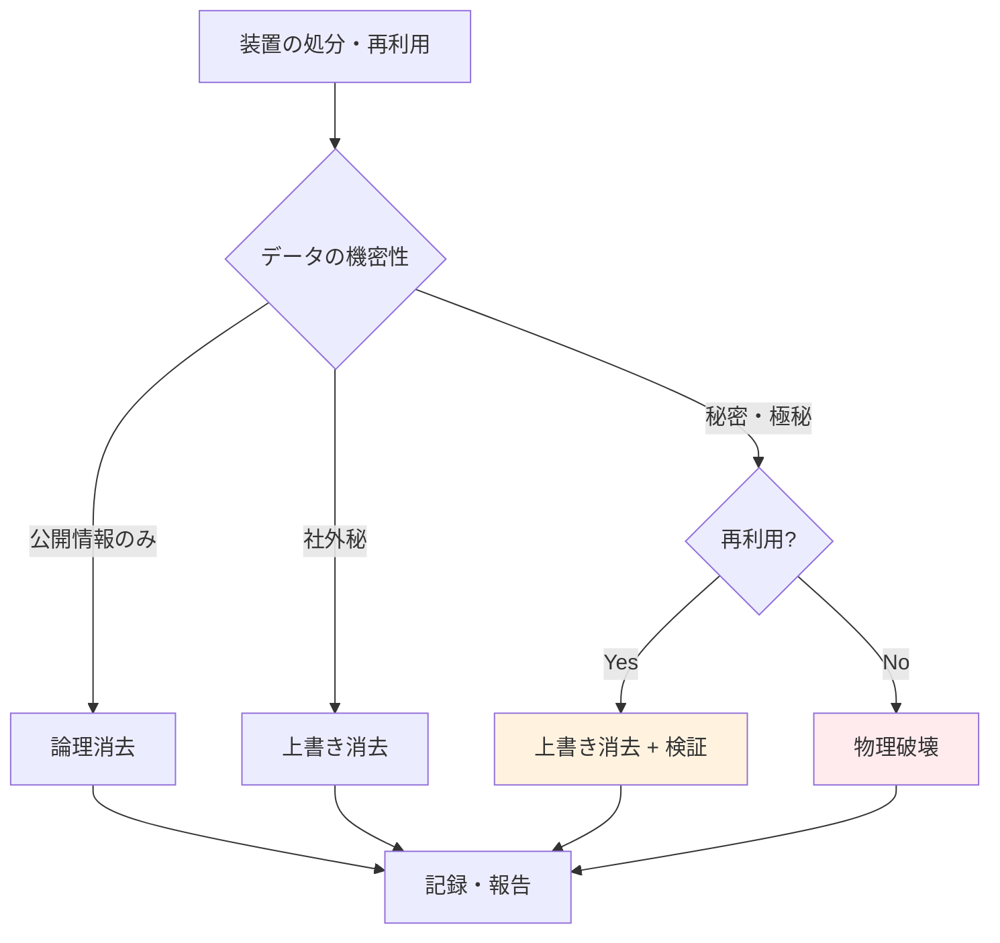

# A.7.14 装置のセキュリティを保った処分又は再利用

## 管理策の概要

| 項目 | 内容 |
|------|------|
| 管理策タイプ | 予防的 |
| 情報セキュリティ特性 | 機密性 |
| サイバーセキュリティ概念 | 防御 |
| 運用能力 | 物理的セキュリティ、資産管理 |
| セキュリティドメイン | 保護 |

## 目的

記憶媒体を含む装置が、処分または再利用される前に、すべての機密データおよびライセンスソフトウェアが消去または上書きされていることを確認します。これにより、処分・再利用後の情報漏洩リスクを防止します。

## 実施のポイント

### データ消去の方法

| 方法 | 概要 | 適用場面 | セキュリティレベル |
|------|------|----------|------------------|
| 論理消去 | ファイル削除、フォーマット | 復元可能、非推奨 | 低 |
| 上書き消去 | ランダムデータで複数回上書き | 再利用時 | 中 |
| 暗号化消去 | 暗号化後に鍵を破棄 | SSD、暗号化対応機器 | 高 |
| 物理破壊 | 破砕、磁気消去 | 廃棄時、最高機密 | 最高 |

### 消去レベルの選択



### 処分・再利用フロー

1. **申請**: 装置の処分・再利用を申請
2. **データ確認**: 保存データの機密レベルを確認
3. **バックアップ**: 必要なデータをバックアップ
4. **消去実施**: 適切な方法でデータ消去
5. **検証**: 消去の完全性を検証
6. **記録**: 処分・再利用記録を作成
7. **処理**: 再利用または廃棄業者へ引渡し

### 外部委託時の注意

外部業者に処分を委託する場合：

- **業者選定**: 信頼できる認定業者を選定
- **契約**: 秘密保持契約、処理方法の明記
- **立会い**: 可能であれば処分に立会い
- **証明書**: 処分証明書の取得

## 実装例

### データ消去基準

```yaml
データ消去基準:

  機密レベル別:
    公開:
      方法: 論理消去（フォーマット）
      回数: 1回
      検証: 不要

    社外秘:
      方法: 上書き消去
      回数: 1回（ランダムデータ）
      検証: サンプリング検証

    秘密:
      方法: 上書き消去
      回数: 3回（DoD方式）
      検証: 全数検証

    極秘:
      方法: 物理破壊
      回数: -
      検証: 破壊証明書

  媒体別:
    HDD:
      再利用: 上書き消去（NIST SP 800-88準拠）
      廃棄: 物理破壊（破砕またはデガウス）

    SSD:
      再利用: 暗号化消去（Secure Erase）
      廃棄: 物理破壊

    USBメモリ:
      再利用: 上書き消去
      廃棄: 物理破壊

    光学メディア:
      廃棄のみ: シュレッダー処理

    紙:
      廃棄のみ: クロスカットシュレッダー
```

### 装置処分申請書

```yaml
装置処分申請書:

  申請情報:
    申請日: 2025-01-27
    申請者: インフラ部 山田太郎

  対象装置:
    装置名: 開発サーバー
    資産番号: SVR-010
    設置場所: サーバールーム
    取得日: 2020-04-01
    処分理由: リース満了、性能不足

  データ情報:
    保存データ: 開発環境、テストデータ
    機密レベル: 秘密
    バックアップ: 完了（2025-01-25）

  処分方法:
    種別: 廃棄
    消去方法: 上書き消去（3回）+ 物理破壊
    委託業者: 株式会社データ消去サービス

  承認:
    上長: 佐藤部長（承認済）
    情報セキュリティ担当: 田中（承認済）
```

### データ消去記録

| 項目 | 内容 |
|------|------|
| 実施日 | 2025-01-28 |
| 対象装置 | 開発サーバー（SVR-010） |
| 消去方法 | 上書き消去（DoD 5220.22-M方式、3回） |
| 使用ツール | DBAN（Darik's Boot and Nuke） |
| 実施者 | インフラ部 山田太郎 |
| 検証方法 | サンプルセクターの読み取り確認 |
| 検証結果 | 正常完了（データ復元不可を確認） |
| 立会者 | インフラ部 鈴木一郎 |

### 処分証明書

```
データ消去・機器処分証明書

証明書番号: DISP-2025-0127

下記の機器について、データ消去および処分を完了したことを証明します。

対象機器:
  品名: サーバー
  型番: Dell PowerEdge R640
  シリアル: XXXXXXX
  資産番号: SVR-010

処分内容:
  データ消去: 上書き消去（3回）実施済
  物理処分: HDD破砕処理

処分日: 2025-01-30
処分業者: 株式会社データ消去サービス
担当者: 処分太郎

（業者印）
```

### 再利用時チェックリスト

| チェック項目 | 確認内容 | 結果 |
|------------|----------|------|
| データ消去 | 適切な方法で消去されたか | □ |
| 消去検証 | 消去の完全性を検証したか | □ |
| ライセンス | ソフトウェアライセンスを解除したか | □ |
| 資産登録 | 資産台帳を更新したか | □ |
| ラベル | 旧所有者情報のラベルを除去したか | □ |
| 初期化 | 工場出荷状態に初期化したか | □ |
| 記録 | 再利用記録を作成したか | □ |

## 関連する管理策

- [A.7.13 装置の保守](/controls/a-7-13) - 装置のライフサイクル管理
- [A.5.9 情報及びその他の関連資産の目録](/controls/a-5-9) - 資産管理
- [A.8.10 情報の削除](/controls/a-8-10) - データの削除

## 参考情報

- NIST SP 800-88（媒体のサニタイズに関するガイドライン）
- JIS Q 27002:2024（情報セキュリティ管理策）
- 個人情報保護委員会ガイドライン（安全管理措置）
