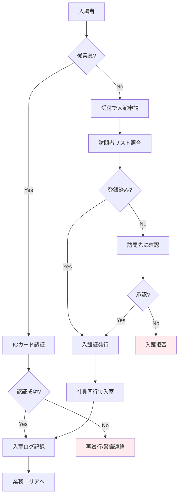

# A.7.2 物理的入退

## 管理策の概要

| 項目 | 内容 |
|------|------|
| 管理策タイプ | 予防的 |
| 情報セキュリティ特性 | 機密性、完全性、可用性 |
| サイバーセキュリティ概念 | 防御 |
| 運用能力 | 物理的セキュリティ、アイデンティティ・アクセス管理 |
| セキュリティドメイン | 保護 |

## 目的

セキュリティを保つべき領域への物理的なアクセスを、適切な入退管理策によって許可された者のみに制限します。入退管理により、不正アクセスの防止、入退記録の保持、緊急時の在館者把握を実現します。

## 実施のポイント

### 認証方式の選択

セキュリティレベルに応じて、適切な認証方式を選択します。

| 認証方式 | 特徴 | 適用場面 |
|----------|------|----------|
| ICカード | 導入コストが低い、紛失リスクあり | 業務エリア |
| 暗証番号（PIN） | 覚えていれば使える、盗み見リスク | 補助的に使用 |
| 生体認証（指紋） | なりすまし困難、コスト中程度 | 高セキュリティエリア |
| 生体認証（顔・虹彩） | 高精度、コスト高 | 最高セキュリティエリア |
| 多要素認証 | 複数方式の組み合わせ | サーバールーム等 |

### 入退室フロー



### 訪問者管理

訪問者の入退管理には以下の手順を適用します。

1. **事前登録**: 訪問予定者の情報を事前に登録
2. **受付手続き**: 本人確認、訪問先確認、入館証発行
3. **同行ルール**: 訪問者は常に社員が同行
4. **行動範囲制限**: 訪問目的に必要なエリアのみアクセス可
5. **退館確認**: 入館証回収、退館時刻記録

### ログの記録と保存

| 記録項目 | 内容 |
|----------|------|
| 日時 | 入退室の日時（秒単位） |
| 人物 | 従業員ID または 訪問者名 |
| 場所 | 入退したエリア・扉 |
| 方法 | 使用した認証方式 |
| 結果 | 成功/失敗 |

**保存期間**: 1年以上（法規制・契約要件に応じて延長）

## 実装例

### 入退室管理規則（例）

```yaml
入退室管理規則:

  従業員:
    認証方式: ICカード（社員証）
    有効時間: 24時間（時間外は別途申請）
    失敗時対応: 3回失敗でカード一時停止、警備に連絡

  訪問者:
    事前登録: 必須（訪問日の前日まで）
    入館証: 使い捨て式、有効期限1日
    同行: 必須（高セキュリティエリアは立入禁止）

  高セキュリティエリア:
    対象: サーバールーム、金庫室
    認証方式: ICカード + 指紋認証
    入室可能者: 事前申請・承認を受けた者のみ
    入室ルール: 原則2名以上で入室

  緊急時:
    避難経路: 内側からのみ開放可能
    在館者確認: 入退室ログから自動集計
```

### 入退室記録テンプレート

| 日時 | 従業員ID/訪問者名 | エリア | 方向 | 認証方式 | 結果 |
|------|-----------------|--------|------|----------|------|
| 2025-01-26 09:00:15 | EMP001 | 本社8F | 入 | ICカード | 成功 |
| 2025-01-26 09:05:30 | 山田太郎（訪問者） | 会議室A | 入 | 入館証 | 成功 |
| 2025-01-26 09:10:45 | EMP002 | サーバールーム | 入 | ICカード+指紋 | 成功 |

## 関連する管理策

- [A.7.1 物理的セキュリティ境界](/controls/a-7-1) - 境界の定義
- [A.7.4 物理的セキュリティの監視](/controls/a-7-4) - 監視との連携
- [A.5.15 アクセス制御](/controls/a-5-15) - 論理的アクセス制御との整合

## 参考情報

- [仮想組織の設定 - 入退室管理](/templates/virtual-organization#入退室管理) - 具体的な管理方式の例
