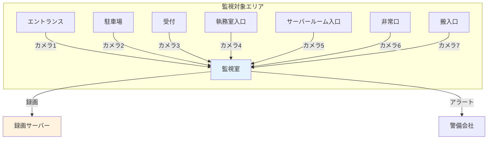
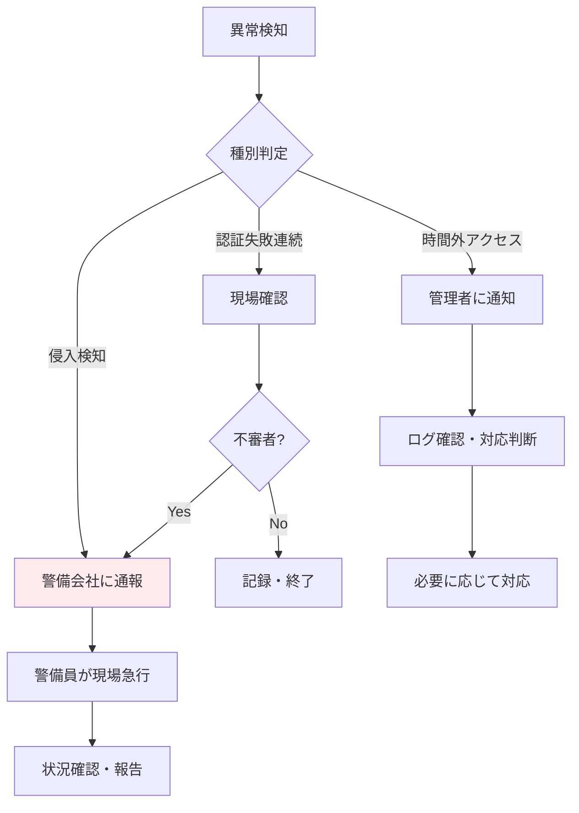

# A.7.4 物理的セキュリティの監視

## 管理策の概要

| 項目 | 内容 |
|------|------|
| 管理策タイプ | 検知的 |
| 情報セキュリティ特性 | 機密性、完全性、可用性 |
| サイバーセキュリティ概念 | 検知 |
| 運用能力 | 物理的セキュリティ |
| セキュリティドメイン | 防御 |

## 目的

施設を継続的に監視し、不正な物理的アクセスを検知します。監視により、インシデントの早期発見、証拠の記録、抑止効果を実現します。

## 実施のポイント

### 監視手段の選択

| 監視手段 | 用途 | 特徴 |
|----------|------|------|
| 監視カメラ（CCTV） | 映像記録、リアルタイム監視 | 証拠として有効、死角に注意 |
| 侵入検知センサー | 不正侵入の検知 | 窓・扉の開閉、動体検知 |
| 警備員巡回 | 目視確認、即時対応 | 人的コスト、カバー範囲に限界 |
| 入退室ログ | 入退記録の自動取得 | 後からの追跡に有効 |

### 監視カメラの配置



### 監視記録の管理

| 項目 | 要件 |
|------|------|
| 録画品質 | 人物が識別できる解像度 |
| 保存期間 | 最低30日間（法規制に応じて延長） |
| アクセス制限 | 管理者のみ閲覧可能 |
| バックアップ | 定期的なバックアップ、冗長化 |
| プライバシー | 撮影範囲の明示、従業員への通知 |

### アラート対応

不正アクセスを検知した場合の対応フローを定義します。



## 実装例

### 監視設備一覧表（例）

| 設置場所 | 機器種別 | 機能 | 録画保存期間 |
|----------|----------|------|--------------|
| エントランス | ドーム型カメラ | 常時録画、動体検知 | 90日 |
| 駐車場 | 屋外型カメラ | 常時録画、夜間赤外線 | 30日 |
| 受付 | ドーム型カメラ | 常時録画 | 90日 |
| サーバールーム入口 | 固定型カメラ | 常時録画、動体検知アラート | 180日 |
| 非常口 | 固定型カメラ | 開閉検知連動録画 | 90日 |
| 執務室 | なし | プライバシー配慮 | - |

### 巡回点検表

| 点検時刻 | 点検場所 | 点検項目 | 結果 | 点検者 |
|----------|----------|----------|------|--------|
| 09:00 | エントランス | 施錠状態、異常の有無 | 異常なし | 山田 |
| 09:10 | 各フロア | 窓の施錠、不審物の有無 | 異常なし | 山田 |
| 09:20 | サーバールーム | 扉の施錠、温度確認 | 異常なし | 山田 |
| 21:00 | 全館 | 退勤確認、施錠確認 | 異常なし | 鈴木 |

### 監視運用ルール

```yaml
監視運用ルール:

  録画管理:
    保存期間:
      通常エリア: 30日
      高セキュリティエリア: 180日
      インシデント関連: 無期限（調査終了まで）
    アクセス権限:
      閲覧: 総務部長、セキュリティ担当者
      エクスポート: 総務部長承認が必要

  アラート対応:
    侵入検知:
      - 即座に警備会社へ通報
      - 管理者へ連絡
      - 現場確認後、報告書作成
    認証失敗:
      - 3回連続失敗で担当者に通知
      - 本人確認後、必要に応じてカード再発行

  プライバシー配慮:
    - 執務室内にはカメラを設置しない
    - 撮影エリアを従業員に周知
    - 録画データは業務目的のみに使用
```

## 関連する管理策

- [A.7.1 物理的セキュリティ境界](/controls/a-7-1) - 監視対象となる境界
- [A.7.2 物理的入退](/controls/a-7-2) - 入退室ログとの連携
- [A.5.24 情報セキュリティインシデント管理の計画及び準備](/controls/a-5-24) - インシデント対応

## 参考情報

- 個人情報保護法に基づくカメラ設置・運用のガイドライン
- [仮想組織の設定](/templates/virtual-organization) - 監視体制の参考
