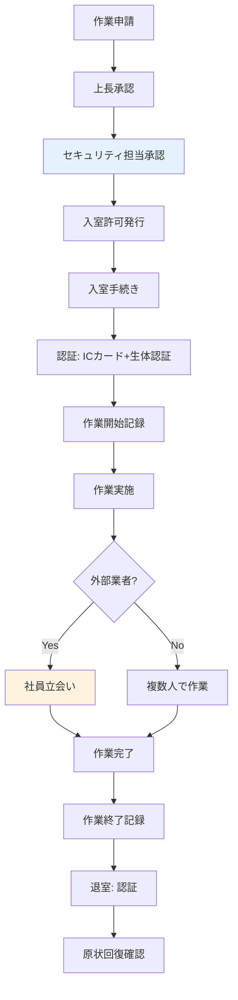

# A.7.6 セキュリティを保つべき領域での作業

## 管理策の概要

| 項目 | 内容 |
|------|------|
| 管理策タイプ | 予防的 |
| 情報セキュリティ特性 | 機密性、完全性、可用性 |
| サイバーセキュリティ概念 | 防御 |
| 運用能力 | 物理的セキュリティ |
| セキュリティドメイン | 保護 |

## 目的

セキュリティを保つべき領域での作業に関するセキュリティ対策を設計し、実装します。高セキュリティエリアでの作業は、不正行為や情報漏洩のリスクが高まるため、厳格なルールに基づいて管理します。

## 実施のポイント

### 高セキュリティエリアの定義

高セキュリティエリアとは、以下のような領域を指します。

- サーバールーム・データセンター
- 金庫室・機密書類保管庫
- 研究開発エリア
- 経営幹部執務室
- 重要なネットワーク機器設置場所

### 作業ルールの策定

| ルール | 内容 |
|--------|------|
| 複数人作業 | 原則2名以上で入室・作業（相互監視） |
| 事前申請 | 作業内容・時間・担当者を事前に申請・承認 |
| 作業記録 | 作業開始・終了時刻、作業内容を記録 |
| 持込制限 | 許可されていない機器・記録媒体の持込禁止 |
| 撮影禁止 | カメラ・スマートフォンでの撮影禁止 |
| 立会い | 外部業者の作業には社員が立会い |

### 入退室手順



### 禁止事項

以下の行為は厳禁とします。

1. **単独作業**（緊急時を除く）
2. **許可のない機器の持込み**（私物PC、USBメモリ等）
3. **撮影・録音**（許可なき場合）
4. **作業範囲外へのアクセス**
5. **作業記録の未記入**
6. **扉の開放放置**

## 実装例

### セキュリティエリア作業申請書

```yaml
セキュリティエリア作業申請:

  申請者情報:
    氏名: 山田太郎
    所属: インフラ部
    社員番号: EMP001

  作業情報:
    対象エリア: サーバールーム
    作業日時: 2025-01-27 10:00 - 12:00
    作業内容: サーバー定期メンテナンス
    作業者:
      - 山田太郎（主担当）
      - 鈴木一郎（副担当）

  持込機器:
    - 作業用ノートPC（資産番号: PC-0123）
    - USBメモリ（資産番号: USB-0045）

  承認:
    上長: 佐藤部長（承認済）
    セキュリティ担当: 田中（承認済）
```

### 作業記録テンプレート

| 項目 | 記録内容 |
|------|----------|
| 作業日 | 2025-01-27 |
| 作業エリア | サーバールーム |
| 入室時刻 | 10:05 |
| 退室時刻 | 11:45 |
| 作業者 | 山田太郎、鈴木一郎 |
| 作業内容 | サーバー3台の定期メンテナンス（パッチ適用） |
| 持込機器 | 作業用PC（PC-0123）、USBメモリ（USB-0045） |
| 持出機器 | なし |
| 特記事項 | サーバーAのファン異音を確認、次回交換予定 |
| 確認者署名 | 鈴木一郎 |

### 外部業者立会いルール

```yaml
外部業者立会いルール:

  事前準備:
    - 秘密保持契約（NDA）の締結確認
    - 作業内容・範囲の明確化
    - 立会い担当者のアサイン

  入館時:
    - 本人確認（身分証明書）
    - 入館証の発行
    - 持込機器の確認・記録

  作業中:
    - 社員が常時立会い（離席禁止）
    - 作業範囲外へのアクセス禁止
    - 撮影・録音の禁止

  退館時:
    - 作業完了確認
    - 持出物の確認
    - 入館証の回収
    - 作業報告書の受領
```

## 関連する管理策

- [A.7.1 物理的セキュリティ境界](/controls/a-7-1) - 高セキュリティエリアの定義
- [A.7.2 物理的入退](/controls/a-7-2) - 入退室管理
- [A.5.19 供給者関係における情報セキュリティ](/controls/#a-5-19) - 外部業者管理

## 参考情報

- [仮想組織の設定 - セキュリティゾーン](/templates/virtual-organization#セキュリティゾーン) - ゾーン区分の参考
