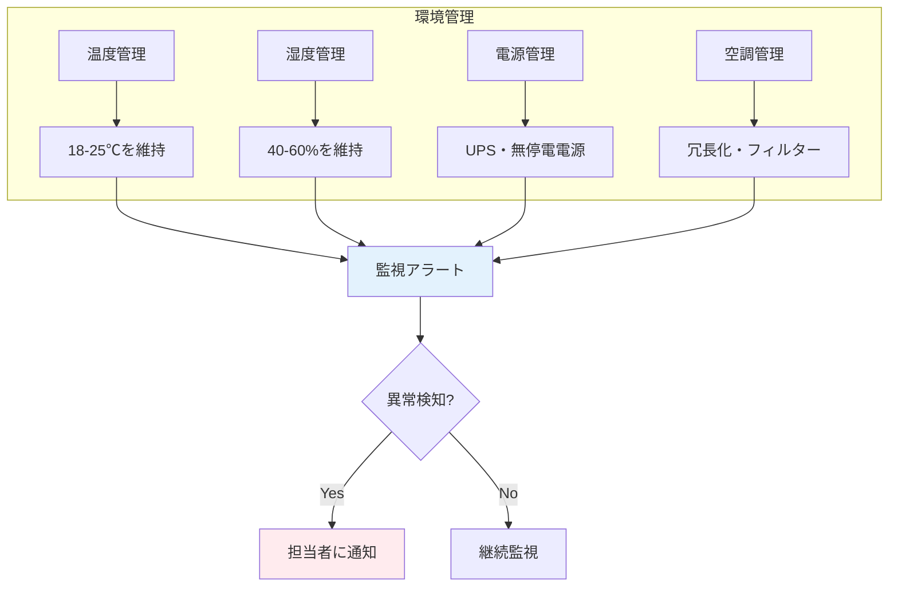

# A.7.8 装置の設置及び保護

## 管理策の概要

| 項目 | 内容 |
|------|------|
| 管理策タイプ | 予防的 |
| 情報セキュリティ特性 | 機密性、完全性、可用性 |
| サイバーセキュリティ概念 | 防御 |
| 運用能力 | 物理的セキュリティ、資産管理 |
| セキュリティドメイン | 保護 |

## 目的

装置を環境上の脅威やハザード、および不正アクセスの機会から保護するために、装置をセキュアに設置し、保護します。適切な設置と保護により、装置の故障、データ損失、業務中断のリスクを低減します。

## 実施のポイント

### 設置場所の選定

装置の設置場所は、以下の脅威を考慮して選定します。

| 脅威 | 対策 |
|------|------|
| 不正アクセス | 施錠可能な部屋、入退室管理 |
| 水害 | 地下・1階を避ける、配管から離す |
| 火災 | 消火設備の近く、可燃物から離す |
| 落雷 | 避雷設備、サージ保護 |
| 地震 | 耐震ラック、転倒防止 |
| 盗難 | セキュリティワイヤー、監視カメラ |

### 環境条件の管理

サーバー・ネットワーク機器には適切な環境条件が必要です。



| 項目 | 推奨値 | 警告値 |
|------|--------|--------|
| 温度 | 18-25℃ | 28℃以上または15℃以下 |
| 湿度 | 40-60% | 70%以上または30%以下 |
| 電源電圧 | 100V ±10% | 規定外 |

### 物理的保護

| 保護対象 | 保護方法 |
|----------|----------|
| サーバー | 施錠可能なラック、耐震固定 |
| ネットワーク機器 | 施錠可能なラック、ケーブルロック |
| PC・ノートPC | セキュリティワイヤー、施錠保管 |
| 外付けHDD・USBメモリ | 施錠保管、暗号化 |
| 複合機・プリンタ | セキュアプリント機能 |

### 電源保護

- **UPS（無停電電源装置）**: 停電時の安全なシャットダウン時間を確保
- **サージプロテクタ**: 落雷・電圧変動からの保護
- **非常用電源**: 長時間停電への対応（自家発電等）

## 実装例

### サーバールーム設備要件

```yaml
サーバールーム設備要件:

  物理的保護:
    入退室管理: ICカード + 生体認証
    ラック: 施錠可能、耐震固定
    監視カメラ: 24時間録画

  環境管理:
    空調:
      冗長化: あり（N+1構成）
      温度設定: 22℃
      湿度設定: 50%
    監視:
      温湿度センサー: 各ラック設置
      アラート閾値:
        温度: 28℃以上
        湿度: 65%以上

  電源管理:
    UPS:
      容量: サーバー負荷の30分以上
      定期点検: 年1回
    サージプロテクタ: 全コンセントに設置
    非常用電源: 自家発電設備（燃料8時間分）

  消火設備:
    種別: ガス消火設備（二酸化炭素）
    連動: 火災報知機と連動
```

### 装置設置チェックリスト

| カテゴリ | チェック項目 | 結果 |
|----------|------------|------|
| **設置場所** | 施錠可能な部屋に設置しているか | □ |
| | 水回り（配管、窓）から離れているか | □ |
| | 直射日光が当たらないか | □ |
| **固定** | ラックに耐震固定されているか | □ |
| | ケーブルが整理されているか | □ |
| | 転倒防止措置があるか | □ |
| **環境** | 空調が適切に稼働しているか | □ |
| | 温湿度が適正範囲か | □ |
| | 監視センサーが設置されているか | □ |
| **電源** | UPSに接続されているか | □ |
| | サージプロテクタを使用しているか | □ |
| | 電源容量に余裕があるか | □ |
| **アクセス** | 不要なポート・インターフェースが無効化されているか | □ |
| | 管理コンソールへのアクセスが制限されているか | □ |

### 端末セキュリティワイヤー運用

```yaml
セキュリティワイヤー運用:

  対象機器:
    - デスクトップPC（全台）
    - ノートPC（オフィス使用時）
    - モニター（盗難リスクのある場所）

  運用ルール:
    - 退勤時は必ずワイヤーで固定
    - 鍵は各自で管理（紛失時は総務に届出）
    - 会議室への持出時も固定

  点検:
    - 月次で固定状況を確認
    - ワイヤーの劣化チェック
```

## 関連する管理策

- [A.7.1 物理的セキュリティ境界](/controls/a-7-1) - 設置場所の境界
- [A.7.12 ケーブル配線のセキュリティ](/controls/a-7-12) - ケーブルの保護
- [A.7.13 装置の保守](/controls/a-7-13) - 装置の維持管理
- [A.8.1 利用者エンドポイント機器](/controls/a-8-1) - エンドポイント管理

## 参考情報

- JIS Q 27002:2024（情報セキュリティ管理策）
- データセンター設計・運用のベストプラクティス
