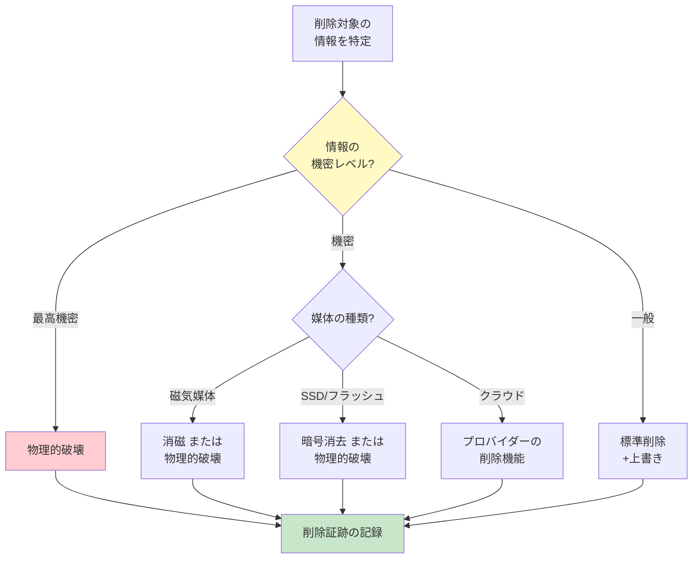

# A.8.10 情報の削除

## 管理策の概要

| 項目 | 内容 |
|------|------|
| 管理策タイプ | 予防的 |
| 情報セキュリティ特性 | 機密性 |
| サイバーセキュリティ概念 | 防御 |
| 運用能力 | 情報保護、法令遵守 |
| セキュリティドメイン | 保護 |

> **2022年版で新規追加された管理策**

## 目的

機密情報の不要な露出を防止し、情報削除に関する法的・規制・契約上の要件を遵守します。

## 実施のポイント

### 情報削除のライフサイクル


### 1. 削除に関する基本原則

機密情報は必要以上に長く保持すべきではありません。不要な保持は情報漏えいリスクを高めます。

#### 削除時の考慮事項

| 考慮事項 | 内容 |
|----------|------|
| 削除方法の選択 | 業務要件と関連法規制に基づき、電子的上書きや暗号消去などの方法を選択 |
| 削除結果の記録 | 削除実施の証跡として結果を記録 |
| 外部委託時の証跡 | 情報削除サービス事業者を利用する場合は、削除の証拠を取得 |

### 2. 削除方法

#### 方法の種類と特徴

| 方法 | 説明 | 適用場面 |
|------|------|----------|
| 電子的上書き | データを複数回上書きして復元不能にする | HDD、SSD |
| 暗号消去 | 暗号化キーを破棄してデータを読取不能にする | 暗号化済みストレージ |
| 消磁（Degaussing） | 強力な磁場でデータを消去 | 磁気記録媒体 |
| 物理的破壊 | 記憶媒体を物理的に破壊 | 最も確実な方法 |
| 工場出荷時リセット | デバイスを初期状態に戻す | スマートフォン等 |

#### 削除方法選択のフローチャート



### 3. 特定環境での削除

#### システム・アプリケーションでの削除設定

- 保持期間経過後に自動的に情報を安全に破棄するようシステムを設定
- 古いバージョン、コピー、一時ファイルを適切な場所すべてで削除
- 承認された安全な削除ソフトウェアを使用し、専門的な復元ツールでも復元不可能にする

#### クラウドサービスでの削除

| ステップ | 内容 |
|----------|------|
| 1. 方法の確認 | クラウドサービスプロバイダーの削除方法が許容可能か確認 |
| 2. 削除の実行 | プロバイダーの削除機能を使用、または削除を依頼 |
| 3. 自動化 | 可能な場合は個別方針に従って削除プロセスを自動化 |
| 4. 検証 | 削除プロセスが実行されたことをログで追跡・確認 |

#### 機器返却・修理時の対応

ベンダーへの機器返却時には、以下の対応を行います。

- 補助記憶装置（HDDなど）の取り外し
- メモリの取り外しまたはデータ消去
- 機密情報が組織の敷地から出る前に保護

### 4. 削除記録の重要性

情報削除の公式記録は、情報漏えい事象の原因分析において有用です。

#### 削除記録テンプレート

```yaml
情報削除記録:
  基本情報:
    削除ID: DEL-2026-001
    削除実施日: 2026-01-13
    実施者: 情報管理担当者
    承認者: 情報セキュリティ管理者
  
  対象情報:
    情報種別: 顧客個人情報
    保存場所: ファイルサーバー /data/customers/2020/
    データ量: 約50GB
    保持期間満了日: 2025-12-31
  
  削除方法:
    手法: 3回上書き（DoD 5220.22-M準拠）
    使用ツール: SecureErase Pro v3.2
  
  検証:
    検証方法: 復元ツールによる確認
    検証結果: 復元不可を確認
    検証者: ITセキュリティチーム
  
  証跡:
    削除ログファイル: /logs/deletion/DEL-2026-001.log
    証明書: 添付
```

## 実践ガイド

### 第三者との契約における削除要件

組織の情報を第三者が保管している場合は、以下を契約に含めることを検討します。

- サービス期間中の情報削除要件
- サービス終了時の情報削除要件
- 削除の証跡提供義務
- 削除の検証権限

### データ保持ポリシーとの整合

情報削除は、組織のデータ保持に関する個別方針と整合させる必要があります。

#### 保持期間設定の考慮事項

- 法的・規制要件（税法、労働法など）
- 業務上の必要性
- 契約上の義務
- 訴訟ホールドの可能性

## 関連する管理策

- [A.5.12 情報の分類](/controls/#a-5-12) - 削除方法選択の基準となる分類
- [A.7.14 装置の安全な処分または再利用](/controls/#a-7-14) - 物理的な記憶媒体の破壊
- [A.8.10 データマスキング](/controls/a-8-11) - 削除の代替としてのマスキング

## 参考情報

- ISO/IEC 27017 - クラウドサービスにおけるユーザーデータ削除に関する情報
- ISO/IEC 27555 - PII削除に関する情報
- NIST SP 800-88 - メディアサニタイゼーションガイドライン
