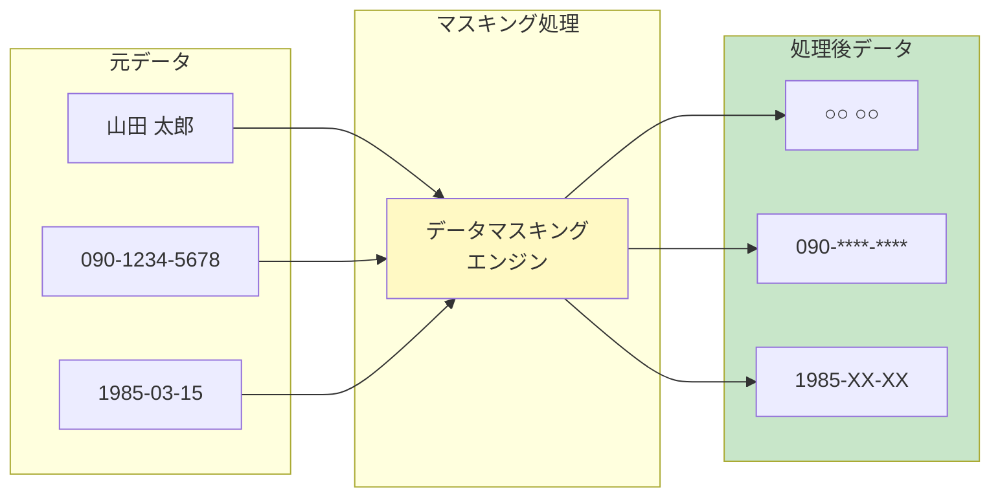
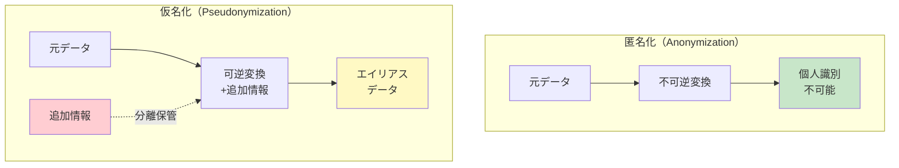
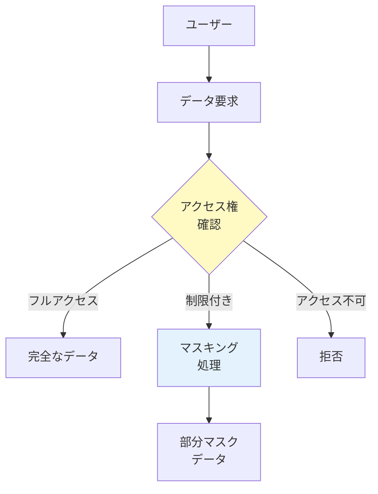

# A.8.11 データマスキング

## 管理策の概要

| 項目 | 内容 |
|------|------|
| 管理策タイプ | 予防的 |
| 情報セキュリティ特性 | 機密性 |
| サイバーセキュリティ概念 | 防御 |
| 運用能力 | 情報保護 |
| セキュリティドメイン | 保護 |

> **2022年版で新規追加された管理策**

## 目的

個人情報（PII）を含む機密データの露出を制限し、法的・規制・契約上の要件を遵守します。

## 実施のポイント

### データマスキングの概念

データマスキングとは、機密データ項目を隠蔽、置換、または難読化するための一連の技術です。



### 主要なマスキング技術

#### 技術の種類と特徴

| 技術 | 説明 | 可逆性 | 用途例 |
|------|------|:------:|--------|
| **匿名化** | PIIを不可逆的に変更し、個人を直接・間接的に識別不能にする | 不可逆 | 統計データ公開 |
| **仮名化** | 識別情報をエイリアスに置換 | 可逆 | 研究用データ |
| **暗号化** | 認可されたユーザーのみ鍵でアクセス可能 | 可逆 | 保存データ保護 |
| **ナリング/削除** | 文字を削除・置換して完全なメッセージを見せない | 不可逆 | 画面表示 |
| **数値・日付の変動** | 値を一定範囲で変動させる | 不可逆 | テストデータ |
| **置換** | 一つの値を別の値に置換して機密データを隠す | 不可逆 | 開発環境 |
| **ハッシュ化** | 値をハッシュ値に変換 | 不可逆 | 参照整合性維持 |

#### 匿名化 vs 仮名化



**重要**: 仮名化では、変換に使用したアルゴリズム（「追加情報」）を分離して保護する必要があります。

### データマスキングの種類

| 種類 | 説明 | 適用場面 |
|------|------|----------|
| **静的マスキング** | 元のデータベースでデータ項目をマスク | 本番データの複製作成 |
| **動的マスキング** | 自動化とルールを使用してリアルタイムでデータを保護 | アプリケーション表示 |
| **オンザフライマスキング** | アプリケーションのメモリ内でデータをマスク | 一時的な処理 |

### 実装時の考慮事項

#### アクセス制御との組み合わせ



#### マスキング設計の原則

- **最小限のデータ表示**: すべてのユーザーに全データへのアクセスを許可せず、クエリとマスクを設計して必要最小限のデータのみ表示
- **レコード単位の難読化**: 一部のレコードについてはユーザーからデータを非表示にする仕組みを設計
- **難読化の難読化**: PII本人の要求により、データが難読化されていることも非表示にできる仕組み（医療施設での妊娠情報など）

#### 法的・規制要件への対応

| 要件例 | マスキング対応 |
|--------|---------------|
| PCI DSS | 決済カード情報の処理・保存時のマスキング |
| GDPR | 個人データの仮名化・匿名化 |
| 個人情報保護法 | 要配慮個人情報の適切な保護 |

### マスキング利用時の追加考慮事項

マスキング、仮名化、匿名化を使用する際は、以下を考慮します。

| 考慮事項 | 内容 |
|----------|------|
| 強度レベル | 処理されたデータの使用目的に応じた適切な強度 |
| アクセス制御 | 処理されたデータへのアクセス管理 |
| 利用制限 | 処理されたデータの使用に関する合意・制限 |
| 照合禁止 | 処理されたデータと他の情報との照合によるPII本人特定の禁止 |
| 追跡管理 | 処理されたデータの提供・受領の追跡 |

## 実践ガイド

### 間接的な識別リスク

匿名化を行う場合、直接的な識別情報を匿名化しても、他のデータとの組み合わせで個人が識別される可能性があることに注意が必要です。

#### 再識別リスクの例

```
匿名化後データ:
- 年齢: 45歳
- 職業: 大学教授
- 居住地域: 〇〇市△△区
- 専門分野: 量子物理学

→ これらの組み合わせで特定の個人を識別可能な場合あり
```

### ハッシュ化の注意点

PIIを匿名化するためにハッシュ関数を使用する場合、列挙攻撃を防ぐために常にソルト関数と組み合わせる必要があります。

### リソース識別子におけるPII

ファイル名やURL（Uniform Resource Locator）などのリソース識別子とその属性に含まれるPIIは、回避するか適切に匿名化する必要があります。

```
❌ 避けるべき例:
/documents/山田太郎_給与明細_202601.pdf
/users/090-1234-5678/profile

✅ 推奨される例:
/documents/emp_a1b2c3d4_payslip_202601.pdf
/users/usr_x7y8z9/profile
```

## 関連する管理策

- [A.5.12 情報の分類](/controls/#a-5-12) - マスキング対象データの特定
- [A.5.15 アクセス制御](/controls/#a-5-15) - マスキングとアクセス制御の組み合わせ
- [A.8.10 情報の削除](/controls/a-8-10) - マスキングの代替としての削除
- [A.8.33 テスト用情報](/controls/#a-8-33) - テストデータのマスキング

## 参考情報

- ISO/IEC 27018 - パブリッククラウドにおけるPII保護に関する追加管理策
- ISO/IEC 20889 - 匿名化技術に関する追加情報
