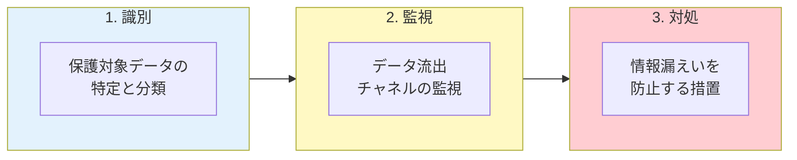
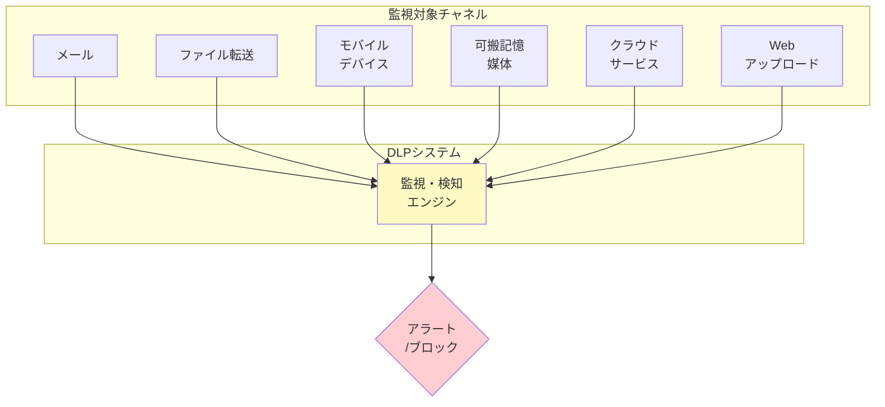
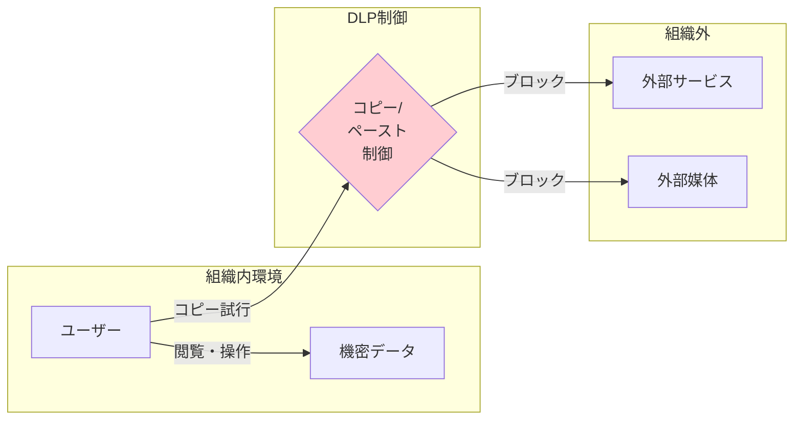
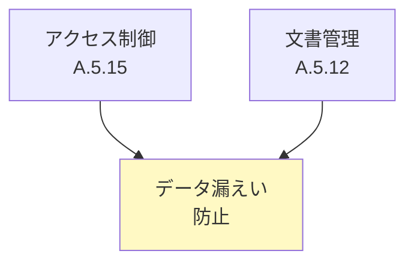

# A.8.12 データ漏えい防止

## 管理策の概要

| 項目 | 内容 |
|------|------|
| 管理策タイプ | 予防的、検知的 |
| 情報セキュリティ特性 | 機密性 |
| サイバーセキュリティ概念 | 防御、検知 |
| 運用能力 | 情報保護 |
| セキュリティドメイン | 保護、防御 |

> **2022年版で新規追加された管理策**

## 目的

個人またはシステムによる情報の不正な開示・抽出を検知し、防止します。

## 実施のポイント

### データ漏えい防止の3つのステップ



### 1. 保護対象の識別と分類

漏えいから保護すべき情報を特定・分類します。

#### 保護対象の例

| カテゴリ | 具体例 |
|----------|--------|
| 個人情報 | 顧客データ、従業員情報、マイナンバー |
| 営業秘密 | 価格モデル、顧客リスト、契約条件 |
| 知的財産 | 製品設計、ソースコード、研究データ |
| 財務情報 | 決算情報、予算計画、M&A情報 |

### 2. データ漏えいチャネルの監視



### 3. DLPツールの機能

データ漏えい防止ツールは以下の機能を提供します。

| 機能 | 説明 | 例 |
|------|------|-----|
| **識別** | 不正開示リスクのある機密情報を特定 | ユーザーシステム上の非構造化データ内の機密情報 |
| **検知** | 機密情報の開示を検出 | 信頼されていないクラウドサービスへのアップロード、メール送信 |
| **ブロック** | 機密情報を露出させるアクションをブロック | データベースエントリのスプレッドシートへのコピー防止 |

### コピー&ペーストの制限

組織外へのデータのコピー&ペーストやアップロードを制限する必要がある場合は、以下の技術の導入を検討します。



#### データエクスポートの管理

データのエクスポートが必要な場合は、データオーナーがエクスポートを承認し、ユーザーの行動に対する責任を明確にします。

### 画面キャプチャへの対応

スクリーンショットや画面の写真撮影については、以下の対策を組み合わせます。

| 対策 | 内容 |
|------|------|
| 利用規約 | 画面キャプチャの禁止を明記 |
| 教育・訓練 | リスクの周知と意識向上 |
| 監査 | 違反行為の検出と対応 |
| 技術的対策 | スクリーンショット機能の制限（可能な場合） |

### バックアップデータの保護

データをバックアップする際は、機密情報が以下の対策で保護されていることを確認します。

- 暗号化
- アクセス制御
- バックアップを保管する記憶媒体の物理的保護

## 高度な脅威への対応

### インテリジェンス活動への対策

データ漏えい防止は、機密情報・秘密情報を狙う敵対者のインテリジェンス活動からの保護も考慮する必要があります。

#### 対抗措置の例

| 手法 | 説明 |
|------|------|
| 偽情報の配置 | 本物の情報を偽情報に置き換え、敵対者の判断を混乱させる |
| リバースソーシャルエンジニアリング | 攻撃者に対して逆に情報収集を行う |
| ハニーポット | 攻撃者を誘引するための囮システム |

## 実践ガイド

### DLP導入時の法的考慮事項

DLPは本質的に従業員のコミュニケーションやオンライン活動の監視を伴います。導入前に以下の法的考慮事項を確認する必要があります。

| 領域 | 確認事項 |
|------|----------|
| プライバシー法 | 従業員のプライバシー権との調整 |
| データ保護法 | 監視データの取扱い |
| 労働法 | 監視の範囲と方法の適法性 |
| 通信傍受法 | データ・通信の傍受に関する規制 |

### 標準的なセキュリティ管理策との連携

DLPは、以下の標準的なセキュリティ管理策によってサポートされます。



### DLP実装のベストプラクティス

#### 段階的導入アプローチ

```yaml
フェーズ1_発見:
  期間: 1-2ヶ月
  活動:
    - 監視モードでDLPを導入
    - データフローの可視化
    - 誤検知率の測定
  
フェーズ2_調整:
  期間: 2-3ヶ月
  活動:
    - ポリシーの微調整
    - 誤検知の削減
    - ユーザー教育
  
フェーズ3_実施:
  期間: 継続
  活動:
    - ブロックモードの有効化
    - インシデント対応プロセスの運用
    - 定期的なポリシーレビュー
```

## 関連する管理策

- [A.5.12 情報の分類](/controls/#a-5-12) - 保護対象データの分類
- [A.5.15 アクセス制御](/controls/#a-5-15) - アクセス制御との連携
- [A.8.11 データマスキング](/controls/a-8-11) - データ保護の代替手段
- [A.8.16 監視活動](/controls/a-8-16) - セキュリティ監視との統合

## 参考情報

- DLPツールはデータの識別、データの使用と移動の監視、データ漏えいを防止するアクション（リスクのある行動についてユーザーに警告、可搬記憶媒体へのデータ転送のブロックなど）を行うよう設計されています。
