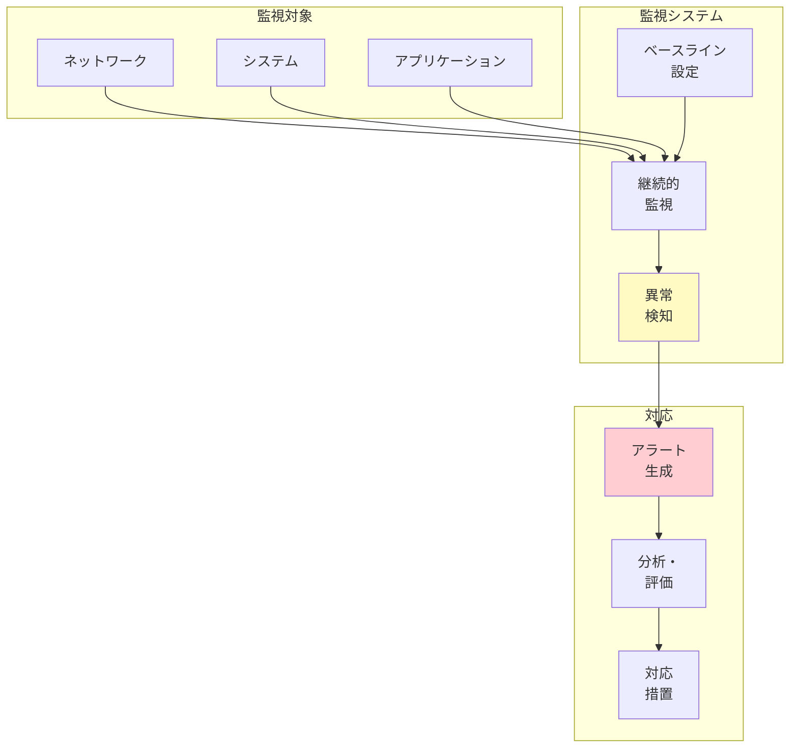
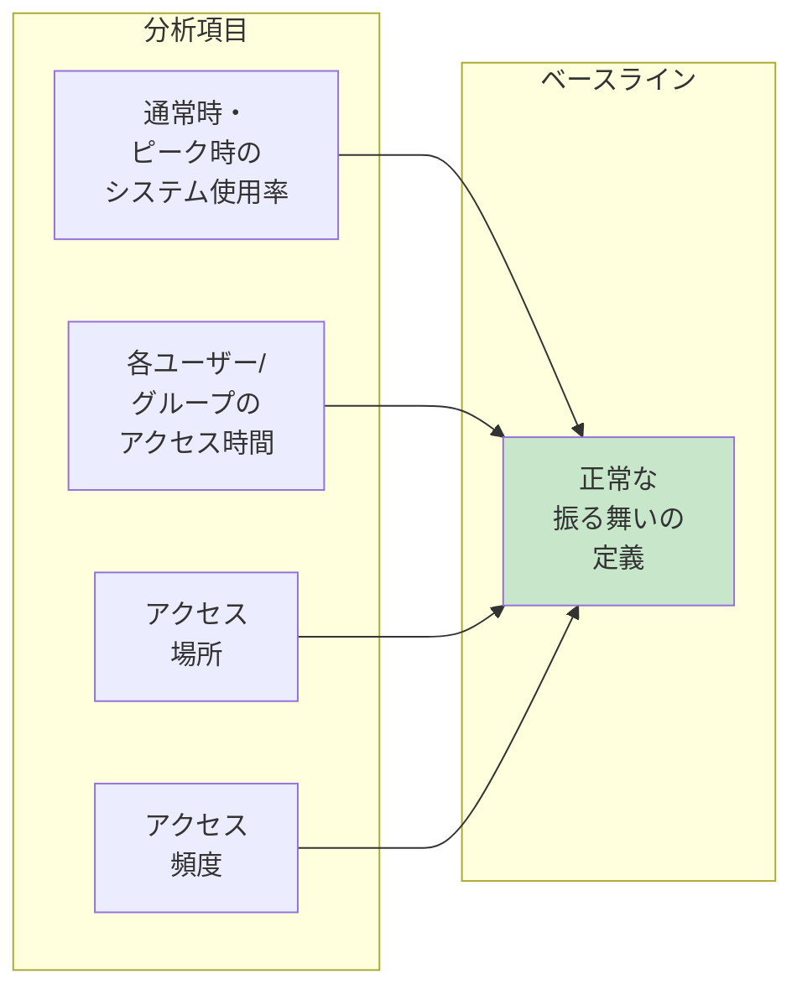
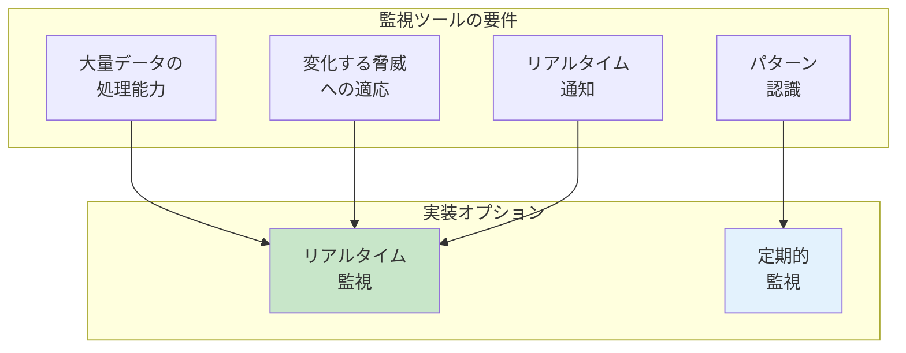
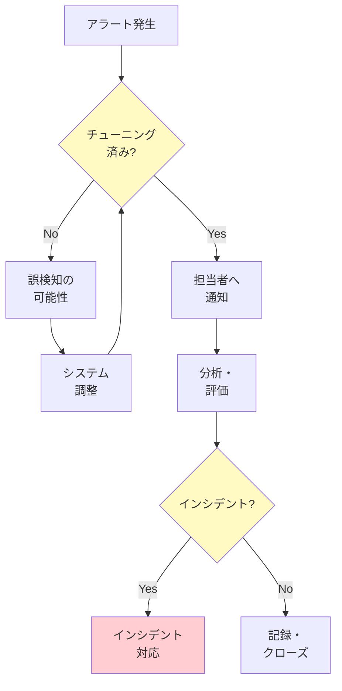

# A.8.16 監視活動

## 管理策の概要

| 項目 | 内容 |
|------|------|
| 管理策タイプ | 検知的、是正的 |
| 情報セキュリティ特性 | 機密性、完全性、可用性 |
| サイバーセキュリティ概念 | 検知、対応 |
| 運用能力 | 情報セキュリティ事象管理 |
| セキュリティドメイン | 防御 |

> **2022年版で新規追加された管理策**

## 目的

異常な振る舞いを検知し、潜在的な情報セキュリティインシデントを評価します。

## 実施のポイント

### 監視活動の全体像



### 1. 監視範囲の決定

監視の範囲とレベルは、業務および情報セキュリティ要件に従い、関連する法令・規制を考慮して決定します。

#### 監視システムに含めるべき項目

| カテゴリ | 監視項目 |
|----------|----------|
| **ネットワーク** | 送受信トラフィック |
| **アクセス** | システム、サーバー、ネットワーク機器、監視システム、重要アプリケーションへのアクセス |
| **構成** | 重要なシステム・ネットワーク構成ファイル |
| **セキュリティツール** | アンチウイルス、IDS、IPS、Webフィルター、ファイアウォール、DLPのログ |
| **イベント** | システムおよびネットワーク活動に関するイベントログ |
| **コード整合性** | 実行中のコードが承認されており、改ざんされていないことの確認 |
| **リソース使用** | CPU、ディスク、メモリ、帯域幅の使用状況とパフォーマンス |

### 2. ベースラインの確立

正常な振る舞いのベースラインを確立し、これに対して異常を監視します。

#### ベースライン設定時の考慮事項



### 3. 異常検知の設定

確立されたベースラインに対して、以下のような異常な振る舞いを識別するよう監視システムを設定します。

#### 検知すべき異常パターン

| カテゴリ | 異常パターン |
|----------|-------------|
| **プロセス異常** | プロセスやアプリケーションの予期しない終了 |
| **マルウェア関連** | マルウェアに典型的な活動、既知の悪意あるIPアドレス/ドメインからのトラフィック（ボットネットC&Cサーバー等） |
| **攻撃特性** | DoS攻撃、バッファオーバーフローなどの既知の攻撃特性 |
| **システム異常** | キーストロークロギング、プロセスインジェクション、標準プロトコルの逸脱 |
| **性能異常** | ネットワークキューイング、レイテンシレベル、ネットワークジッターなどのボトルネック・過負荷 |
| **不正アクセス** | システムや情報への不正アクセス（実際または試行） |
| **不正スキャン** | 業務アプリケーション、システム、ネットワークの不正スキャン |
| **リソースアクセス** | 保護されたリソース（DNSサーバー、Webポータル、ファイルシステム）へのアクセス成功/失敗 |
| **ユーザー行動** | 期待される振る舞いに対する異常なユーザー/システム行動 |

### 4. 監視ツールの要件



#### 監視ツールの機能要件

- 大量のデータを処理する能力
- 常に変化する脅威環境への適応
- リアルタイム通知の許可
- 特定のシグネチャ、データ、ネットワーク/アプリケーション行動パターンの認識

### 5. アラート管理

#### アラートシステムの設定

自動監視ソフトウェアは、事前定義されたしきい値に基づいてアラートを生成するよう設定します。

| アラート通知方法 | 用途 |
|-----------------|------|
| 管理コンソール | SOC担当者向けリアルタイム表示 |
| メール | 非緊急の通知 |
| インスタントメッセージ | 緊急時の即時通知 |
| SMS | 重大インシデントの緊急連絡 |

#### アラート対応体制



#### 重要な対応要件

- アラートへの対応に専任の担当者を配置
- 担当者は潜在的なインシデントを正確に解釈できるよう適切に訓練
- アラート通知を受信・対応するための冗長なシステムとプロセスを整備

### 6. 異常イベントの共有

異常イベントは、以下の活動を改善するために関係者に共有します。

- 監査
- セキュリティ評価
- 脆弱性スキャン
- 監視活動

## 実践ガイド

### 監視強化の手法

セキュリティ監視は以下の方法で強化できます。

| 手法 | 説明 |
|------|------|
| **脅威インテリジェンス** | [A.5.7 脅威インテリジェンス](/controls/a-5-7)との連携 |
| **機械学習・AI** | 異常検知の自動化と精度向上 |
| **ブロックリスト/許可リスト** | 既知の脅威/正常なアクセスの管理 |
| **技術的セキュリティ評価** | 脆弱性評価、ペネトレーションテスト、サイバー攻撃シミュレーション |
| **パフォーマンス監視** | 異常な振る舞いの確立と検知の支援 |
| **ログとの統合** | ログと監視システムの組み合わせ活用 |

### SIEM（セキュリティ情報イベント管理）

監視活動は、SIEMなどの専門ソフトウェアを使用して実施されることが多いです。

#### SIEM導入のポイント

```yaml
SIEM構成要素:
  ログ収集:
    - ネットワーク機器
    - サーバー
    - アプリケーション
    - セキュリティツール
  
  相関分析:
    - ルールベース検知
    - 異常検知
    - 機械学習
  
  アラート管理:
    - 優先度設定
    - エスカレーション
    - 自動対応
  
  レポーティング:
    - ダッシュボード
    - コンプライアンスレポート
    - インシデントレポート
```

### ボットネット検知

異常な通信の監視は、ボットネットの識別に役立ちます。

- ボットネット: ボットネット所有者の悪意ある制御下にあるデバイスの集合
- 用途: 他組織のコンピュータへの分散型サービス妨害（DDoS）攻撃など
- 検知方法: 感染デバイスとコントローラー間の通信を監視

### 監視記録の保持

監視記録は、定義された保持期間中、維持する必要があります。

| 考慮事項 | 内容 |
|----------|------|
| 法的要件 | 業界規制や法令で定められた保持期間 |
| フォレンジック | インシデント調査に必要な期間 |
| ベースライン更新 | トレンド分析と改善に必要なデータ |
| ストレージ | 保持期間に応じた適切な容量計画 |

## 関連する管理策

- [A.5.7 脅威インテリジェンス](/controls/a-5-7) - 脅威情報との連携
- [A.5.25 情報セキュリティ事象の評価と決定](/controls/#a-5-25) - 検知した事象の評価
- [A.5.26 情報セキュリティインシデントへの対応](/controls/#a-5-26) - 検知後の対応
- [A.8.15 ログ取得](/controls/#a-8-15) - 監視のためのログ基盤
- [A.8.12 データ漏えい防止](/controls/#a-8-12) - DLPツールとの統合

## 参考情報

- イベントログ取得は、自動監視システム（[A.8.16](/controls/#a-8-16)）の基盤を設定し、潜在的なセキュリティインシデントを示す可能性のあるアラートを生成できます。
- 監視活動は、侵入検知システムなどの専門ソフトウェアを使用して実施されることが多く、これらは正常で許容可能な期待されるシステムおよびネットワーク活動のベースラインに対して設定できます。
