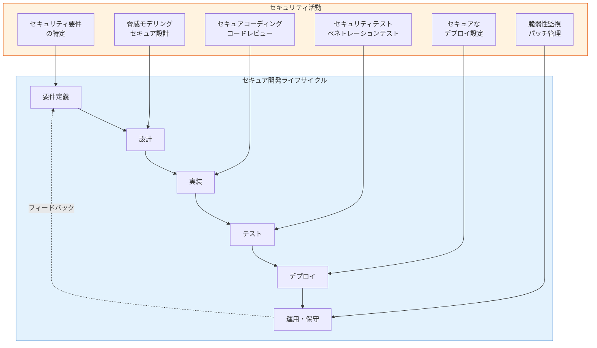
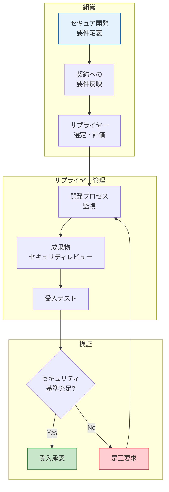

# A.8.25 セキュアな開発ライフサイクル

## 管理策の概要

| 項目 | 内容 |
|------|------|
| 管理策ID | A.8.25 |
| 管理策名称 | セキュアな開発ライフサイクル |
| 種別 | 技術的管理策 |
| 管理策タイプ | 予防的 |
| 情報セキュリティ特性 | 機密性、完全性、可用性 |
| サイバーセキュリティ概念 | 防御 |
| 運用能力 | アプリケーションセキュリティ、システム・ネットワークセキュリティ |
| セキュリティドメイン | 保護 |
| ISO/IEC 27001:2022 | 附属書A |

## 目的

ソフトウェアとシステムのセキュアな開発ライフサイクル全体を通じて、情報セキュリティが設計され実装されることを確実にする。

## 管理策

ソフトウェアとシステムのセキュアな開発のためのルールを確立し、適用すること。

## 実施のポイント

### セキュア開発の基本原則

セキュアな開発は、セキュアなサービス、アーキテクチャ、ソフトウェア、システムを構築するための必須要件です。



### セキュア開発で考慮すべき要素

以下の要素を考慮してセキュア開発を実現します。

```yaml
# セキュア開発フレームワーク
secure_development_framework:
  name: "組織セキュア開発基準"
  version: "2.0"
  
  # 1. 環境分離
  environment_separation:
    reference: "A.8.31"
    requirements:
      - development_environment: "開発環境"
      - test_environment: "テスト環境"
      - production_environment: "本番環境"
    isolation_method: "物理的または論理的分離"
    
  # 2. 開発ライフサイクルにおけるセキュリティ
  sdlc_security:
    methodology:
      reference: "A.8.28, A.8.27"
      includes:
        - "セキュア設計原則"
        - "脅威モデリング"
    coding_guidelines:
      reference: "A.8.28"
      per_language: true
      
  # 3. 要件・設計フェーズ
  requirements_design:
    reference: "A.5.8"
    activities:
      - "セキュリティ要件の特定"
      - "プロジェクトにおけるセキュリティチェックポイント"
      
  # 4. テスト
  testing:
    reference: "A.8.29"
    types:
      - "回帰テスト"
      - "コードスキャン（SAST/DAST）"
      - "ペネトレーションテスト"
      
  # 5. リポジトリとバージョン管理
  source_control:
    source_code:
      reference: "A.8.4"
    configuration:
      reference: "A.8.9"
    version_control:
      reference: "A.8.32"
      
  # 6. 開発者のスキル
  developer_skills:
    reference: "A.8.28"
    requirements:
      - "アプリケーションセキュリティの知識"
      - "セキュアコーディングトレーニング"
      - "脆弱性の予防・発見・修正能力"
      
  # 7. ライセンス管理
  licensing:
    reference: "A.5.32"
    considerations:
      - "費用対効果の高いソリューション"
      - "将来のライセンス問題の回避"
```

### 開発ライフサイクル全体でのセキュリティ統合

```mermaid
flowchart LR
    subgraph 計画
        P1[セキュリティ<br/>要件定義]
        P2[リスク<br/>アセスメント]
    end
    
    subgraph 設計
        D1[脅威<br/>モデリング]
        D2[セキュア<br/>アーキテクチャ]
    end
    
    subgraph 開発
        DEV1[セキュア<br/>コーディング]
        DEV2[コード<br/>レビュー]
    end
    
    subgraph テスト
        T1[SAST]
        T2[DAST]
        T3[ペネトレ<br/>テスト]
    end
    
    subgraph デプロイ
        DP1[セキュア<br/>構成]
        DP2[検証]
    end
    
    subgraph 運用
        O1[監視]
        O2[脆弱性<br/>対応]
    end
    
    P1 --> P2 --> D1 --> D2 --> DEV1 --> DEV2 --> T1 --> T2 --> T3 --> DP1 --> DP2 --> O1 --> O2
    
    style 計画 fill:#e8f5e9,stroke:#2e7d32
    style 設計 fill:#e3f2fd,stroke:#1565c0
    style 開発 fill:#fff3e0,stroke:#e65100
    style テスト fill:#fce4ec,stroke:#c2185b
    style デプロイ fill:#f3e5f5,stroke:#7b1fa2
    style 運用 fill:#e0f2f1,stroke:#00695c
```



## 実装例

### セキュリティチェックポイント定義

```yaml
# 各フェーズのセキュリティチェックポイント
security_checkpoints:
  # 要件定義フェーズ
  requirements_phase:
    checkpoint_name: "セキュリティ要件レビュー"
    timing: "要件定義完了時"
    activities:
      - "機密性・完全性・可用性要件の確認"
      - "認証・認可要件の定義"
      - "データ保護要件の特定"
      - "コンプライアンス要件の確認"
    deliverables:
      - "セキュリティ要件仕様書"
    gate_criteria:
      - "全てのセキュリティ要件が文書化されていること"
      - "リスクアセスメントが完了していること"
      
  # 設計フェーズ
  design_phase:
    checkpoint_name: "セキュア設計レビュー"
    timing: "詳細設計完了時"
    activities:
      - "脅威モデリングの実施"
      - "セキュリティアーキテクチャレビュー"
      - "暗号化方式の妥当性確認"
      - "認証フローの検証"
    deliverables:
      - "脅威モデル文書"
      - "セキュリティ設計書"
    gate_criteria:
      - "識別された脅威に対する対策が設計されていること"
      - "セキュリティアーキテクチャが承認されていること"
      
  # 実装フェーズ
  implementation_phase:
    checkpoint_name: "セキュアコードレビュー"
    timing: "実装完了時（継続的）"
    activities:
      - "静的コード解析（SAST）"
      - "ピアコードレビュー"
      - "依存関係の脆弱性スキャン"
    deliverables:
      - "コードレビュー記録"
      - "SAST結果レポート"
    gate_criteria:
      - "高・重大な脆弱性が解消されていること"
      - "コーディング規約が遵守されていること"
      
  # テストフェーズ
  test_phase:
    checkpoint_name: "セキュリティテストレビュー"
    timing: "テスト完了時"
    activities:
      - "動的アプリケーションテスト（DAST）"
      - "ペネトレーションテスト"
      - "脆弱性アセスメント"
    deliverables:
      - "セキュリティテスト結果報告書"
      - "脆弱性修正報告書"
    gate_criteria:
      - "重大な脆弱性が全て修正されていること"
      - "残存リスクが許容範囲内であること"
      
  # リリースフェーズ
  release_phase:
    checkpoint_name: "セキュリティリリース承認"
    timing: "本番リリース前"
    activities:
      - "本番環境のセキュリティ構成確認"
      - "インシデント対応準備の確認"
      - "監視設定の確認"
    deliverables:
      - "リリース承認書"
      - "運用移行チェックリスト"
    gate_criteria:
      - "全てのセキュリティテストに合格していること"
      - "運用チームへの引き継ぎが完了していること"
```

### セキュア開発ポリシー

```yaml
# セキュア開発ポリシー
secure_development_policy:
  scope: "全ての社内開発およびカスタム開発"
  
  # 必須要件
  mandatory_requirements:
    training:
      - "新規開発者: 入社後3ヶ月以内にセキュアコーディング研修受講"
      - "全開発者: 年次セキュリティ更新研修"
      
    code_review:
      - "全てのプルリクエストは最低1名の承認が必要"
      - "セキュリティに関わる変更は2名以上の承認が必要"
      
    testing:
      - "全てのリリースでSASTを実行"
      - "重要システムはペネトレーションテスト必須"
      
    documentation:
      - "セキュリティ設計の文書化"
      - "既知の脆弱性と対策の記録"
      
  # 禁止事項
  prohibited_practices:
    - "ハードコードされたパスワード・秘密鍵"
    - "未承認のコードサンプルの使用"
    - "認証のないウェブサービス呼び出し"
    - "本番データの開発・テスト環境での使用"
    
  # 外部委託開発
  outsourced_development:
    reference: "A.8.30"
    requirements:
      - "契約書にセキュア開発要件を明記"
      - "開発プロセスの監査権"
      - "成果物のセキュリティテスト実施"
```

### 開発者向けセキュリティガイドライン

```yaml
# 言語別セキュアコーディングガイドライン
secure_coding_guidelines:
  # 汎用ガイドライン
  general:
    input_validation:
      - "全ての入力は信頼できないものとして扱う"
      - "ホワイトリストベースの検証を優先"
      - "クライアントサイドの検証に依存しない"
      
    output_encoding:
      - "コンテキストに応じたエンコーディング"
      - "HTMLエンティティエスケープ"
      - "SQLパラメータ化クエリ"
      
    authentication:
      - "多要素認証の検討"
      - "セッション管理のベストプラクティス遵守"
      - "パスワードの安全なハッシュ化"
      
    authorization:
      - "最小権限の原則"
      - "サーバーサイドでの権限チェック"
      
    error_handling:
      - "エラーメッセージに機密情報を含めない"
      - "適切なログ記録"
      
    cryptography:
      - "承認されたアルゴリズムのみ使用"
      - "適切な鍵管理"
      
  # 言語固有
  java:
    - "PreparedStatementの使用"
    - "OWASPエンコーダーライブラリの活用"
    
  javascript:
    - "eval()の使用禁止"
    - "DOM操作時のサニタイズ"
    
  python:
    - "パラメータ化クエリの使用"
    - "pickleの信頼できないデータへの使用禁止"
```

## 外部委託開発時の考慮事項

開発が外部委託される場合、組織はサプライヤーが組織のセキュア開発ルールに準拠していることの保証を得る必要があります（A.8.30参照）。



## 関連する管理策

| 管理策ID | 管理策名称 | 関連性 |
|----------|-----------|--------|
| [A.5.8](/controls/a-5-8) | プロジェクトマネジメントにおける情報セキュリティ | プロジェクト計画段階でのセキュリティ |
| [A.8.4](/controls/#a-8-4) | ソースコードへのアクセス | ソースコードの保護 |
| [A.8.9](/controls/a-8-9) | 構成管理 | 構成のセキュリティ管理 |
| [A.8.27](/controls/#a-8-27) | セキュアなシステムアーキテクチャおよび構築の原則 | セキュア設計の原則 |
| [A.8.28](/controls/a-8-28) | セキュアコーディング | セキュアなコード実装 |
| [A.8.29](/controls/#a-8-29) | 開発および受入れにおけるセキュリティテスト | セキュリティテスト |
| [A.8.30](/controls/#a-8-30) | 外部委託による開発 | サプライヤー開発の管理 |
| [A.8.31](/controls/#a-8-31) | 開発、テスト、本番環境の分離 | 環境分離 |
| [A.8.32](/controls/#a-8-32) | 変更管理 | バージョン管理とセキュリティ |

## 参考情報

- ISO/IEC 27002:2022 8.25
- OWASP Software Assurance Maturity Model (SAMM)
- NIST SP 800-64 セキュリティ考慮事項
- Microsoft Security Development Lifecycle (SDL)
- BSIMM（Building Security In Maturity Model）
