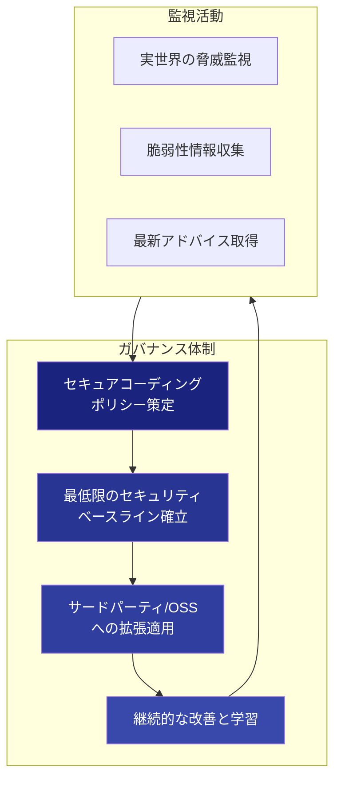
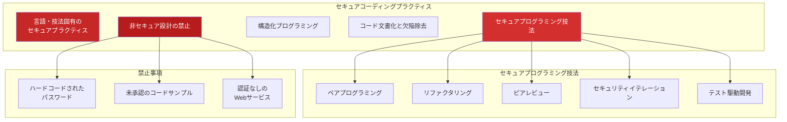
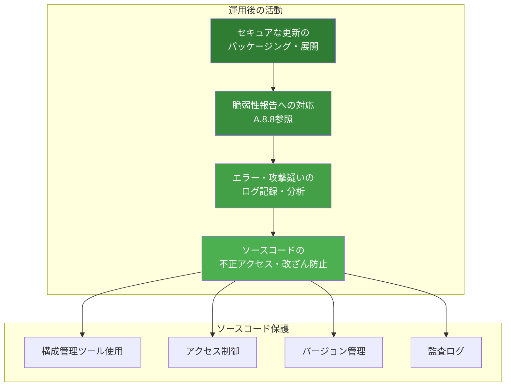

# A.8.28 セキュアコーディング

## 概要

| 項目 | 内容 |
|------|------|
| 管理策ID | A.8.28 |
| 管理策名称 | セキュアコーディング |
| 管理策タイプ | 予防的 |
| 情報セキュリティ特性 | 機密性、完全性、可用性 |
| サイバーセキュリティ概念 | 防御 |
| 運用機能 | アプリケーションセキュリティ、システム・ネットワークセキュリティ |
| セキュリティドメイン | 保護 |
| ISO/IEC 27002:2022 | 8.28 |
| 新規/変更 | **新規** |

## 目的

ソフトウェアがセキュアに書かれることを確保し、ソフトウェアにおける潜在的な情報セキュリティ脆弱性の数を削減する。

## 管理策

ソフトウェア開発にはセキュアコーディングの原則を適用しなければならない。

## 実施のポイント

### 1. 組織全体のガバナンス

組織は、セキュアコーディングの適切なガバナンスを提供するために、組織全体のプロセスを確立する必要があります。



### 2. セキュアコーディングのライフサイクル

```mermaid
flowchart LR
    subgraph PLAN["計画・準備フェーズ"]
        P1[組織固有の<br/>期待・原則定義]
        P2[過去の欠陥・<br/>脆弱性の学習]
        P3[開発ツールの<br/>セキュア設定]
        P4[開発者の<br/>資格・研修]
    end
    
    subgraph CODE["コーディングフェーズ"]
        C1[言語固有の<br/>セキュアプラクティス]
        C2[セキュア技法の<br/>適用]
        C3[コード文書化と<br/>欠陥除去]
        C4[非セキュアな<br/>設計の禁止]
    end
    
    subgraph TEST["テスト・レビューフェーズ"]
        T1[SAST実施]
        T2[攻撃面分析]
        T3[一般的なエラー<br/>の軽減確認]
    end
    
    subgraph MAINT["保守フェーズ"]
        M1[セキュアな更新]
        M2[脆弱性対応]
        M3[ログ分析と<br/>コード調整]
        M4[ソースコード保護]
    end
    
    PLAN --> CODE --> TEST --> MAINT
    
    style P1 fill:#0d47a1,color:#fff
    style C1 fill:#1565c0,color:#fff
    style T1 fill:#1976d2,color:#fff
    style M1 fill:#1e88e5,color:#fff
```



### 3. 計画・コーディング前の準備事項

セキュアコーディングの原則は、新規開発と再利用シナリオの両方で使用すべきです。

```yaml
secure_coding_prerequisites:
  organizational_principles:
    description: "組織固有のセキュアコーディング原則"
    applies_to:
      - 内部開発
      - 外部委託開発
    mandatory: true
    
  historical_defects:
    description: "過去の脆弱性に繋がるコーディング慣行・欠陥の学習"
    sources:
      - 過去のインシデント報告
      - 業界のCVEデータベース
      - OWASP Top 10
      - CWE/SANS Top 25
      
  development_tools:
    ide_configuration:
      description: "IDEをセキュアコード作成を強制するよう設定"
      examples:
        - セキュリティリンターの有効化
        - 静的解析プラグインの導入
        - コード品質ルールの設定
    tool_maintenance:
      description: "開発ツールの最新化"
      items:
        - コンパイラの更新
        - ビルドツールの更新
        - セキュリティスキャナーの更新
        
  developer_qualification:
    description: "開発者のセキュアコーディング資格"
    requirements:
      - セキュアコーディング研修の完了
      - 認定資格の取得（推奨）
      - 定期的なスキルアップデート
      
  secure_design:
    description: "セキュアな設計とアーキテクチャ"
    includes:
      - 脅威モデリング
      - セキュリティ要件の明確化
      - アーキテクチャレビュー
      
  coding_standards:
    description: "セキュアコーディング標準の使用義務化"
    examples:
      - CERT Coding Standards
      - OWASP Secure Coding Practices
      - 言語固有のガイドライン
      
  development_environment:
    description: "管理された開発環境の使用"
    requirements:
      - 本番環境からの分離
      - アクセス制御の実施
      - 構成管理の適用
```

### 4. コーディング中の考慮事項



### 5. 外部ライブラリ・コンポーネントの管理

```yaml
external_component_management:
  library_management:
    description: "外部ライブラリの管理"
    requirements:
      - インベントリの維持（ライブラリ名、バージョン）
      - リリースサイクルに合わせた定期更新
      - 脆弱性情報の監視
      - SBOM（Software Bill of Materials）の作成
      
  component_selection:
    criteria:
      - 十分に検証されたコンポーネントの選択
      - 認証・暗号化コンポーネントは特に慎重に
      - ライセンスの確認
      - セキュリティ履歴の確認
      - 評判の良いソースからの取得
      
  package_modification:
    when_required: true
    considerations:
      - 内蔵コントロール・整合性プロセスへの影響
      - ベンダー同意の取得
      - ベンダーからの標準アップデートとしての取得可能性
      - 将来の保守責任への影響
      - 他のソフトウェアとの互換性
      
  monitoring:
    vulnerability_tracking:
      sources:
        - NVD（National Vulnerability Database）
        - GitHub Security Advisories
        - Snyk、Dependabot等のツール
      frequency: 継続的
    update_policy:
      critical: 24時間以内
      high: 7日以内
      medium: 30日以内
      low: 次回リリース時
```

### 6. レビューと保守



### 7. 運用前の評価項目

```yaml
pre_deployment_evaluation:
  attack_surface:
    description: "攻撃面の評価"
    principle: "最小権限の原則"
    checks:
      - 不要なサービス・ポートの特定
      - 公開APIの最小化
      - 入力ポイントの列挙と保護確認
      
  common_errors:
    description: "一般的なプログラミングエラーの軽減確認"
    analysis:
      method: "最も一般的なプログラミングエラーの分析"
      documentation: "軽減措置の文書化"
      references:
        - OWASP Top 10
        - CWE Top 25
        - SANS Top 25
        
  sast_results:
    description: "静的アプリケーションセキュリティテスト結果"
    requirements:
      - 高・致命的な脆弱性がゼロ
      - 中程度の脆弱性に対する軽減計画
      - 誤検知の適切な除外
```

## 実装例

### セキュアコーディングチェックリスト

```yaml
secure_coding_checklist:
  # 入力検証
  input_validation:
    - id: SC-001
      check: "すべてのユーザー入力がサーバー側で検証されている"
      category: 入力検証
      severity: 高
      
    - id: SC-002
      check: "ホワイトリスト方式で入力が検証されている"
      category: 入力検証
      severity: 高
      
    - id: SC-003
      check: "入力長の制限が適用されている"
      category: 入力検証
      severity: 中
      
  # 出力エンコーディング
  output_encoding:
    - id: SC-004
      check: "HTMLコンテキストで適切にエスケープされている"
      category: 出力エンコーディング
      severity: 高
      
    - id: SC-005
      check: "SQLクエリでパラメータ化クエリを使用している"
      category: 出力エンコーディング
      severity: 致命的
      
  # 認証・セッション
  authentication:
    - id: SC-006
      check: "パスワードが安全にハッシュ化されている（bcrypt、Argon2等）"
      category: 認証
      severity: 致命的
      
    - id: SC-007
      check: "セッションIDが適切に生成・管理されている"
      category: セッション管理
      severity: 高
      
  # アクセス制御
  access_control:
    - id: SC-008
      check: "すべてのリソースアクセスで認可チェックが行われている"
      category: アクセス制御
      severity: 致命的
      
  # エラー処理
  error_handling:
    - id: SC-009
      check: "エラーメッセージが機密情報を漏洩しない"
      category: エラー処理
      severity: 中
      
    - id: SC-010
      check: "例外が適切にキャッチ・処理されている"
      category: エラー処理
      severity: 中
      
  # 暗号化
  cryptography:
    - id: SC-011
      check: "承認された暗号アルゴリズムのみ使用している"
      category: 暗号化
      severity: 高
      
    - id: SC-012
      check: "暗号鍵がコード内にハードコードされていない"
      category: 暗号化
      severity: 致命的
```

### 言語別セキュアコーディングガイドライン例

```yaml
language_specific_guidelines:
  java:
    framework: "OWASP Java Security Guidelines"
    key_points:
      - "PreparedStatementを使用してSQLインジェクションを防止"
      - "シリアライズ時のセキュリティ考慮"
      - "セキュリティマネージャーの適切な使用"
      - "入力検証にBean Validationを活用"
    prohibited:
      - "Runtime.exec()の直接使用"
      - "MD5、SHA-1の暗号用途での使用"
      - "デフォルトの信頼ストアへの依存"
      
  python:
    framework: "PEP 506, OWASP Python Security"
    key_points:
      - "パラメータ化クエリの使用（SQLAlchemy等）"
      - "pickleの信頼できないソースでの使用禁止"
      - "secrets モジュールを暗号学的乱数に使用"
      - "入力検証ライブラリの活用"
    prohibited:
      - "eval()、exec()のユーザー入力での使用"
      - "shell=True でのsubprocess使用"
      - "assert文でのセキュリティチェック"
      
  javascript:
    framework: "OWASP NodeJS Security"
    key_points:
      - "コンテンツセキュリティポリシー（CSP）の実装"
      - "DOMベースXSSの防止"
      - "依存関係の定期的な監査（npm audit）"
      - "strict modeの使用"
    prohibited:
      - "eval()の使用"
      - "innerHTML での未サニタイズ入力の使用"
      - "document.write()の使用"
```

### コードレビューチェックポイント

```yaml
code_review_checkpoints:
  security_review:
    reviewer_qualification:
      - セキュアコーディング研修修了
      - 開発言語への精通
      - セキュリティ脆弱性への理解
      
    review_scope:
      - 入力検証ロジック
      - 認証・認可処理
      - セッション管理
      - 暗号化実装
      - エラー処理
      - ログ出力
      
    automated_checks:
      sast_tools:
        - SonarQube
        - Checkmarx
        - Fortify
        - Semgrep
      dependency_check:
        - OWASP Dependency-Check
        - Snyk
        - npm audit / pip audit
        
    documentation:
      required:
        - レビュー実施日
        - レビュアー名
        - 発見事項
        - 是正措置
        - 承認状態
```

## 関連する管理策

| 管理策ID | 管理策名称 | 関連性 |
|----------|------------|--------|
| [A.8.25](/controls/a-8-25) | セキュアな開発ライフサイクル | SDLCにおけるセキュアコーディングの位置づけ |
| [A.8.26](/controls/#a-8-26) | アプリケーションセキュリティ要件 | 実装すべきセキュリティ要件の定義 |
| [A.8.27](/controls/#a-8-27) | セキュアなシステムアーキテクチャと設計原則 | コーディング前のセキュア設計 |
| [A.8.29](/controls/#a-8-29) | 開発及び受入れにおけるセキュリティテスト | コーディング後のセキュリティ検証 |
| [A.8.4](/controls/#a-8-4) | ソースコードへのアクセス | ソースコードの保護 |
| [A.8.8](/controls/a-8-8) | 技術的脆弱性の管理 | 報告された脆弱性への対応 |
| [A.8.9](/controls/a-8-9) | 構成管理 | 開発ツールとライブラリの構成管理 |

## 参考情報

- ISO/IEC 27002:2022 8.28 Secure coding
- OWASP Secure Coding Practices Quick Reference Guide
- CERT Secure Coding Standards
- CWE/SANS Top 25 Most Dangerous Software Errors
- ISO/IEC 15408 (Common Criteria)
