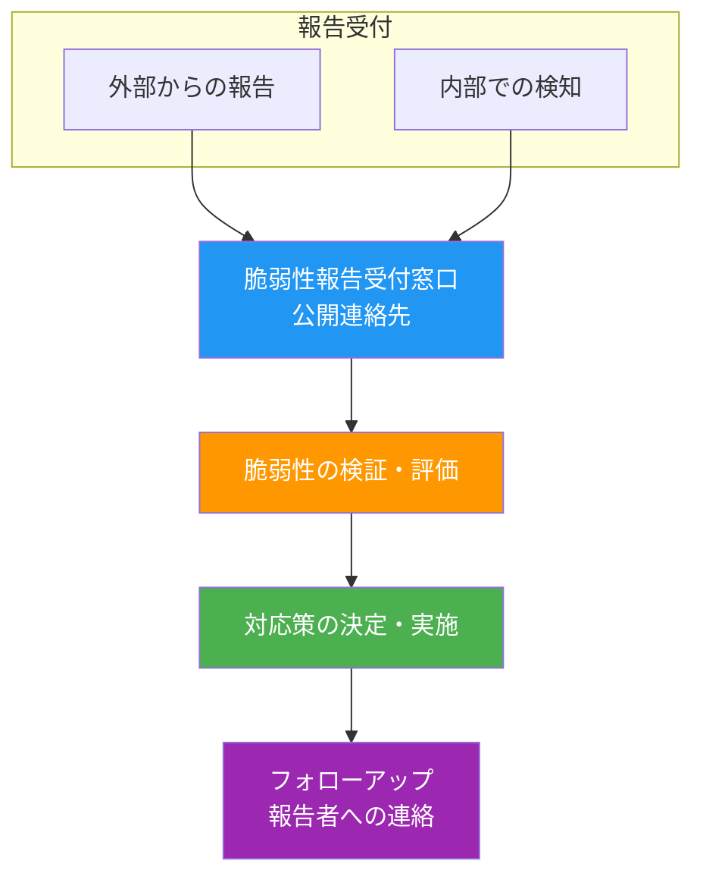

# A.8.8 技術的脆弱性の管理

## 管理策の概要

| 項目 | 内容 |
|------|------|
| 管理策タイプ | 予防的 |
| 情報セキュリティ特性 | 機密性、完全性、可用性 |
| サイバーセキュリティ概念 | 識別、保護 |
| 運用能力 | 脅威・脆弱性管理 |
| セキュリティドメイン | ガバナンス・エコシステム、保護、防御 |

## 目的

使用中の情報システムの技術的脆弱性に関する情報を取得し、そのような脆弱性に対する組織のエクスポージャーを評価し、適切な措置を講じることで、技術的脆弱性の悪用を防止します。

## 実施のポイント

### 前提条件：正確な資産台帳

効果的な技術的脆弱性管理の前提として、正確な資産台帳（A.5.9〜A.5.14参照）が必要です。この台帳には以下の情報を含める必要があります。

| 項目 | 内容 |
|------|------|
| ソフトウェアベンダー | 製品の提供元 |
| ソフトウェア名 | 製品の正式名称 |
| バージョン番号 | 使用中のバージョン |
| 展開状況 | どのシステムにインストールされているか |
| 担当者 | ソフトウェアの責任者 |

### 技術的脆弱性の特定

脆弱性を特定するために、組織は以下を考慮する必要があります。

#### 1. 役割と責任の定義

技術的脆弱性管理に関連する役割と責任を定義・確立します。

- 脆弱性の監視
- 脆弱性リスク評価
- 更新プログラムの適用
- 資産の追跡
- 必要な調整

#### 2. 情報源の特定と維持

資産台帳に基づき、関連する技術的脆弱性を特定し、それらに関する認識を維持するための情報源を特定します。新しい情報源が見つかった場合や台帳の変更に応じて、リストを更新します。

#### 3. 供給者への要件

情報システムの供給者に対し、脆弱性の報告、取り扱い、開示（該当する契約における要件を含む）を確保するよう要求します（A.5.20参照）。

#### 4. 脆弱性スキャンツールの活用

使用中の技術に適した脆弱性スキャンツールを使用して、脆弱性を特定し、パッチ適用の成功を検証します。

#### 5. ペネトレーションテストの実施

有能で許可された担当者による、計画的で文書化された再現可能なペネトレーションテストまたは脆弱性評価を実施します。

:::caution 注意
このような活動はシステムのセキュリティを侵害する可能性があるため、注意が必要です。
:::

#### 6. サードパーティライブラリの追跡

サードパーティライブラリやソースコードの脆弱性を追跡します。これはセキュアコーディング（A.8.28参照）に含める必要があります。

### 脆弱性報告の受付体制

組織は以下の手順と能力を開発する必要があります。



- 自社製品・サービス（使用している外部コンポーネントを含む）における脆弱性の存在を検知する
- 内部または外部の情報源から脆弱性報告を受け付ける

組織は、研究者やその他の人が問題を報告できるよう、脆弱性開示に関するトピック固有のポリシーの一部として公開連絡先を提供する必要があります。バグバウンティプログラムの検討も推奨されます。

### 技術的脆弱性の評価

特定された脆弱性を評価するために、以下を考慮します。

1. **報告の分析と検証**
   - 必要な対応と修復活動を決定するための報告の分析・検証

2. **リスクの特定**
   - 潜在的な技術的脆弱性が特定された場合、関連するリスクと講じるべき措置を特定
   - 措置には、脆弱なシステムの更新や他の管理策の適用が含まれる場合がある

### 技術的脆弱性への対処

#### ソフトウェア更新管理プロセス

最新の承認済みパッチとアプリケーション更新がインストールされるよう、ソフトウェア更新管理プロセスを実装します。

- 変更が必要な場合、元のソフトウェアを保持
- 変更は指定されたコピーに適用
- すべての変更を完全にテストし、文書化
- 必要に応じて、変更を将来のソフトウェアアップグレードに再適用できるようにする
- 必要な場合、独立した評価機関によるテストと検証を実施

#### 対処のガイドライン

| 項目 | 内容 |
|------|------|
| タイムリーな対応 | 潜在的な脆弱性への対応タイムラインを定義し、適切かつタイムリーに行動 |
| 変更管理との連携 | 緊急度に応じて、変更管理（A.8.32）またはインシデント対応手順（A.5.26）に従う |
| 正規のソースからの更新 | 更新は正規のソースからのみ使用（内部・外部問わず） |
| テストと評価 | 更新をインストール前にテスト・評価し、効果的で副作用がないことを確認 |
| 高リスクシステムの優先 | リスクの高いシステムを優先的に対処 |
| 修復の開発 | 通常はソフトウェア更新やパッチを開発して修復 |
| 有効性の確認 | 修復または軽減が効果的であることを確認するテスト |
| 真正性の検証 | 修復の真正性を検証するメカニズムを提供 |

#### 更新が利用できない場合の対策

更新が利用できない場合や、インストールできない場合は、以下のような他の管理策を検討します。

1. ベンダーや他の関連ソースが提案する回避策の適用
2. 脆弱性に関連するサービスや機能の停止
3. ネットワーク境界でのアクセス制御の適応・追加（ファイアウォールなど）
4. 適切なトラフィックフィルターによる脆弱なシステム・デバイス・アプリケーションの保護（仮想パッチ）
5. 実際の攻撃を検知するための監視強化
6. 脆弱性に関する認識向上

### クラウドサービスにおける脆弱性管理

サードパーティのクラウドサービスを使用している場合、クラウドサービスプロバイダのリソースに対する技術的脆弱性管理はプロバイダが確保する必要があります。クラウドサービス契約の一部として、プロバイダの脆弱性対応に関する報告プロセスを含める必要があります（A.5.23参照）。

## 実装例

### 脆弱性管理プロセスの構成例

```yaml
脆弱性管理プロセス:
  
  情報収集:
    自動スキャン:
      ツール: Nessus、OpenVAS等
      頻度: 週次（重要システム）、月次（一般システム）
    
    情報源:
      - NVD（National Vulnerability Database）
      - JVN（Japan Vulnerability Notes）
      - ベンダーセキュリティアドバイザリ
      - US-CERT、JPCERT/CC
    
  評価基準:
    CVSS評価:
      Critical (9.0-10.0): 即時対応
      High (7.0-8.9): 1週間以内
      Medium (4.0-6.9): 1ヶ月以内
      Low (0.1-3.9): 次回定期メンテナンス
    
    追加考慮事項:
      - 攻撃コードの公開有無
      - 自社環境への適用可能性
      - 影響を受けるシステムの重要度
  
  対応プロセス:
    1. 脆弱性情報の受領・登録
    2. 影響範囲の特定
    3. リスク評価
    4. 対応方針の決定
    5. パッチテスト
    6. 本番環境への適用
    7. 適用結果の確認
    8. 記録・報告
```

### 脆弱性対応タイムライン例

| CVSSスコア | 深刻度 | 対応開始 | 対応完了目標 | エスカレーション |
|------------|--------|----------|-------------|-----------------|
| 9.0-10.0 | 緊急 | 即時 | 24時間以内 | 経営層へ即時報告 |
| 7.0-8.9 | 高 | 24時間以内 | 1週間以内 | IT責任者へ報告 |
| 4.0-6.9 | 中 | 1週間以内 | 1ヶ月以内 | 定期報告に含める |
| 0.1-3.9 | 低 | 計画的対応 | 3ヶ月以内 | 定期報告に含める |

### 脆弱性管理記録テンプレート

```yaml
脆弱性対応記録:
  基本情報:
    脆弱性ID: CVE-20XX-XXXXX
    検出日: ________________
    深刻度: Critical / High / Medium / Low
    CVSSスコア: ____

  影響を受けるシステム:
    システム名: ________________
    ソフトウェア: ________________
    バージョン: ________________

  リスク評価:
    攻撃コード公開: あり / なし
    自社環境への適用性: 高 / 中 / 低
    対応優先度: ________________

  対応内容:
    対応種別: パッチ適用 / 設定変更 / ワークアラウンド / リスク受容
    対応内容詳細: ________________
    テスト結果: ________________
    適用日: ________________
    確認者: ________________
```

## 関連する管理策

- [A.5.9 情報およびその他の関連資産の目録](/controls/#a-5-9)
- [A.5.20 供給者との契約における情報セキュリティへの取り組み](/controls/#a-5-20)
- [A.5.23 クラウドサービス利用のための情報セキュリティ](/controls/a-5-23)
- [A.5.26 情報セキュリティインシデントへの対応](/controls/#a-5-26)
- [A.8.19 運用システムにおけるソフトウェアの導入](/controls/#a-8-19)
- [A.8.28 セキュアコーディング](/controls/a-8-28)
- [A.8.32 変更管理](/controls/#a-8-32)

## 参考情報

- 技術的脆弱性管理は変更管理のサブ機能と見なすことができ、変更管理のプロセスと手順を活用できます。
- 更新が問題を適切に解決しない場合や、否定的な副作用がある可能性があります。更新の適切なテストが不可能な場合（コストやリソースの不足など）、他のユーザーが報告する経験に基づいて、関連するリスクを評価するために更新を遅らせることを検討できます。
- 脆弱性スキャンには、多層防御が完全に考慮されない弱点があります。連続して常に呼び出される2つの対策は、他方の強みによってマスクされる脆弱性を持つ可能性があります。組織は脆弱性レポートのレビューと対応に注意を払う必要があります。
- クラウドコンピューティングを使用する場合の技術的脆弱性管理に関する詳細は、ISO/IEC 19086シリーズおよびISO/IEC 27017を参照してください。
