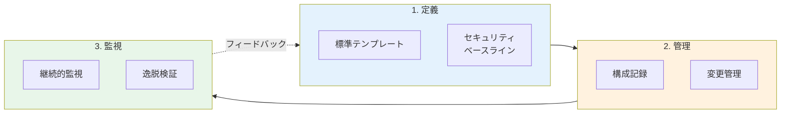
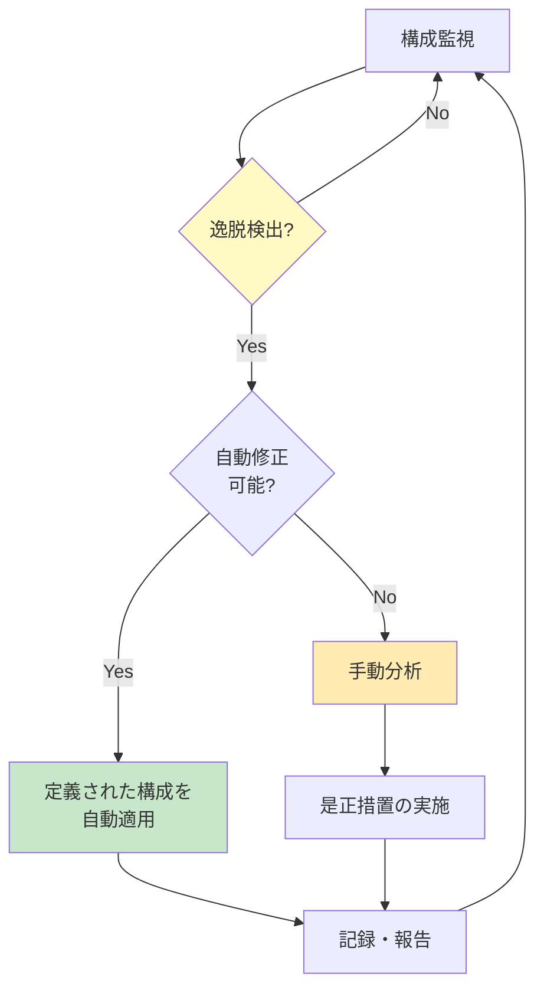

# A.8.9 構成管理

## 管理策の概要

| 項目 | 内容 |
|------|------|
| 管理策タイプ | 予防的 |
| 情報セキュリティ特性 | 機密性、完全性、可用性 |
| サイバーセキュリティ概念 | 防御 |
| 運用能力 | セキュア構成 |
| セキュリティドメイン | 保護 |

> **2022年版で新規追加された管理策**

## 目的

ハードウェア、ソフトウェア、サービス、ネットワークが必要なセキュリティ設定で正しく機能し、不正または誤った変更によって構成が改ざんされないようにします。

## 実施のポイント

### 構成管理の3つの柱



### 1. 標準テンプレートの策定

セキュアな構成のための標準テンプレートを定義します。

#### テンプレート作成時の考慮事項

- **公開ガイダンスの活用**: ベンダーや独立したセキュリティ組織が提供する事前定義テンプレートを参照
- **必要な保護レベル**: 対象システムの重要度に応じた適切なセキュリティ水準を設定
- **組織のポリシーとの整合**: 情報セキュリティ方針や関連する個別方針との一貫性を確保
- **実現可能性**: 組織の環境における実装可能性と運用性を考慮

#### セキュリティ構成の主要項目

| 項目 | 内容 |
|------|------|
| 特権アカウント | 管理者レベルのアカウントを最小限に制限 |
| 不要なアカウント | 未使用・不要・安全でないアカウントを無効化 |
| 不要な機能 | 使用しない機能やサービスを無効化または制限 |
| ユーティリティ制限 | 強力なユーティリティへのアクセスを制限 |
| 時刻同期 | すべてのシステムでクロックを同期 |
| デフォルト認証情報 | ベンダーの初期パスワードを即座に変更 |
| 自動ログオフ | 非アクティブ時の自動ログオフを設定 |
| ライセンス | ライセンス要件の遵守を確認 |

### 2. 構成記録の維持

確立された構成は記録し、変更ログを安全に保管します。

#### 構成記録に含める情報

```yaml
構成記録項目:
  資産情報:
    - 資産オーナーまたは連絡先
    - 最終構成変更日
    - 構成テンプレートのバージョン
    - 他の資産との関係性
  
  管理情報:
    - 承認者
    - 変更理由
    - 適用日時
    - ロールバック手順
```

#### 変更管理との連携

構成の変更は、必ず変更管理プロセス（[8.32 変更管理](/controls/#a-8-32)）に従って実施します。

### 3. 構成の監視

#### 監視の実施方法

- **システム管理ツールの活用**: メンテナンスユーティリティ、リモートサポート、エンタープライズ管理ツール、バックアップ・復元ソフトウェアを統合的に活用
- **定期レビュー**: 構成設定の確認、パスワード強度の評価、実施されたアクティビティの監査
- **逸脱検出**: 実際の構成と定義された目標テンプレートを比較し、差異を特定

#### 逸脱への対応



## 実践ガイド

### 構成管理の自動化

自動化は、セキュリティ構成管理において特に効果的です。

#### Infrastructure as Code（IaC）の活用

| ツール例 | 用途 |
|----------|------|
| Ansible | サーバー構成の自動化 |
| Terraform | クラウドインフラの構成管理 |
| Chef/Puppet | 継続的な構成適用 |
| AWS Config / Azure Policy | クラウド構成の監視・是正 |

### 構成テンプレートの保護

構成テンプレートと目標値は機密情報として扱い、不正アクセスから保護する必要があります。攻撃者がセキュリティ構成を把握すると、その設定を回避する攻撃が可能になります。

### システムハードニング

構成管理の重要な要素として、システムハードニングがあります。

#### ハードニングチェックリスト例

- [ ] 不要なサービスの無効化
- [ ] デフォルトアカウントの無効化または名前変更
- [ ] ファイアウォールの有効化
- [ ] 監査ログの有効化
- [ ] セキュリティパッチの適用
- [ ] 不要なポートのクローズ
- [ ] 暗号化の有効化

## 関連する管理策

- [A.5.9 情報およびその他の関連資産の目録](/controls/#a-5-9) - 資産管理との統合
- [A.8.8 技術的脆弱性の管理](/controls/a-8-8) - 脆弱性対応としての構成変更
- [A.8.32 変更管理](/controls/#a-8-32) - 構成変更の管理プロセス

## 参考情報

- CIS Benchmarks - 各種OSやアプリケーションのセキュリティ構成ガイドライン
- NIST SP 800-128 - セキュリティ重視の構成管理ガイド
- STIGs（Security Technical Implementation Guides）- 米国国防総省のセキュリティ構成標準
