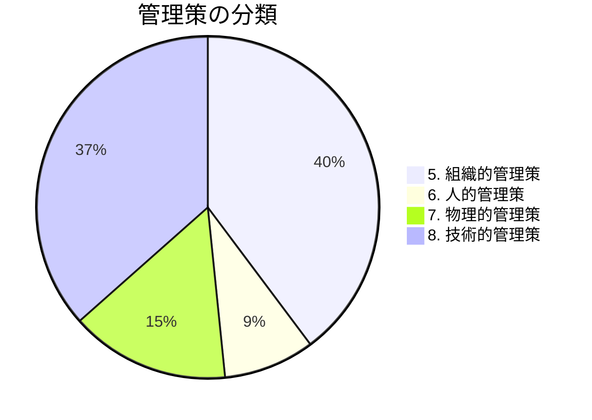

# 管理策（Annex A）

ISO/IEC 27001:2022 の附属書A（Annex A）に記載された93項目の管理策について解説します。

## 概要

2022年版では、管理策が4つのカテゴリに再編成されました。

## カテゴリ別一覧

| カテゴリ | 管理策数 | 概要 |
|----------|----------|------|
| [5. 組織的管理策](/controls/5) | 37項目 | 方針、組織、資産管理など |
| [6. 人的管理策](/controls/6) | 8項目 | 採用、教育、懲戒など |
| [7. 物理的管理策](/controls/7) | 14項目 | 入退室、機器保護など |
| [8. 技術的管理策](/controls/8) | 34項目 | アクセス制御、暗号、監視など |

## 2022年版の変更点

ISO/IEC 27001:2022 では、以下の変更がありました：

- 管理策数：114項目 → 93項目
- カテゴリ：14ドメイン → 4テーマ
- 新規管理策：11項目追加
- 統合：複数の管理策を1つに統合

## 詳細ページ

各カテゴリの詳細は、上記リンクから参照してください。
