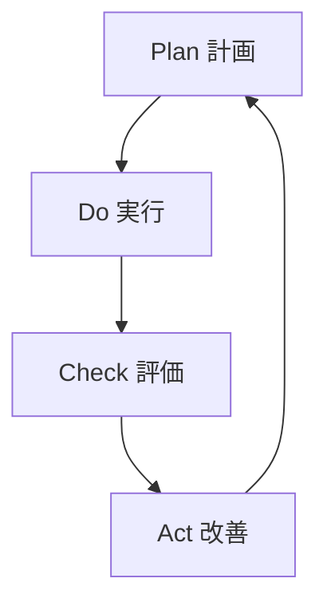

# 用語集

ISMS（情報セキュリティマネジメントシステム）に関する重要な用語を解説します。

## A

### Asset（資産）
組織にとって価値のある情報や情報処理施設。

### Availability（可用性）
認可されたエンティティが要求したときにアクセス可能で利用可能な特性。

## C

### CIA
機密性（Confidentiality）、完全性（Integrity）、可用性（Availability）の頭文字。情報セキュリティの3要素。

### Confidentiality（機密性）
認可されていない個人、エンティティ又はプロセスに対して、情報を利用不可又は非公開にする特性。

### Control（管理策）
リスクを修正する措置。

## I

### Information Security（情報セキュリティ）
情報の機密性、完全性及び可用性を維持すること。

### Integrity（完全性）
資産の正確さ及び完全さを保護する特性。

### ISMS
Information Security Management System（情報セキュリティマネジメントシステム）の略。

## P

### PDCA
Plan-Do-Check-Act サイクル。継続的改善のための管理手法。

## R

### Risk（リスク）
目的に対する不確かさの影響。

### Risk Assessment（リスクアセスメント）
リスク特定、リスク分析及びリスク評価のプロセス全体。

### Risk Treatment（リスク対応）
リスクを修正するプロセス。

## S

### Statement of Applicability（適用宣言書）
組織の ISMS に適用される管理策と、その適用理由を記述した文書。SoA とも呼ばれる。
