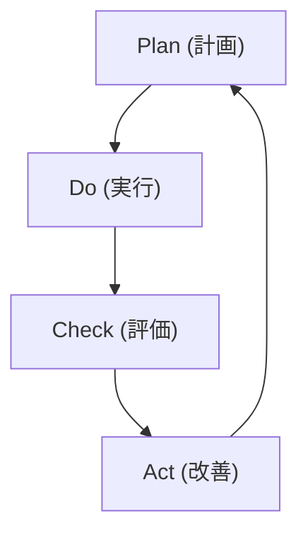

# 用語集

ISMS（情報セキュリティマネジメントシステム）に関する重要な用語を解説します。

## あ行

### インシデント（Incident）
望まない単独若しくは一連の情報セキュリティ事象、又は予期しない単独若しくは一連の情報セキュリティ事象であって、事業運営を危うくする確率及び情報セキュリティを脅かす確率が高いもの。

## か行

### 可用性（Availability）
認可されたエンティティが要求したときにアクセス可能で利用可能な特性。

### 監査（Audit）
監査基準が満たされている程度を判定するために、証拠を収集し、客観的に評価する体系的なプロセス。

### 管理策（Control）
リスクを修正する措置。

### 完全性（Integrity）
資産の正確さ及び完全さを保護する特性。

### 機密性（Confidentiality）
認可されていない個人、エンティティ又はプロセスに対して、情報を利用不可又は非公開にする特性。

### 脅威インテリジェンス（Threat Intelligence）
情報セキュリティ上の脅威に関する情報を収集・分析し、組織の意思決定や対策に活用できる形にしたもの。

## さ行

### 災害復旧（DR）
Disaster Recovery の略。災害発生後にITインフラストラクチャを復旧するためのプロセス。

### 資産（Asset）
組織にとって価値のある情報や情報処理施設。

### 事業継続計画（BCP）
Business Continuity Plan の略。事業の中断・阻害に対応し、事業を復旧し、再開し、あらかじめ定められたレベルに回復するための文書化した手順。

### 侵害指標（IoC）
Indicators of Compromise の略。侵害の痕跡を示す技術的指標（悪意あるIPアドレス、ファイルハッシュ等）。

### 情報セキュリティ（Information Security）
情報の機密性、完全性及び可用性を維持すること。

### 情報セキュリティマネジメントシステム（ISMS）
Information Security Management System の略。情報セキュリティを管理するための体系的な仕組み。

### 是正処置（Corrective Action）
不適合の原因を除去し、再発を防止するための処置。

### 脆弱性（Vulnerability）
一つ以上の脅威によって付け込まれる可能性のある、資産又は管理策の弱点。

## た行

### 適用宣言書（SoA）
Statement of Applicability の略。組織の ISMS に適用される管理策と、その適用理由を記述した文書。

### 手順（Procedure）
活動又はプロセスを実行するために規定された方法。

### デジタルフォレンジック（Forensics）
法的な証拠能力を維持しながら、デジタル証拠を収集・分析・保全する技術・手法。

### トリアージ（Triage）
インシデント対応において、事象の緊急度や重要度を評価し、対応の優先順位を決定するプロセス。

## な行

### 内部監査（Internal Audit）
組織自身が行う、又は組織の代理で行う監査。ISMSが組織の要求事項及びISO/IEC 27001の要求事項に適合しているかを検証する。

## は行

### ビジネスインパクト分析（BIA）
Business Impact Analysis の略。事業活動の中断が組織に与える影響を分析するプロセス。

### 不適合（Nonconformity）
要求事項を満たしていないこと。

### ペネトレーションテスト（Penetration Testing）
情報システムのセキュリティを評価するために、攻撃者の視点から脆弱性の悪用を試みるテスト手法。

### 方針（Policy）
トップマネジメントによって正式に表明された組織の意図及び方向付け。

## ま行

### マネジメントレビュー（Management Review）
ISMSが引き続き適切、妥当かつ有効であることを確実にするために、トップマネジメントが計画した間隔でISMSをレビューすること。

## ら行

### リスク（Risk）
組織の目的達成に影響を与える可能性のある不確実な事象。脅威が脆弱性を突くことで発生し得る損害の可能性と影響度の組み合わせ。

### リスクアセスメント（Risk Assessment）
リスク特定、リスク分析及びリスク評価のプロセス全体。

### リスク対応（Risk Treatment）
リスクを修正するプロセス。リスクの回避、低減、移転、受容などの選択肢がある。

## アルファベット

### CIA
機密性（Confidentiality）、完全性（Integrity）、可用性（Availability）の頭文字。情報セキュリティの3要素。

### CSIRT
Computer Security Incident Response Team の略。コンピュータセキュリティインシデントに対応するチーム。

### CVE
Common Vulnerabilities and Exposures の略。公開された脆弱性に付与される一意の識別子。

### CVSS
Common Vulnerability Scoring System の略。脆弱性の深刻度を評価するための業界標準スコアリングシステム。

### JVN
Japan Vulnerability Notes の略。日本で使用されているソフトウェアなどの脆弱性関連情報とその対策情報を提供するポータルサイト。

### NVD
National Vulnerability Database の略。米国政府が管理する脆弱性データベース。

### OSINT
Open Source Intelligence の略。公開情報から収集・分析されるインテリジェンス。

### PDCA
Plan-Do-Check-Act サイクル。継続的改善のための管理手法。

### RPO
Recovery Point Objective（目標復旧時点）の略。データの復旧において許容できるデータ損失の時間量。

### RTO
Recovery Time Objective（目標復旧時間）の略。中断発生後、事業活動やリソースを復旧させるまでの目標時間。

### SIEM
Security Information and Event Management の略。セキュリティ情報とイベントを統合的に管理・分析するシステム。

### TIP
Threat Intelligence Platform の略。脅威インテリジェンスを収集・分析・共有するためのプラットフォーム。

### TTPs
Tactics, Techniques, and Procedures の略。攻撃者の戦術、技術、手順を体系化したもの。
