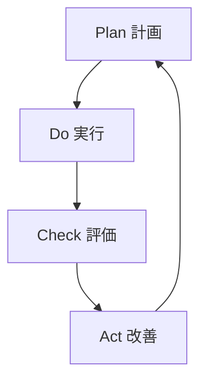

# 用語集

ISMS（情報セキュリティマネジメントシステム）に関する重要な用語を解説します。

## A

### Asset（資産）
組織にとって価値のある情報や情報処理施設。

### Audit（監査）
監査基準が満たされている程度を判定するために、証拠を収集し、客観的に評価する体系的なプロセス。

### Availability（可用性）
認可されたエンティティが要求したときにアクセス可能で利用可能な特性。

## B

### BCP（事業継続計画）
Business Continuity Plan の略。事業の中断・阻害に対応し、事業を復旧し、再開し、あらかじめ定められたレベルに回復するための文書化した手順。

### BIA（ビジネスインパクト分析）
Business Impact Analysis の略。事業活動の中断が組織に与える影響を分析するプロセス。

## C

### CIA
機密性（Confidentiality）、完全性（Integrity）、可用性（Availability）の頭文字。情報セキュリティの3要素。

### Confidentiality（機密性）
認可されていない個人、エンティティ又はプロセスに対して、情報を利用不可又は非公開にする特性。

### Control（管理策）
リスクを修正する措置。

### Corrective Action（是正処置）
不適合の原因を除去し、再発を防止するための処置。

### CSIRT
Computer Security Incident Response Team の略。コンピュータセキュリティインシデントに対応するチーム。

### CVE
Common Vulnerabilities and Exposures の略。公開された脆弱性に付与される一意の識別子。

### CVSS
Common Vulnerability Scoring System の略。脆弱性の深刻度を評価するための業界標準スコアリングシステム。

## D

### DR（災害復旧）
Disaster Recovery の略。災害発生後にITインフラストラクチャを復旧するためのプロセス。

## F

### Forensics（フォレンジック）
法的な証拠能力を維持しながら、デジタル証拠を収集・分析・保全する技術・手法。

## I

### Incident（インシデント）
望まない単独若しくは一連の情報セキュリティ事象、又は予期しない単独若しくは一連の情報セキュリティ事象であって、事業運営を危うくする確率及び情報セキュリティを脅かす確率が高いもの。

### Information Security（情報セキュリティ）
情報の機密性、完全性及び可用性を維持すること。

### Integrity（完全性）
資産の正確さ及び完全さを保護する特性。

### Internal Audit（内部監査）
組織自身が行う、又は組織の代理で行う監査。ISMSが組織の要求事項及びISO/IEC 27001の要求事項に適合しているかを検証する。

### IoC
Indicators of Compromise の略。侵害の痕跡を示す技術的指標（悪意あるIPアドレス、ファイルハッシュ等）。

### ISMS
Information Security Management System（情報セキュリティマネジメントシステム）の略。

## J

### JVN
Japan Vulnerability Notes の略。日本で使用されているソフトウェアなどの脆弱性関連情報とその対策情報を提供するポータルサイト。

## M

### Management Review（マネジメントレビュー）
ISMSが引き続き適切、妥当かつ有効であることを確実にするために、トップマネジメントが計画した間隔でISMSをレビューすること。

## N

### Nonconformity（不適合）
要求事項を満たしていないこと。

### NVD
National Vulnerability Database の略。米国政府が管理する脆弱性データベース。

## O

### OSINT
Open Source Intelligence の略。公開情報から収集・分析されるインテリジェンス。

## P

### PDCA
Plan-Do-Check-Act サイクル。継続的改善のための管理手法。

### Penetration Testing（ペネトレーションテスト）
情報システムのセキュリティを評価するために、攻撃者の視点から脆弱性の悪用を試みるテスト手法。

### Policy（方針）
トップマネジメントによって正式に表明された組織の意図及び方向付け。

### Procedure（手順）
活動又はプロセスを実行するために規定された方法。

## R

### Risk（リスク）
目的に対する不確かさの影響。

### Risk Assessment（リスクアセスメント）
リスク特定、リスク分析及びリスク評価のプロセス全体。

### Risk Treatment（リスク対応）
リスクを修正するプロセス。

### RPO（目標復旧時点）
Recovery Point Objective の略。データの復旧において許容できるデータ損失の時間量。

### RTO（目標復旧時間）
Recovery Time Objective の略。中断発生後、事業活動やリソースを復旧させるまでの目標時間。

## S

### SIEM
Security Information and Event Management の略。セキュリティ情報とイベントを統合的に管理・分析するシステム。

### Statement of Applicability（適用宣言書）
組織の ISMS に適用される管理策と、その適用理由を記述した文書。SoA とも呼ばれる。

## T

### Threat Intelligence（脅威インテリジェンス）
情報セキュリティ上の脅威に関する情報を収集・分析し、組織の意思決定や対策に活用できる形にしたもの。

### TIP
Threat Intelligence Platform の略。脅威インテリジェンスを収集・分析・共有するためのプラットフォーム。

### Triage（トリアージ）
インシデント対応において、事象の緊急度や重要度を評価し、対応の優先順位を決定するプロセス。

### TTPs
Tactics, Techniques, and Procedures の略。攻撃者の戦術、技術、手順を体系化したもの。

## V

### Vulnerability（脆弱性）
一つ以上の脅威によって付け込まれる可能性のある、資産又は管理策の弱点。
