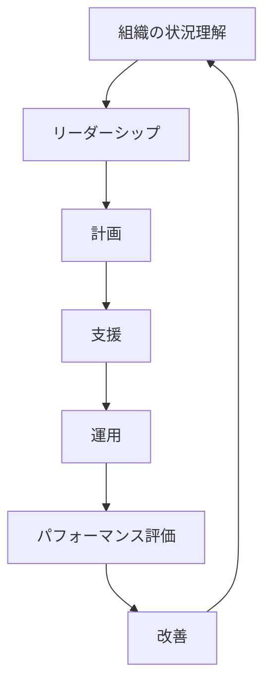

## このサイトについて

ISMS Guide は、ISO/IEC 27001:2022 に基づく情報セキュリティマネジメントシステム（ISMS）の構築を支援するドキュメントサイトです。

### ISMS 構築の全体像

### 特徴

- ISO/IEC 27001:2022 の最新版に対応
- 日本語で分かりやすく解説
- 実装のヒントと具体例を提供
- Mermaid 図による視覚的な説明

### 本サイトのコンテンツについて

本サイトのコンテンツは、**ISO から正規に購入した規格原文をベースに、著者自身の言葉で解釈・要約したオリジナルコンテンツ**です。

- ISO・JISC（日本規格協会）に事前問い合わせを実施済み
- JIS 規格のコンテンツの流用ではありません
- JISC 回答:「規格を読み込み、ご自身の言葉で概要や要約等を作成される場合には引用の対象外」

詳しくは [コンテンツの著作権・出典について](/about/copyright) をご覧ください。

**正規規格の入手先:**
- [ISO Store](https://www.iso.org/standard/27001) - ISO/IEC 27001:2022（英語）
- [JSA Webdesk](https://webdesk.jsa.or.jp/) - JIS Q 27001:2023（日本語）
