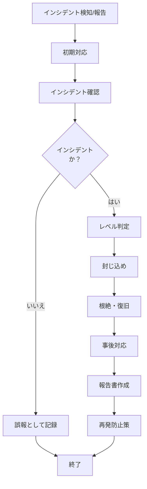

# インシデント対応手順

> 関連: [A.5.24 情報セキュリティインシデント管理の計画及び準備](/controls/a-5-24)

## 1. 目的

本手順は、{{組織名}}における情報セキュリティインシデントへの対応手順を定め、迅速かつ適切な対応により被害を最小限に抑えることを目的とする。

## 2. 適用範囲

本手順は、当組織で発生した全ての情報セキュリティインシデント及びその疑いのある事象に適用する。

## 3. インシデントの分類

| レベル | 分類 | 例 |
|:------:|------|-----|
| 重大 | 事業継続に影響 | 大規模情報漏えい、ランサムウェア感染 |
| 中程度 | 業務に影響 | 部分的なシステム停止、マルウェア感染 |
| 軽微 | 影響が限定的 | フィッシングメール受信、軽微な操作ミス |

## 4. 対応体制

| 役割 | 責任 | 担当者 |
|------|------|--------|
| インシデント対応責任者 | 全体統括 | {{ISMS責任者}} |
| 技術担当 | 技術的対応 | {{技術担当}} |
| 広報担当 | 外部対応 | {{広報担当}} |

## 5. 対応フロー

## 6. 対応手順

### 6.1 検知・報告

1. インシデントを発見した者は、直ちに情報セキュリティ担当に報告する
2. 報告内容：発生日時、発見者、事象の概要、影響範囲

### 6.2 初期対応

1. 被害拡大を防止するための緊急措置を実施
2. 証拠の保全（ログ、スクリーンショット等）

### 6.3 封じ込め

1. 影響を受けたシステム・ネットワークの隔離
2. 不正アクセスの遮断
3. 感染端末の隔離

### 6.4 根絶・復旧

1. 原因の除去
2. システムの復旧
3. 正常動作の確認

### 6.5 事後対応

1. インシデント報告書の作成
2. 根本原因の分析
3. 再発防止策の策定・実施
4. 必要に応じて外部への報告（監督官庁、顧客等）

## 7. 関連文書

- [インシデント報告書](../records/incident-report.md)
- [是正処置手順](./corrective-action-procedure.md)

## 改訂履歴

| 版 | 日付 | 変更内容 | 承認者 |
|----|------|----------|--------|
| 1.0 | {{発効日}} | 初版作成 | {{承認者}} |

