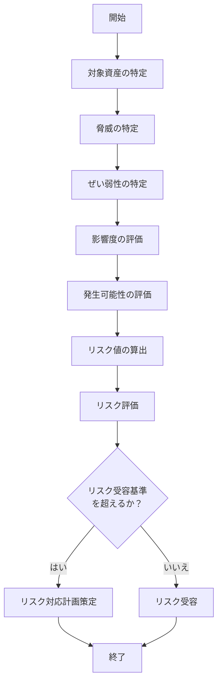

# リスクアセスメント手順

> 関連: [6.1.2 情報セキュリティリスクアセスメント](/requirements/6-1-2)

## 1. 目的

本手順は、{{組織名}}における情報セキュリティリスクアセスメントの実施方法を定め、リスクの特定、分析、評価を体系的に行うことを目的とする。

## 2. 適用範囲

本手順は、当組織の ISMS 適用範囲（{{適用範囲}}）における全ての情報資産に対するリスクアセスメントに適用する。

## 3. 用語の定義

| 用語 | 定義 |
|------|------|
| リスク | 目的に対する不確かさの影響 |
| リスクアセスメント | リスク特定、リスク分析、リスク評価のプロセス全体 |
| 脅威 | 望ましくないインシデントの潜在的な原因 |
| ぜい弱性 | 脅威によって利用され得る資産又は管理策の弱点 |
| 影響度 | リスクが顕在化した場合の損害の大きさ |
| 発生可能性 | リスクが顕在化する確率 |

## 4. リスクアセスメントのフロー

> 関連: [6.1.2 情報セキュリティリスクアセスメント](/requirements/6-1-2)

## 5. 実施手順

### 5.1 準備

1. リスクアセスメントの対象範囲を確認する
2. 情報資産台帳を最新化する
3. リスクアセスメントチームを編成する

### 5.2 資産の特定

1. 対象範囲内の情報資産を洗い出す
2. 各資産の資産価値を評価する
3. 資産の所有者・管理者を明確にする

<!--
  [記載のポイント]
  資産価値の評価基準例：
  - 高（3）: 機密性が高い、業務に不可欠
  - 中（2）: 業務に影響がある
  - 低（1）: 影響が限定的
-->

### 5.3 脅威の特定

各資産に対する脅威を特定する。

**脅威の分類例:**
- 自然災害（地震、火災、水害等）
- 人的脅威・意図的（不正アクセス、マルウェア、内部不正等）
- 人的脅威・偶発的（操作ミス、紛失等）
- 技術的脅威（システム障害、ネットワーク障害等）

### 5.4 ぜい弱性の特定

脅威が利用し得るぜい弱性を特定する。

**ぜい弱性の例:**
- 物理的：入退室管理の不備、施錠の不備
- 技術的：パッチ未適用、設定不備
- 人的：教育不足、手順の不備
- 組織的：ポリシーの不備、監視体制の不備

### 5.5 影響度の評価

リスクが顕在化した場合の影響度を評価する。

| レベル | 影響度 | 説明 |
|:------:|--------|------|
| 3 | 高 | 事業継続に重大な影響、法的制裁の可能性 |
| 2 | 中 | 業務に相当の影響、復旧に時間を要する |
| 1 | 低 | 影響は限定的、短時間で復旧可能 |

### 5.6 発生可能性の評価

リスクが顕在化する発生可能性を評価する。

| レベル | 発生可能性 | 説明 |
|:------:|------------|------|
| 3 | 高 | 1年以内に発生する可能性が高い |
| 2 | 中 | 数年に1回程度発生する可能性 |
| 1 | 低 | 発生する可能性は低い |

### 5.7 リスク値の算出

リスク値 = 資産価値 × 影響度 × 発生可能性

### 5.8 リスク評価

算出したリスク値をリスク受容基準と比較し、対応の要否を判断する。

| リスク値 | リスクレベル | 対応 |
|:--------:|:------------:|------|
| 18-27 | 高 | 即座にリスク対応が必要 |
| 8-17 | 中 | リスク対応計画を策定 |
| 1-7 | 低 | リスク受容可能（監視継続） |

## 6. 実施時期

- 定期：年1回以上
- 臨時：重大な変更時、重大なインシデント発生時

## 7. 成果物

- [リスク台帳](../registers/risk-register.md)
- [リスクアセスメント報告書](../records/risk-assessment-report.md)
- [リスク対応計画](../plans/risk-treatment-plan.md)

## 8. 関連文書

- [ISMS マニュアル](../manual/isms-manual.md)
- [情報資産台帳](../registers/asset-inventory.md)
- [リスク対応計画](../plans/risk-treatment-plan.md)

## 改訂履歴

| 版 | 日付 | 変更内容 | 承認者 |
|----|------|----------|--------|
| 1.0 | {{発効日}} | 初版作成 | {{承認者}} |

