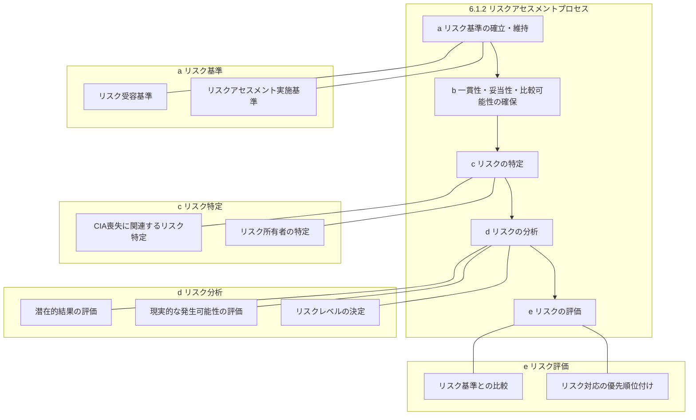
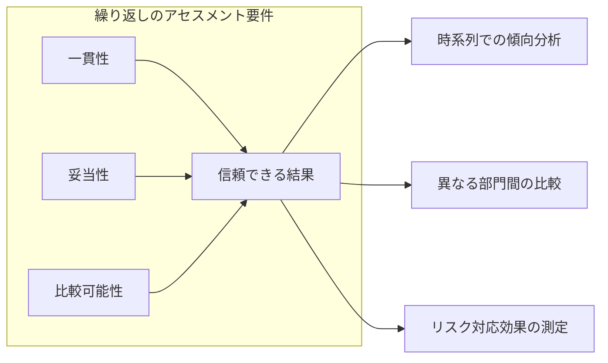
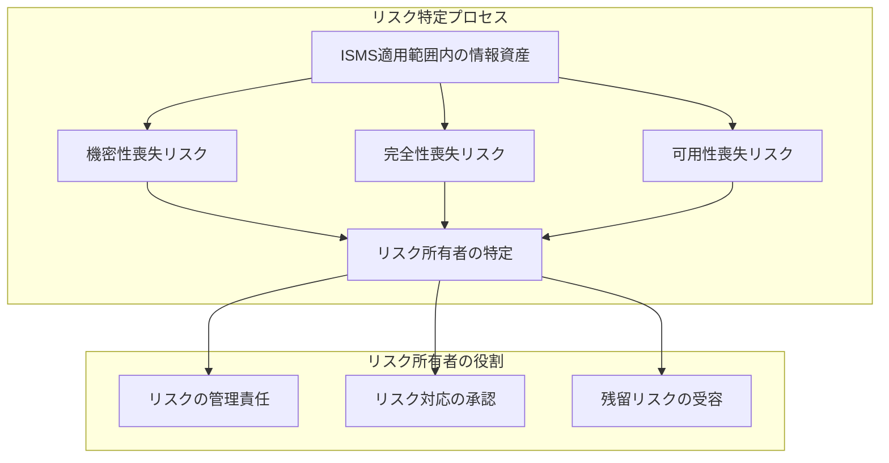
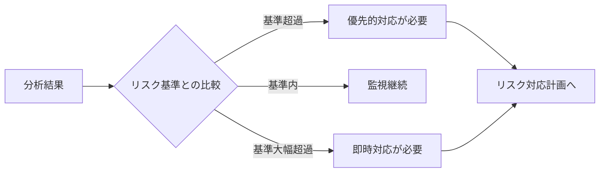
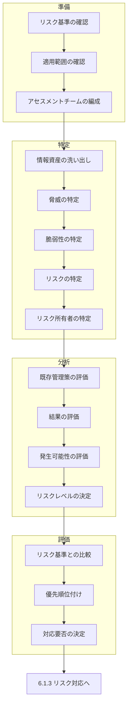

# 6.1.2 情報セキュリティリスクアセスメント

> **関連テンプレート**:
> - [リスクアセスメント手順](/isms/procedures/risk-assessment-procedure#_4-リスクアセスメントのフロー) - プロセス全体
> - [リスク台帳 - 3. リスク一覧](/isms/registers/risk-register#_3-リスク一覧) - リスク記録
> - [情報資産台帳 - 4. 情報資産一覧](/isms/registers/asset-inventory#_4-情報資産一覧) - 資産情報
> - [リスクアセスメント報告書 - 4. リスクアセスメント結果](/isms/records/risk-assessment-report#_4-リスクアセスメント結果) - 結果報告

## 概要

| 項目 | 内容 |
|------|------|
| 要求事項番号 | 6.1.2 |
| 要求事項名 | 情報セキュリティリスクアセスメント |
| 上位箇条 | 6.1 リスク及び機会に対処する活動 |
| 関連する文書化要求 | リスクアセスメントプロセスに関する文書化した情報の保持 |

## 要求事項の目的

組織が情報セキュリティリスクを体系的に特定、分析、評価するためのプロセスを確立し、維持することを要求する。これにより、リスクに基づいた意思決定とISMS全体の有効性を確保する。

## 要求事項の構成

## 詳細要件

### a) リスク基準の確立・維持

組織は以下を含む情報セキュリティリスク基準を確立し、維持しなければならない。

| 基準の種類 | 内容 | 考慮事項 |
|-----------|------|----------|
| リスク受容基準 | 組織が受け入れ可能とするリスクのレベル | 事業目標、法規制要件、利害関係者の期待 |
| アセスメント実施基準 | リスクアセスメントを実施するための基準 | 評価方法、尺度、一貫性の確保 |

### b) 一貫性・妥当性・比較可能性

### c) リスクの特定

### d) リスクの分析

| 分析要素 | 説明 | 評価ポイント |
|---------|------|-------------|
| 潜在的結果 | リスクが顕在化した場合の影響 | 事業への影響、財務的損失、評判への影響 |
| 発生可能性 | リスクが現実に発生する確率 | 脅威の頻度、脆弱性の存在、既存管理策 |
| リスクレベル | 結果と可能性の組み合わせ | 定量的/定性的評価、リスクマトリクス |

### e) リスクの評価

## 文書化要求

組織は、情報セキュリティリスクアセスメントプロセスに関する文書化した情報を保持しなければならない。

| 文書化項目 | 内容例 |
|-----------|--------|
| リスク基準 | 受容基準、評価尺度、判定基準 |
| アセスメント手順 | 実施手順、役割と責任、スケジュール |
| リスク特定結果 | リスク一覧、リスク所有者 |
| リスク分析結果 | 影響評価、発生可能性評価、リスクレベル |
| リスク評価結果 | 優先順位、対応要否の判定 |

## リスクアセスメントの全体フロー

## 関連する要求事項・管理策

| 関連項目 | 関係性 |
|---------|--------|
| 6.1.3 リスク対応 | アセスメント結果に基づく対応 |
| 8.2 リスクアセスメントの実施 | 運用段階での定期的実施 |
| 9.3 マネジメントレビュー | リスクアセスメント結果のレビュー |
| A.5.7 脅威インテリジェンス | リスク特定への情報提供 |

## 実施のポイント

1. **リスク基準は経営層の承認を得る**: 受容基準は組織のリスク選好を反映
2. **一貫した方法論を使用**: 定量的・定性的アプローチの選択と維持
3. **リスク所有者を明確に**: 管理責任と意思決定権限の明確化
4. **定期的な見直し**: 環境変化に応じたアセスメントの更新
5. **文書化の徹底**: トレーサビリティと監査対応の確保

