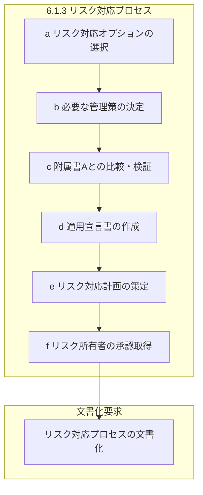
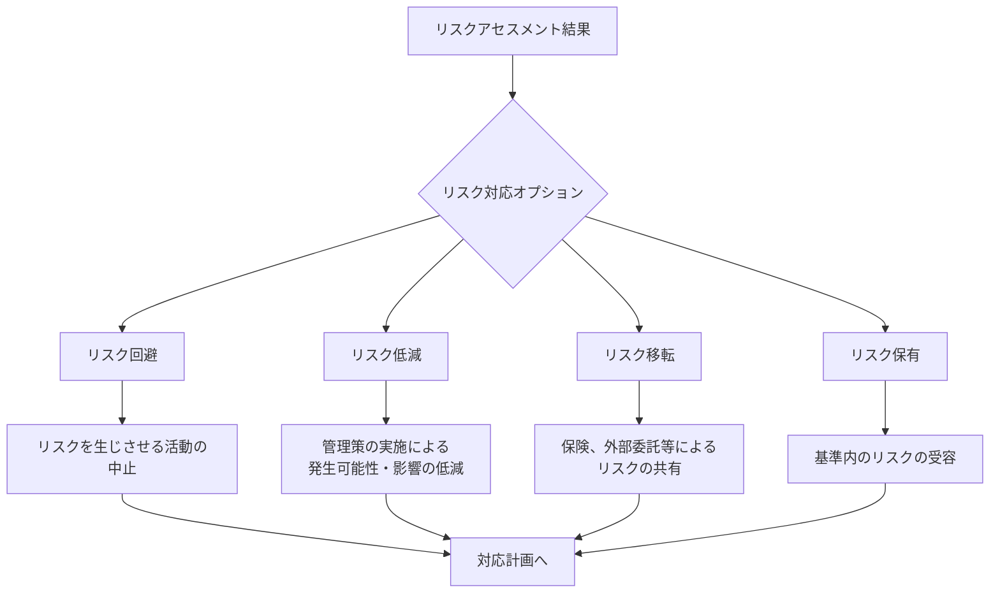
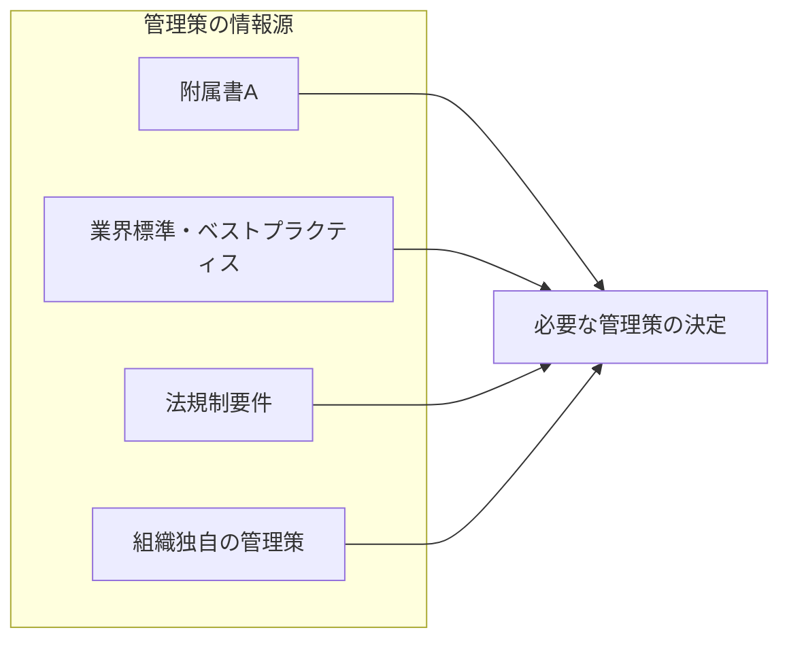
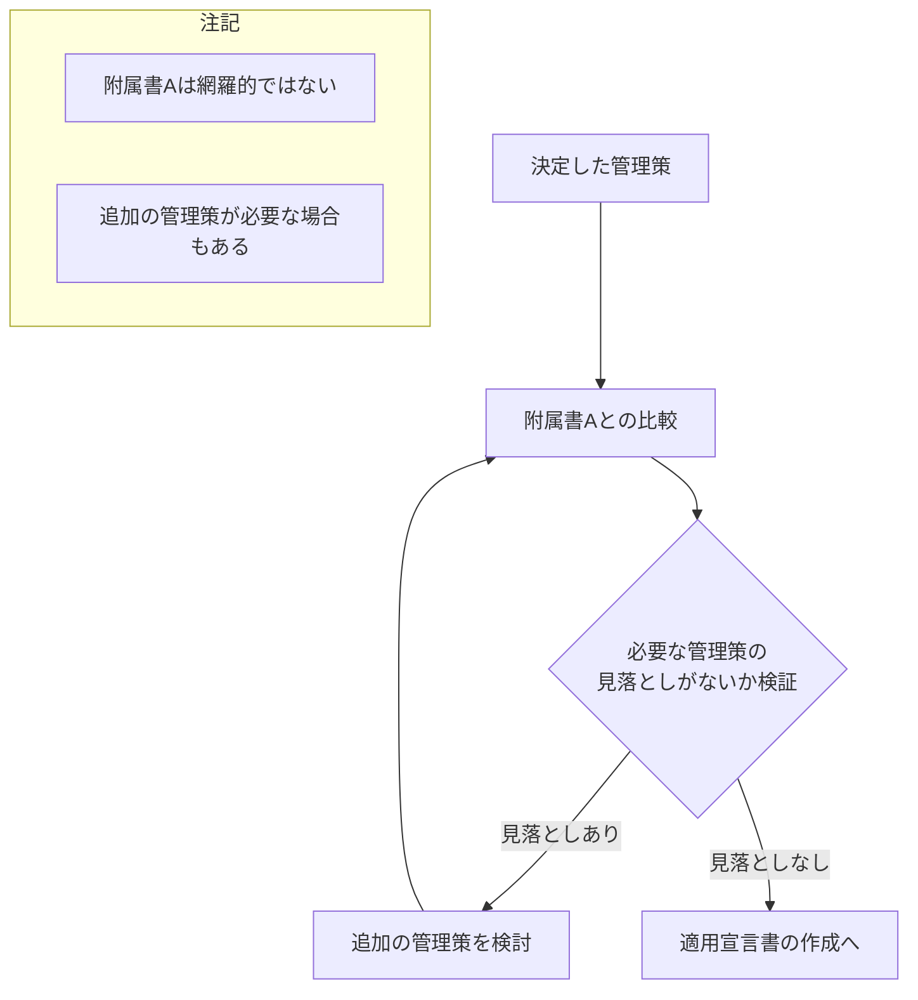
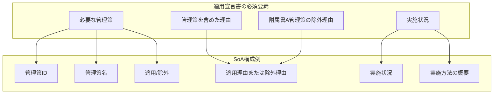
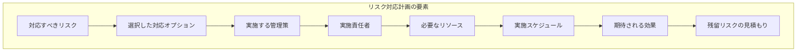
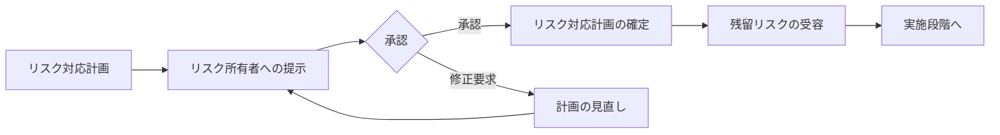
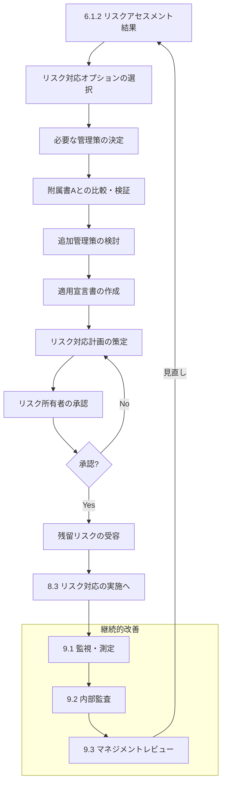

# 6.1.3 情報セキュリティリスク対応

## 概要

| 項目 | 内容 |
|------|------|
| 要求事項番号 | 6.1.3 |
| 要求事項名 | 情報セキュリティリスク対応 |
| 上位箇条 | 6.1 リスク及び機会に対処する活動 |
| 関連する文書化要求 | リスク対応プロセスに関する文書化した情報の保持 |

## 要求事項の目的

リスクアセスメントの結果に基づき、適切なリスク対応オプションを選択し、必要な管理策を決定・実施するための体系的なプロセスを確立する。適用宣言書（SoA）の作成とリスク対応計画の策定を通じて、組織のリスク管理を実効性あるものとする。

## 要求事項の構成

## 詳細要件

### a) リスク対応オプションの選択

| 対応オプション | 説明 | 適用場面 |
|---------------|------|----------|
| リスク回避 | リスクを生じさせる活動を行わない | リスクが許容できない場合 |
| リスク低減 | 管理策により発生可能性や影響を軽減 | 最も一般的な対応 |
| リスク移転 | 第三者とリスクを共有 | 保険、アウトソーシング等 |
| リスク保有 | 情報に基づきリスクを受容 | 受容基準内のリスク |

### b) 必要な管理策の決定

選択したリスク対応オプションを実施するために必要なすべての管理策を決定する。

> **注記1**: 組織は、必要に応じて管理策を設計するか、または任意の情報源から特定することができる。

### c) 附属書Aとの比較・検証

> **注記2**: 附属書Aには、情報セキュリティ管理策のリストが含まれている。この文書の利用者は、必要な情報セキュリティ管理策を見落とさないよう、附属書Aを参照することが求められる。

> **注記3**: 附属書Aに記載された情報セキュリティ管理策は網羅的ではなく、必要に応じて追加の情報セキュリティ管理策を含めることができる。

### d) 適用宣言書（SoA）の作成

| SoA要素 | 内容 | 注意点 |
|---------|------|--------|
| 必要な管理策 | 6.1.3 b)およびc)で決定した管理策 | 附属書A以外の管理策も含む |
| 含めた理由 | 各管理策を選択した根拠 | リスク対応との関連を明示 |
| 実施状況 | 実施済み/未実施の状態 | 計画中の管理策も記載 |
| 除外理由 | 附属書A管理策を除外した理由 | 合理的な理由が必要 |

### e) リスク対応計画の策定

### f) リスク所有者の承認

## 文書化要求

組織は、情報セキュリティリスク対応プロセスに関する文書化した情報を保持しなければならない。

| 文書化項目 | 内容 |
|-----------|------|
| リスク対応プロセス | 手順、役割と責任、判断基準 |
| 適用宣言書（SoA） | 管理策一覧、適用/除外とその理由、実施状況 |
| リスク対応計画 | 対応内容、責任者、スケジュール、リソース |
| 承認記録 | リスク所有者の承認、残留リスク受容の記録 |

## リスク対応の全体フロー

## 関連する要求事項・管理策

| 関連項目 | 関係性 |
|---------|--------|
| 6.1.2 リスクアセスメント | 対応の基礎となる情報を提供 |
| 8.3 リスク対応の実施 | 運用段階でのリスク対応計画の実施 |
| 附属書A | 管理策の参照元 |
| 9.3 マネジメントレビュー | リスク対応計画の状況レビュー |

## 実施のポイント

1. **リスクとの紐付けを明確に**: 各管理策がどのリスクに対応するか明示
2. **適用宣言書の完全性**: すべての附属書A管理策について判断を記載
3. **除外理由の妥当性**: 管理策を除外する場合は合理的な理由を文書化
4. **リスク所有者の関与**: 対応計画と残留リスク受容の承認を確実に取得
5. **実現可能な計画**: リソースと期間を考慮した現実的な計画策定

> **注記4**: この文書における情報セキュリティリスクアセスメント及び対応のプロセスは、ISO 31000に規定する原則及び一般的な指針と整合している。

## 関連テンプレート

- [リスク対応計画](/isms/plans/risk-treatment-plan) - リスク対応の実施計画
- [適用宣言書](/isms/soa/statement-of-applicability) - 管理策の適用/除外とその理由
- [リスク台帳](/isms/registers/risk-register) - リスク対応状況の追跡
