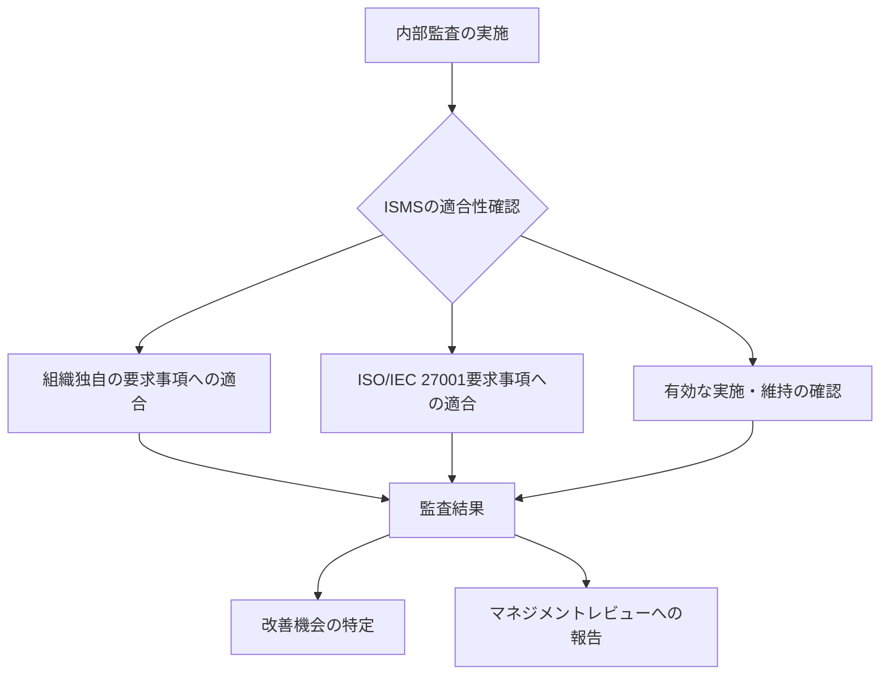
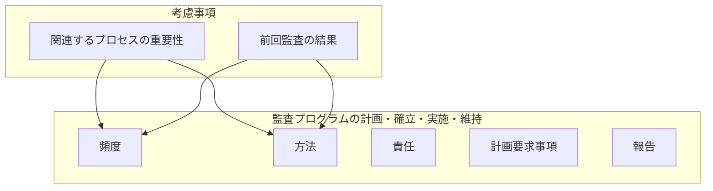
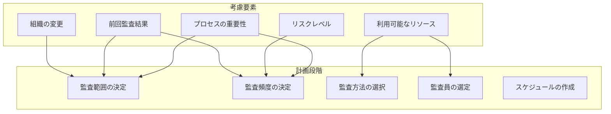
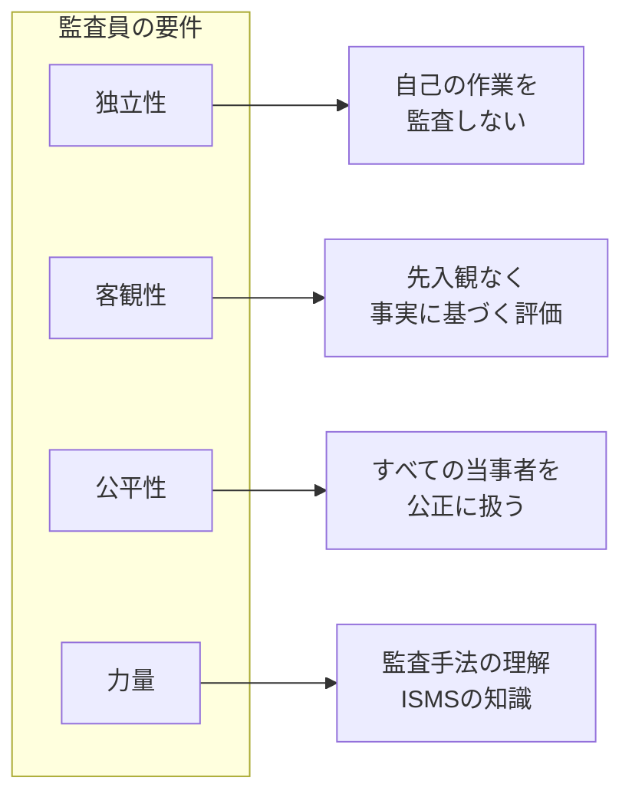
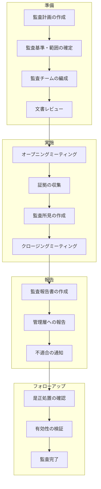
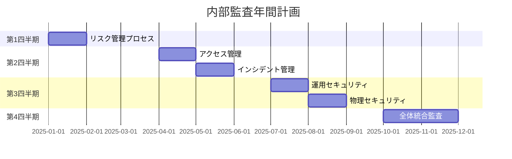
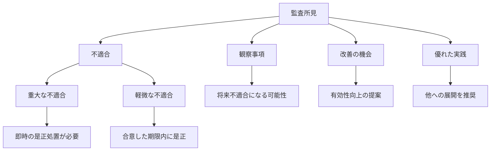

# 9.2 内部監査

## 概要

| 項目 | 内容 |
|------|------|
| 要求事項番号 | 9.2 |
| 要求事項名 | 内部監査 |
| 上位箇条 | 9 パフォーマンス評価 |
| 構成 | 9.2.1 一般、9.2.2 内部監査プログラム |

## 要求事項の目的

ISMSがあらかじめ定めた間隔で内部監査を実施し、組織独自の要求事項及びISO/IEC 27001の要求事項への適合性、並びにISMSの有効な実施・維持を検証する。

## 9.2.1 一般

### 内部監査の目的

### 適合性確認の対象

| 確認対象 | 内容 |
|---------|------|
| 組織独自の要求事項 | 組織が定めたISMSの要求事項（方針、手順等） |
| ISO/IEC 27001要求事項 | 規格の箇条4～10の要求事項 |
| 有効な実施・維持 | ISMSが意図した通りに機能しているか |

## 9.2.2 内部監査プログラム

### 監査プログラムの構成要素

### 監査プログラムの策定

### 監査の実施要件

| 要件 | 内容 | 詳細 |
|------|------|------|
| a) 監査基準・範囲の定義 | 各監査の基準と範囲を明確にする | 何を、どの範囲で監査するか |
| b) 客観性・公平性の確保 | 監査プロセスの客観性・公平性を確保する監査員の選定と監査の実施 | 自己の作業を監査しない |
| c) 結果の報告 | 監査結果を関連する管理層に報告 | 改善機会、不適合等 |

### 監査プロセスの流れ

## 文書化要求

監査プログラムの実施及び監査結果の証拠として、文書化した情報を利用可能にしなければならない。

| 文書化項目 | 内容 |
|-----------|------|
| 監査プログラム | 年間計画、スケジュール、対象範囲 |
| 監査計画 | 個別監査の計画詳細 |
| 監査チェックリスト | 監査で確認する事項 |
| 監査報告書 | 監査所見、不適合、改善推奨事項 |
| 是正処置記録 | 不適合への対応と完了確認 |

## 監査プログラムの年間計画例

## 監査所見の分類

## 関連する要求事項・管理策

| 関連項目 | 関係性 |
|---------|--------|
| 9.1 監視、測定、分析及び評価 | 監査の前提となるパフォーマンスデータ |
| 9.3 マネジメントレビュー | 監査結果のインプット |
| 10.2 不適合及び是正処置 | 監査で発見された不適合への対応 |
| 7.2 力量 | 監査員の力量確保 |

## 実施のポイント

1. **リスクベースのアプローチ**: 重要なプロセスに重点を置いた監査計画
2. **監査員の独立性確保**: 自己の作業を監査しない原則の徹底
3. **前回監査結果の活用**: 過去の不適合領域への注目
4. **客観的証拠の収集**: 記録、観察、インタビューに基づく評価
5. **タイムリーな報告**: 監査結果の迅速な管理層への報告
6. **フォローアップの徹底**: 是正処置の完了と有効性の確認
