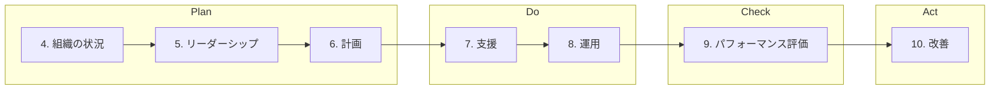

# 要求事項（箇条4-10）

ISO/IEC 27001:2022 の要求事項について解説します。

## 概要

ISMS の要求事項は、箇条4から箇条10までの7つのセクションで構成されています。

## 各箇条の概要

| 箇条 | タイトル | 概要 |
|------|----------|------|
| 4 | [組織の状況](/requirements/4) | 組織の内外の課題、利害関係者のニーズ、適用範囲の決定 |
| 5 | [リーダーシップ](/requirements/5) | トップマネジメントのコミットメント、方針、役割・責任 |
| 6 | [計画](/requirements/6) | リスクアセスメント、リスク対応、目標設定 |
| 7 | [支援](/requirements/7) | 資源、力量、認識、コミュニケーション、文書化 |
| 8 | [運用](/requirements/8) | 運用の計画と管理、リスクアセスメント・対応の実施 |
| 9 | [パフォーマンス評価](/requirements/9) | 監視・測定、内部監査、マネジメントレビュー |
| 10 | [改善](/requirements/10) | 不適合と是正処置、継続的改善 |

## 詳細ページ

各箇条の詳細は、上記リンクから参照してください。
