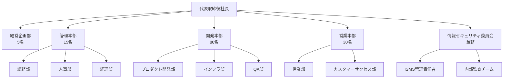
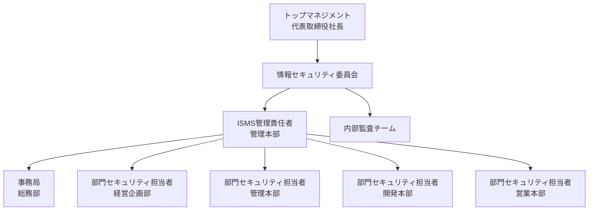
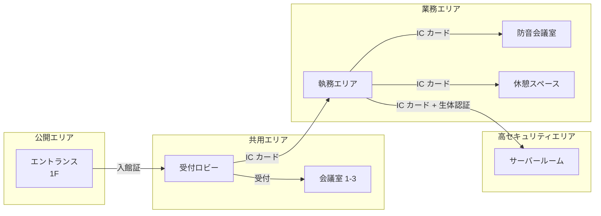

# 仮想組織の設定

このドキュメントでは、ISMS Guide のテンプレートで使用する仮想的な組織を定義します。

::: warning サンプル目的
この仮想組織は、テンプレート内のサンプルデータや記載例の基盤として設定されたものです。実在する組織ではありません。テンプレートをご利用の際は、[置き換えチェックリスト](#置き換えチェックリスト)を参照して、自組織の情報に置き換えてください。
:::

## 組織概要

### 基本情報

| 項目 | 内容 |
|------|------|
| 組織名 | 株式会社テクノソリューションズ |
| 英文名 | TechnoSolutions Inc. |
| 業種 | IT サービス業（SaaS プロバイダー） |
| 設立年 | 2015年 |
| 資本金 | 5,000万円 |
| 従業員数 | 約150名 |
| 売上規模 | 約20億円/年 |
| 本社所在地 | 東京都港区 |

### 事業内容

株式会社テクノソリューションズは、以下の事業を展開しています：

1. **クラウドサービス事業**
   - 企業向け業務管理 SaaS の開発・提供
   - API プラットフォームサービス
   - データ分析サービス

2. **受託開発事業**
   - 顧客企業向けシステム開発
   - 既存システムのクラウド移行支援

3. **保守・運用事業**
   - クラウドインフラの運用代行
   - 24時間365日監視サービス

### 経営理念・方針

**経営理念**
> 「テクノロジーで企業の成長を支援し、社会に価値を創造する」

**情報セキュリティ基本方針**
> 当社は、お客様からお預かりした情報資産および当社の情報資産を、事故・災害・犯罪などの脅威から保護し、お客様ならびに社会の信頼に応えるため、情報セキュリティマネジメントシステムを構築・運用します。

## 組織構造

### 組織図



### 部門・役職一覧

| 部門 | 人数 | 主な役割 |
|------|------|----------|
| 経営企画部 | 5名 | 経営戦略立案、事業計画策定、IR |
| 管理本部 | 15名 | 総務、人事、経理、法務 |
| - 総務部 | 5名 | 施設管理、備品管理、社内規程整備 |
| - 人事部 | 5名 | 採用、教育、労務管理 |
| - 経理部 | 5名 | 財務、経理、予算管理 |
| 開発本部 | 80名 | 製品開発、インフラ運用、品質保証 |
| - プロダクト開発部 | 50名 | SaaS 製品の設計・開発 |
| - インフラ部 | 20名 | クラウドインフラ構築・運用 |
| - QA部 | 10名 | 品質管理、テスト |
| 営業本部 | 30名 | 営業、マーケティング、顧客支援 |
| - 営業部 | 20名 | 新規開拓、既存顧客営業 |
| - カスタマーサクセス部 | 10名 | 顧客支援、オンボーディング |

### 主要な役職

| 役職 | 担当者（例） | 役割 |
|------|-------------|------|
| 代表取締役社長 | 山田太郎 | 経営全般の統括、ISMS のトップマネジメント |
| 管理本部長 | 佐藤花子 | 管理部門統括 |
| 開発本部長 | 鈴木一郎 | 開発部門統括 |
| 営業本部長 | 高橋次郎 | 営業部門統括 |
| ISMS管理責任者 | 田中三郎 | ISMS の構築・運用・維持の責任者 |
| 内部監査責任者 | 渡辺四郎 | 内部監査の実施責任者 |

### ISMS 推進体制



**情報セキュリティ委員会の構成**

| 役割 | メンバー | 責務 |
|------|----------|------|
| 委員長 | 代表取締役社長 | 最終意思決定、リソース配分 |
| 副委員長 | 管理本部長 | 委員長補佐、日常的な監督 |
| ISMS管理責任者 | 総務部長（兼務） | ISMS の運用管理、リスク対応の推進 |
| 委員 | 各本部長 | 部門内でのセキュリティ施策実行 |
| 事務局 | 総務部員 | 議事運営、文書管理、連絡調整 |

## 拠点情報

### 本社

| 項目 | 内容 |
|------|------|
| 名称 | 本社 |
| 所在地 | 東京都港区芝浦3-X-X シーサイドビル 8F |
| 用途 | 本社機能、営業、一部開発 |
| 従業員数 | 約100名 |
| 床面積 | 約800m2 |
| フロア構成 | ワンフロア（執務エリア、会議室、サーバールーム） |

**本社の設備**

- 執務エリア（フリーアドレス）
- 会議室 5室（うち防音会議室 1室）
- サーバールーム（開発環境用）
- 休憩スペース・カフェテリア
- 受付・来客スペース

### 開発センター

| 項目 | 内容 |
|------|------|
| 名称 | 福岡開発センター |
| 所在地 | 福岡市博多区博多駅前2-X-X テックビル 5F |
| 用途 | 開発拠点 |
| 従業員数 | 約40名 |
| 床面積 | 約400m2 |

**開発センターの特徴**

- プロダクト開発部の一部が勤務
- 本社とビデオ会議で常時接続
- ローカルサーバーなし（クラウド環境のみ使用）

### データセンター

| 項目 | 内容 |
|------|------|
| 名称 | 東京データセンター（委託） |
| 所在地 | 東京都内（委託先非公開） |
| 用途 | 本番クラウドインフラ |
| 運用形態 | IaaS（AWS / GCP）+ コロケーション |

**クラウドインフラ構成**

- メイン環境：AWS（東京リージョン）
- DR環境：AWS（大阪リージョン）
- 一部サービス：GCP（東京リージョン）

### リモートワーク環境

| 項目 | 内容 |
|------|------|
| 対象者 | 全従業員（出社比率約50%） |
| 利用機器 | 会社貸与 PC（Windows / Mac） |
| 接続方式 | VPN + ゼロトラストネットワーク |
| 認証 | SSO + 多要素認証（MFA） |

**リモートワークルール**

- 業務用 PC 以外からの社内システムアクセス禁止
- 公衆 Wi-Fi での業務禁止（モバイルルーター貸与）
- 画面のぞき見防止フィルターの使用必須
- 機密情報の印刷禁止

## 情報資産

### 情報資産分類表

| 分類 | 具体例 | 機密レベル |
|------|--------|------------|
| 顧客情報 | 顧客企業情報、契約情報、利用データ | 極秘 |
| 個人情報 | 顧客担当者情報、従業員情報 | 秘密 |
| 技術情報 | ソースコード、設計書、インフラ構成 | 秘密 |
| 営業情報 | 提案書、見積書、商談情報 | 社外秘 |
| 経営情報 | 財務情報、経営計画、取締役会議事録 | 極秘 |
| 一般情報 | 公開資料、プレスリリース | 公開 |

### 主要システム一覧

| システム名 | 用途 | 運用形態 | 機密レベル |
|------------|------|----------|------------|
| 顧客管理システム（CRM） | 顧客情報・商談管理 | SaaS | 極秘 |
| 人事管理システム | 従業員情報管理 | SaaS | 秘密 |
| 会計システム | 財務・経理処理 | SaaS | 極秘 |
| ソースコード管理 | Git リポジトリ | GitHub Enterprise | 秘密 |
| 社内ポータル | 社内情報共有 | 自社開発（オンプレ） | 社外秘 |
| グループウェア | メール、スケジュール | Google Workspace | 社外秘 |
| ビジネスチャット | 社内コミュニケーション | Slack | 社外秘 |
| 本番環境 | SaaS サービス提供 | AWS / GCP | 極秘 |

### 機密レベル定義

| レベル | 定義 | 取扱い基準 |
|--------|------|------------|
| 極秘 | 漏洩時に事業継続に重大な影響を与える情報 | 閲覧：経営層・特定担当者のみ、暗号化必須、複製禁止 |
| 秘密 | 漏洩時に業務に重大な影響を与える情報 | 閲覧：業務上必要な者のみ、暗号化推奨、複製制限 |
| 社外秘 | 社外への漏洩を防ぐべき情報 | 閲覧：従業員、暗号化推奨（外部送信時必須） |
| 公開 | 公開しても問題ない情報 | 制限なし |

## 物理的環境

### オフィスレイアウト概要

**本社フロア構成**

```
┌─────────────────────────────────────────────────────────┐
│                        本社 8F                           │
├──────────┬──────────────────────────────┬───────────────┤
│  受付    │                              │  サーバー     │
│  ロビー  │      執務エリア              │  ルーム       │
│          │     （フリーアドレス）        │               │
├──────────┤                              ├───────────────┤
│ 会議室   │                              │  防音         │
│ 1-3      │                              │  会議室       │
├──────────┼──────────────────────────────┼───────────────┤
│ 会議室4  │     休憩スペース             │  倉庫        │
└──────────┴──────────────────────────────┴───────────────┘
```

### セキュリティゾーン



**ゾーン別アクセス権限**

| ゾーン | アクセス権限 | 認証方式 |
|--------|-------------|----------|
| 公開エリア | 誰でも | なし |
| 共用エリア | 来客（受付後）、従業員 | 受付確認、入館証 |
| 業務エリア | 従業員のみ | IC カード |
| 高セキュリティエリア | 許可された従業員のみ | IC カード + 生体認証 |

### 入退室管理

| 対象 | 管理方式 | 記録保持期間 |
|------|----------|--------------|
| ビル入館 | IC カード（ビル共通） | 1年間 |
| オフィス入退室 | IC カード（社員証） | 1年間 |
| サーバールーム | IC カード + 指紋認証 | 3年間 |
| 来客 | 入館証発行、社員同行必須 | 1年間 |

**入退室ルール**

1. 共連れ（tailgating）禁止
2. IC カードの貸し借り禁止
3. 来客は受付で入館証発行、社員が常時同行
4. サーバールームは事前申請制（2名以上で入室）
5. 退室時も打刻必須

---

## 置き換えチェックリスト {#checklist}

テンプレートを自組織向けにカスタマイズする際は、以下の項目を置き換えてください。

### 組織基本情報

- [ ] 組織名（株式会社テクノソリューションズ → 自社名）
- [ ] 英文名（TechnoSolutions Inc. → 自社英文名）
- [ ] 業種・事業内容
- [ ] 設立年、資本金、従業員数、売上規模
- [ ] 経営理念・情報セキュリティ基本方針

### 組織構造

- [ ] 組織図（部門構成を自社に合わせて変更）
- [ ] 部門名・人数
- [ ] 役職名・担当者名
- [ ] ISMS 推進体制（委員会構成）

### 拠点情報

- [ ] 本社所在地・設備
- [ ] 支社・営業所（ある場合）
- [ ] 開発拠点（ある場合）
- [ ] データセンター・クラウド環境
- [ ] リモートワーク環境・ルール

### 情報資産

- [ ] 情報資産の分類・具体例
- [ ] 主要システム一覧
- [ ] 機密レベル定義（自社の基準に合わせて調整）

### 物理的環境

- [ ] オフィスレイアウト
- [ ] セキュリティゾーン区分
- [ ] 入退室管理方式

---

## 規模別の調整ポイント {#scaling}

この仮想組織は従業員約150名の中規模 IT 企業を想定しています。自組織の規模に応じて、以下のポイントを調整してください。

### 小規模組織（~50名）向け

**組織構造**
- 部門を簡素化（本部制 → 部制）
- 兼務を増やす（ISMS 管理責任者 = 総務担当など）
- 情報セキュリティ委員会 → セキュリティ担当者 + 経営者

**拠点**
- 単一拠点が一般的
- サーバールームなし → クラウドのみ
- 開発センターなし

**推奨する簡素化**
```
代表取締役
├── 管理部（総務・経理・人事）
├── 開発部
├── 営業部
└── ISMS担当（兼務）
```

### 中規模組織（50~300名）向け

**組織構造**
- 本ドキュメントの構成がそのまま参考になります
- 部門セキュリティ担当者を各部門に配置推奨

**拠点**
- 本社 + 1~2拠点が一般的
- 小規模サーバールームまたはクラウド中心

### 大規模組織（300名~）向け

**組織構造**
- 情報セキュリティ専任部門の設置を推奨
- 事業部制の場合、事業部ごとに ISMS 推進担当
- グループ会社がある場合、グループセキュリティ方針の策定

**拠点**
- 複数拠点管理の仕組みが必要
- データセンター専任チーム
- 海外拠点がある場合、現地規制対応

**追加で検討すべき要素**
- CSIRT（セキュリティインシデント対応チーム）の設置
- SOC（セキュリティオペレーションセンター）の設置/外部委託
- 専任の内部監査チーム

---

## 関連ドキュメント

- [テンプレート一覧](/templates/) - 全テンプレートの概要
- [フォーク利用ガイド](/templates/fork-guide) - カスタマイズ手順
- [ISMS マニュアル](/isms/manual/isms-manual) - 適用範囲・組織の定義
