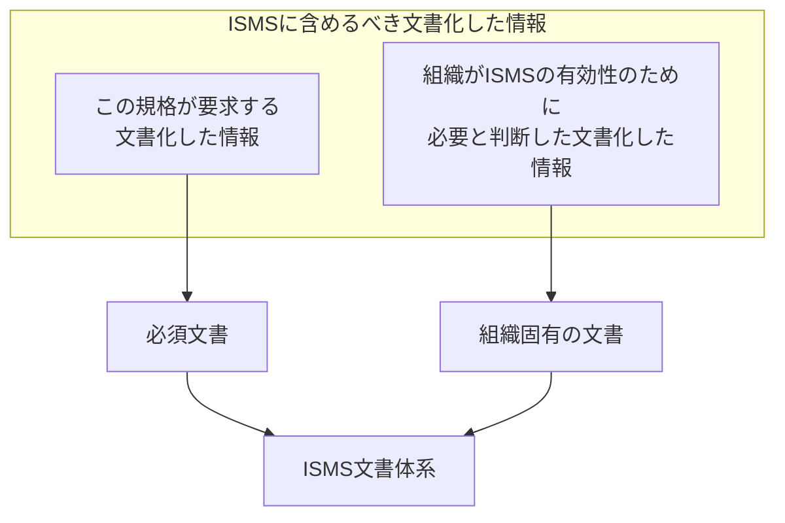
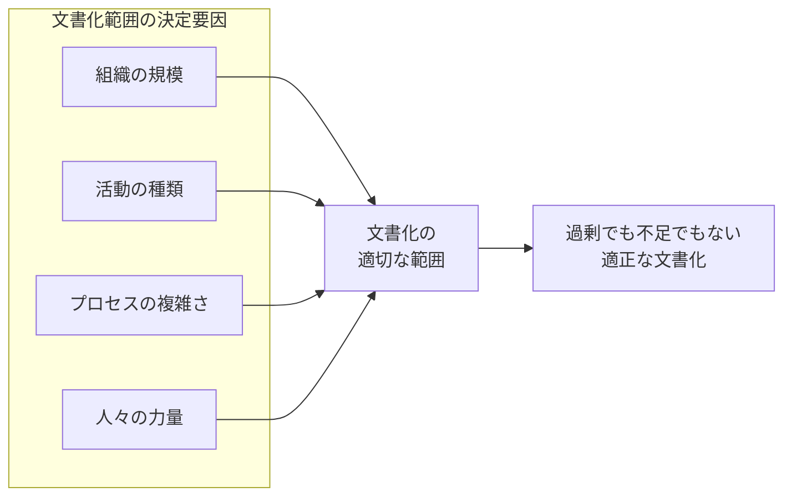
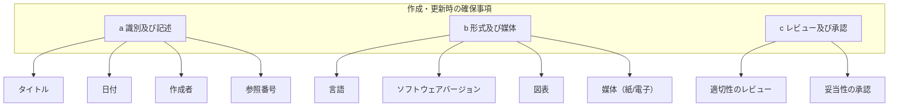
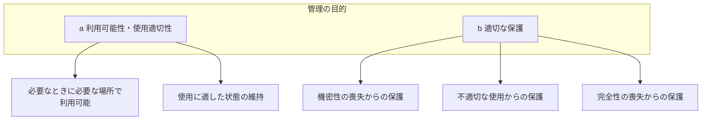
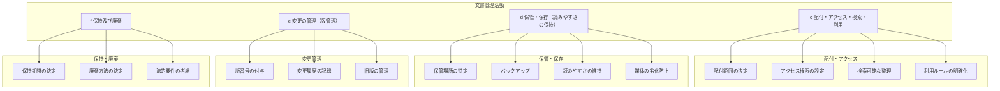
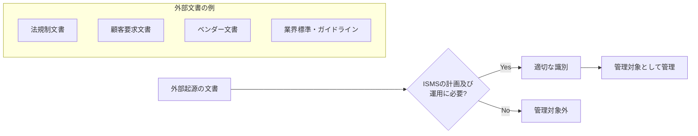
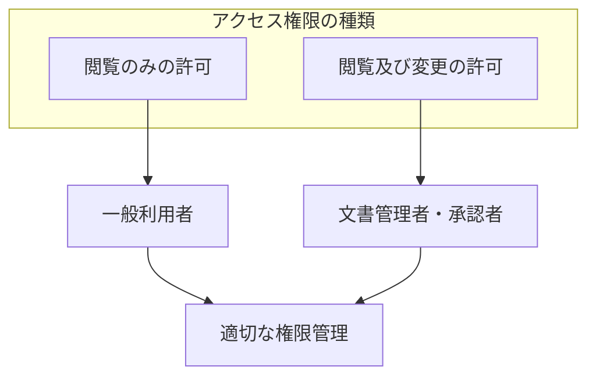
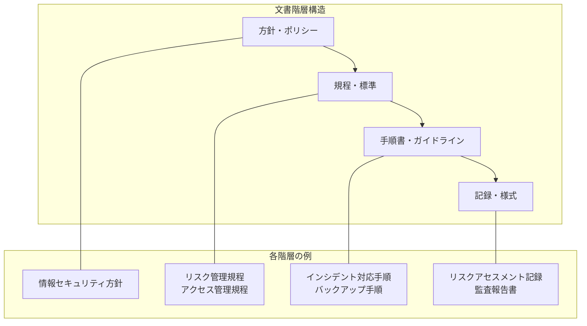

# 7.5 文書化した情報

## 概要

| 項目 | 内容 |
|------|------|
| 要求事項番号 | 7.5 |
| 要求事項名 | 文書化した情報 |
| 上位箇条 | 7 支援 |
| 構成 | 7.5.1 一般、7.5.2 作成及び更新、7.5.3 文書化した情報の管理 |

## 要求事項の目的

ISMSの有効な運用に必要な文書化した情報を特定し、適切に作成、更新、管理するための要件を定める。文書化により、ISMSの一貫性、トレーサビリティ、及び継続的改善を支援する。

## 7.5.1 一般

### 文書化要件の構成

### 文書化の範囲に影響する要因

| 要因 | 影響の内容 |
|------|-----------|
| 組織の規模 | 大規模組織ほど詳細な文書化が必要な傾向 |
| 活動・プロセス・製品・サービスの種類 | 複雑さに応じた文書化レベル |
| プロセスとその相互作用の複雑さ | 複雑なプロセスほど詳細な手順書が必要 |
| 人々の力量 | 経験豊富な人員が多ければ簡略化も可能 |

## 7.5.2 作成及び更新

### 文書作成時の確保事項

| 確保事項 | 内容 | 例 |
|---------|------|-----|
| 識別・記述 | 文書を特定するための情報 | タイトル、日付、作成者、参照番号 |
| 形式 | 文書の表現方法 | 言語、ソフトウェアバージョン、図表 |
| 媒体 | 文書の保存形態 | 紙、電子媒体 |
| レビュー・承認 | 文書の適切性・妥当性の確認 | 責任者による確認と承認 |

## 7.5.3 文書化した情報の管理

### 管理の目的

### 管理活動

### 外部起源の文書化した情報

### アクセス権限に関する注記

## 文書体系の例

## ISO/IEC 27001:2022が要求する文書化した情報

| 箇条 | 文書化要求 |
|------|-----------|
| 4.3 | ISMSの適用範囲 |
| 5.2 | 情報セキュリティ方針 |
| 6.1.2 | リスクアセスメントプロセス |
| 6.1.3 | リスク対応プロセス、適用宣言書 |
| 6.2 | 情報セキュリティ目的 |
| 7.2 | 力量の証拠 |
| 8.1 | プロセスが計画通り実施された確信を持つために必要な範囲 |
| 8.2 | リスクアセスメント結果 |
| 8.3 | リスク対応結果 |
| 9.1 | 監視・測定結果 |
| 9.2 | 監査プログラム実施及び監査結果 |
| 9.3 | マネジメントレビュー結果 |
| 10.2 | 不適合の性質及び取った処置、是正処置の結果 |

## 関連する要求事項・管理策

| 関連項目 | 関係性 |
|---------|--------|
| A.5.1 情報セキュリティのための方針群 | 方針文書の管理 |
| A.5.10 情報及びその他の関連資産の利用の許容範囲 | 文書へのアクセス管理 |
| A.5.33 知的財産の保護 | 文書の知的財産保護 |
| A.7.10 記憶媒体 | 電子文書の媒体管理 |

## 実施のポイント

1. **必要十分な文書化**: 過剰でも不足でもない適切なレベルを維持
2. **一貫した識別体系**: 文書番号、版管理の統一ルール
3. **アクセス権限の適切な設定**: 機密性と利便性のバランス
4. **定期的なレビュー**: 文書の有効性と最新性の確認
5. **外部文書の管理**: 法規制等の外部文書も管理対象に含める
6. **電子化の活用**: 検索性、版管理、配付の効率化
