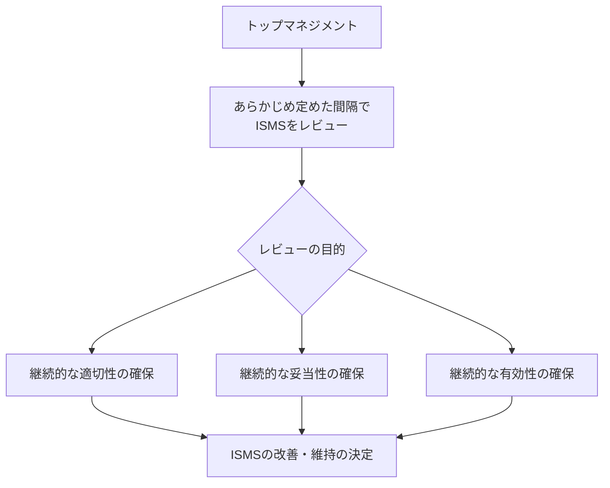
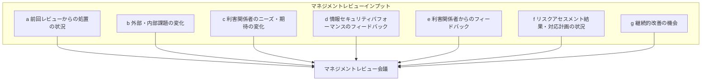
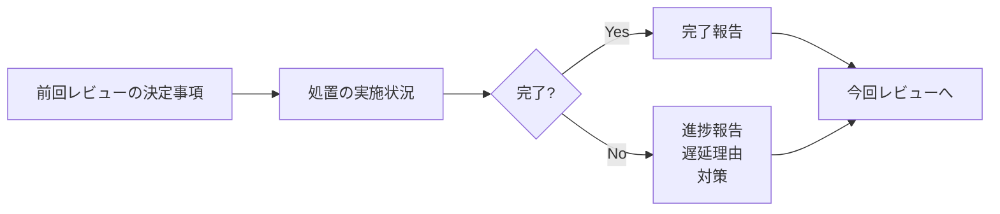
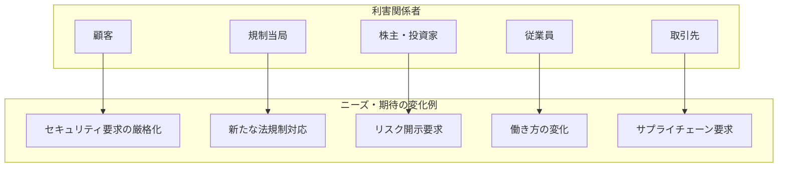
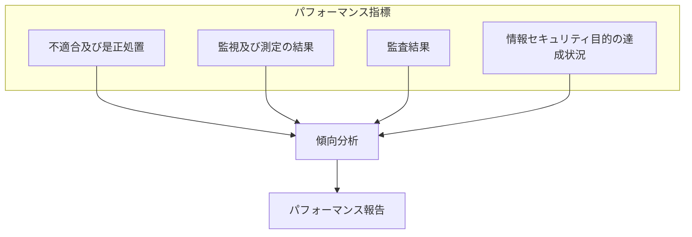
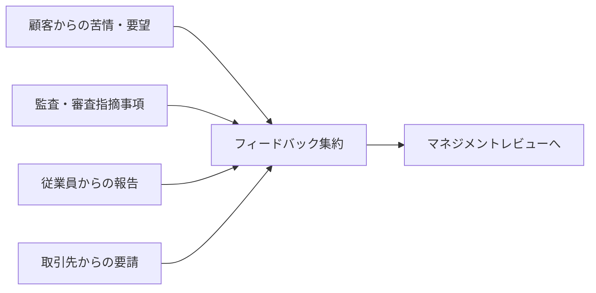
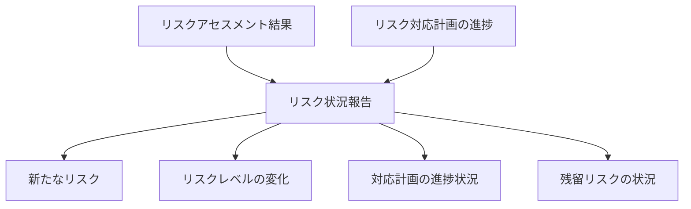
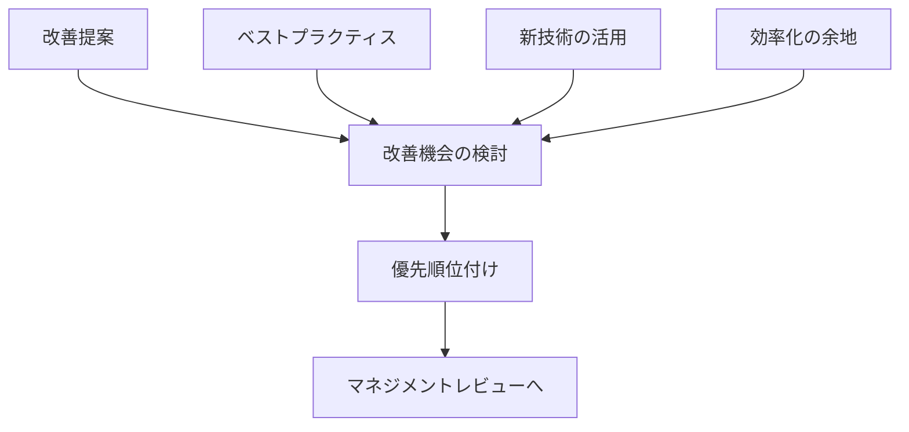
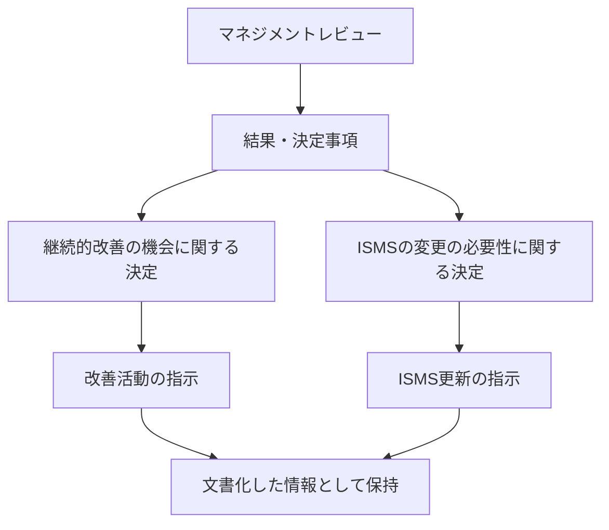
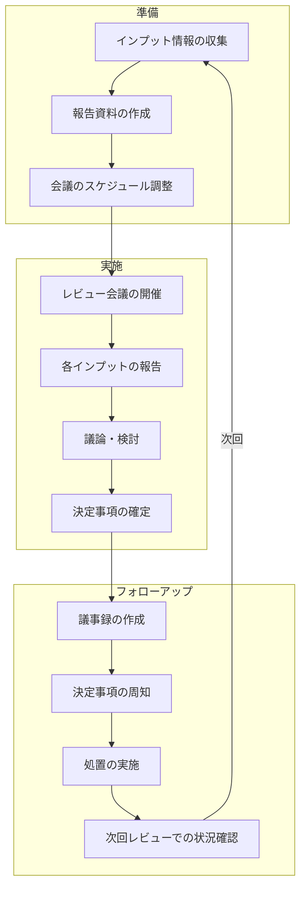

# 9.3 マネジメントレビュー

## 概要

| 項目 | 内容 |
|------|------|
| 要求事項番号 | 9.3 |
| 要求事項名 | マネジメントレビュー |
| 上位箇条 | 9 パフォーマンス評価 |
| 構成 | 9.3.1 一般、9.3.2 マネジメントレビューへのインプット、9.3.3 マネジメントレビューの結果 |

## 要求事項の目的

トップマネジメントがあらかじめ定めた間隔でISMSをレビューし、その継続的な適切性、妥当性及び有効性を確保する。マネジメントレビューは、ISMSの戦略的方向性を決定し、継続的改善を推進する重要なプロセスである。

## 9.3.1 一般

| 確認事項 | 意味 | 確認ポイント |
|---------|------|-------------|
| 適切性 | ISMSが組織のニーズに合っているか | 組織の状況変化への対応 |
| 妥当性 | ISMSが目的を達成できるか | リソースの十分性、プロセスの機能 |
| 有効性 | ISMSが意図した結果を出しているか | 目的の達成度、リスク低減効果 |

## 9.3.2 マネジメントレビューへのインプット

### インプット項目の全体像

### 各インプット項目の詳細

#### a) 前回マネジメントレビューからの処置の状況

#### b) 外部及び内部の課題の変化

| 変化の種類 | 例 |
|-----------|-----|
| 外部課題の変化 | 法規制の改正、脅威環境の変化、技術動向、市場環境 |
| 内部課題の変化 | 組織体制の変更、事業戦略の変更、システム更新 |

#### c) 利害関係者のニーズ及び期待の変化

#### d) 情報セキュリティパフォーマンスのフィードバック

| パフォーマンス項目 | 報告内容例 |
|------------------|-----------|
| 不適合・是正処置 | 発生件数、原因分類、対応状況、傾向 |
| 監視・測定結果 | KPI達成状況、トレンド、異常値 |
| 監査結果 | 監査所見、不適合件数、改善推奨事項 |
| 目的の達成状況 | 各目的の進捗、達成/未達成の理由 |

#### e) 利害関係者からのフィードバック

#### f) リスクアセスメント結果及びリスク対応計画の状況

#### g) 継続的改善の機会

## 9.3.3 マネジメントレビューの結果

### アウトプット要件

| アウトプット | 内容例 |
|-------------|--------|
| 継続的改善の機会 | プロセスの効率化、管理策の強化、教育訓練の充実 |
| ISMSの変更の必要性 | 適用範囲の変更、方針の改定、プロセスの見直し |

## マネジメントレビューのプロセス全体

## 文書化要求

マネジメントレビューの結果の証拠として、文書化した情報を利用可能にしなければならない。

| 文書化項目 | 内容 |
|-----------|------|
| レビュー議事録 | 出席者、日時、議題、議論内容 |
| インプット報告書 | 各インプット項目の詳細報告 |
| 決定事項記録 | 決定内容、責任者、期限 |
| 処置実施記録 | 決定事項への対応状況 |

## 関連する要求事項・管理策

| 関連項目 | 関係性 |
|---------|--------|
| 5.1 リーダーシップ及びコミットメント | トップマネジメントの関与 |
| 6.1 リスク及び機会への対処 | リスクアセスメント結果のインプット |
| 9.1 監視、測定、分析及び評価 | パフォーマンスデータのインプット |
| 9.2 内部監査 | 監査結果のインプット |
| 10.1 継続的改善 | 改善機会の特定と実施 |

## 実施のポイント

1. **トップマネジメントの参加**: 意思決定権限者の出席確保
2. **定期的な実施**: 少なくとも年1回、状況に応じて追加実施
3. **インプットの網羅性**: 要求される全項目の報告準備
4. **決定事項の明確化**: 責任者と期限を明確に
5. **フォローアップの徹底**: 決定事項の実施状況を追跡
6. **文書化の確実な実施**: 結果の証拠としての記録保持
