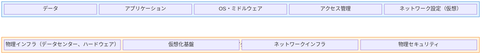

# A.5.23 クラウドサービス利用のための情報セキュリティ

## 管理策の概要

| 項目 | 内容 |
|------|------|
| 管理策タイプ | 予防的 |
| 情報セキュリティ特性 | 機密性、完全性、可用性 |
| サイバーセキュリティ概念 | 保護 |
| 運用能力 | 供給者関係セキュリティ |
| セキュリティドメイン | ガバナンス・エコシステム、保護 |

## 目的

クラウドサービスの取得、利用、管理、および終了に関するプロセスを、組織の情報セキュリティ要件に従って確立し、クラウドサービス利用に伴う情報セキュリティを適切に管理します。

## 実施のポイント

### クラウドサービスに関するポリシーの策定

組織は、クラウドサービスの利用に関するトピック固有のポリシーを策定し、すべての関係者に周知する必要があります。このポリシーは、外部サービス管理の既存アプローチ（A.5.21、A.5.22）の拡張として位置づけることができます。

### 責任共有モデルの理解

クラウドサービスの利用においては、情報セキュリティの責任がクラウドサービスプロバイダと利用組織の間で共有されます。それぞれの責任範囲を明確に定義し、適切に実装することが不可欠です。



:::note サービスモデル別の責任範囲
上記はIaaSの例です。PaaS・SaaSでは、利用組織の責任範囲はより限定的になります。
:::

### 組織が定義すべき事項

| 項目 | 内容 |
|------|------|
| セキュリティ要件 | クラウドサービス利用に関連するすべての情報セキュリティ要件 |
| 選定基準 | クラウドサービスの選定基準と利用範囲 |
| 役割と責任 | クラウドサービスの利用・管理に関する役割と責任 |
| 管理策の分担 | プロバイダと利用組織それぞれが管理する情報セキュリティ管理策 |
| セキュリティ機能の活用 | プロバイダが提供するセキュリティ機能の取得・活用方法 |
| 保証の取得 | プロバイダが実装する管理策に対する保証の取得方法 |
| マルチクラウド管理 | 複数のクラウドサービスを利用する場合の管理策、インターフェース、変更の管理方法 |
| インシデント対応 | クラウドサービスに関連して発生するインシデントの対応手順 |
| 継続的評価 | 情報セキュリティリスク管理のための継続的な監視・レビュー・評価のアプローチ |
| 終了戦略 | クラウドサービスの変更・終了に向けた出口戦略 |

### クラウドサービス契約の確認事項

クラウドサービス契約は事前定義されており交渉の余地がない場合が多いですが、組織は以下の点について契約内容を確認する必要があります。

#### 契約に含めるべき保護条項

1. **技術基盤**
   - 業界標準に基づいたアーキテクチャとインフラの提供

2. **アクセス制御**
   - 組織の要件を満たすアクセス制御の管理

3. **マルウェア対策**
   - マルウェア監視・保護ソリューションの実装

4. **データの所在**
   - 機密情報の処理・保存場所（特定の国・地域、法的管轄区域）

5. **インシデント対応**
   - クラウドサービス環境でのセキュリティインシデント発生時の専門的サポート

6. **再委託**
   - クラウドサービスの外部への再委託に関する要件（または禁止条項）

7. **デジタル証拠**
   - 異なる法域でのデジタル証拠収集に関するサポート

8. **サービス終了時の対応**
   - サービス終了時の適切なサポートと可用性の提供期間

9. **バックアップ**
   - 必要に応じたデータと設定情報のバックアップ提供と安全な管理

10. **データの返却**
    - サービス提供中または終了時における設定ファイル、ソースコード、データの提供・返却

### サービス変更時の事前通知

組織は、以下のような重要な変更について、プロバイダから事前通知を受ける契約条項を検討すべきです。

- 技術インフラの変更（移転、再構成、ハードウェア・ソフトウェアの変更）
- 情報の処理・保存場所の変更（新たな地理的・法的管轄区域への移動）
- 再委託先の変更（新規追加や変更）

### リスクアセスメントの実施

クラウドサービス利用に伴うリスクを特定するため、関連するリスクアセスメントを実施します。残余リスクは明確に特定し、組織の適切な管理者が受容する必要があります。

## 実装例

### クラウドサービス利用ポリシーの構成例

```yaml
クラウドサービス利用ポリシー:
  
  利用可能なサービスモデル:
    - IaaS: 承認済み（リスク評価完了後）
    - PaaS: 承認済み（リスク評価完了後）
    - SaaS: 承認済み（セキュリティ評価完了後）
  
  必須要件:
    データ所在地: 日本国内または同等のデータ保護法がある国
    暗号化: 保存時・転送時ともに必須
    アクセス管理: シングルサインオン連携必須
    監査ログ: 最低1年間の保持
    SLA: 99.9%以上の可用性
  
  承認プロセス:
    1. 情報セキュリティ部門によるセキュリティ評価
    2. プライバシー影響評価（個人情報を扱う場合）
    3. 契約条項のレビュー
    4. 経営層による最終承認
  
  禁止事項:
    - 未承認のクラウドサービスの利用
    - 機密情報の暗号化なしでのアップロード
    - 共有リンクの無制限公開
```

### クラウドサービス評価チェックリスト

| 評価項目 | 確認内容 | 評価結果 |
|----------|----------|----------|
| セキュリティ認証 | ISO 27001、SOC 2等の取得状況 | □ 取得済 / □ 未取得 |
| データ暗号化 | 保存時・転送時の暗号化対応 | □ 対応 / □ 非対応 |
| アクセス制御 | 多要素認証、RBAC対応 | □ 対応 / □ 非対応 |
| データ所在地 | データセンターの所在国 | 国名: ________ |
| バックアップ | バックアップ方式と復旧時間 | RTO: ____ / RPO: ____ |
| インシデント対応 | 通知義務と対応SLA | □ 明記あり / □ なし |
| データポータビリティ | データエクスポート機能 | □ あり / □ なし |
| 解約時対応 | データ返却・削除の条項 | □ 明記あり / □ なし |

## 関連する管理策

- [A.5.21 ICTサプライチェーンにおける情報セキュリティの管理](/controls/a-5-21)
- [A.5.22 供給者のサービス提供の監視、レビューおよび変更管理](/controls/a-5-22)
- [A.8.8 技術的脆弱性の管理](/controls/a-8-8)

## 参考情報

本管理策はクラウドサービス利用者の観点からクラウドセキュリティを取り扱っています。クラウドサービスに関連する詳細な情報については、以下の国際規格が参考になります。

- ISO/IEC 17788、17789（クラウドコンピューティングの概要とアーキテクチャ）
- ISO/IEC 22123-1（クラウドコンピューティング用語）
- ISO/IEC 19941（クラウドポータビリティ）
- ISO/IEC 27017（クラウドサービスの情報セキュリティ）
- ISO/IEC 27018（パブリッククラウドにおける個人情報保護）
- ISO/IEC 27036-4（クラウドサービスの供給者関係）
- ISO/IEC 19086シリーズ（クラウドサービス契約）
