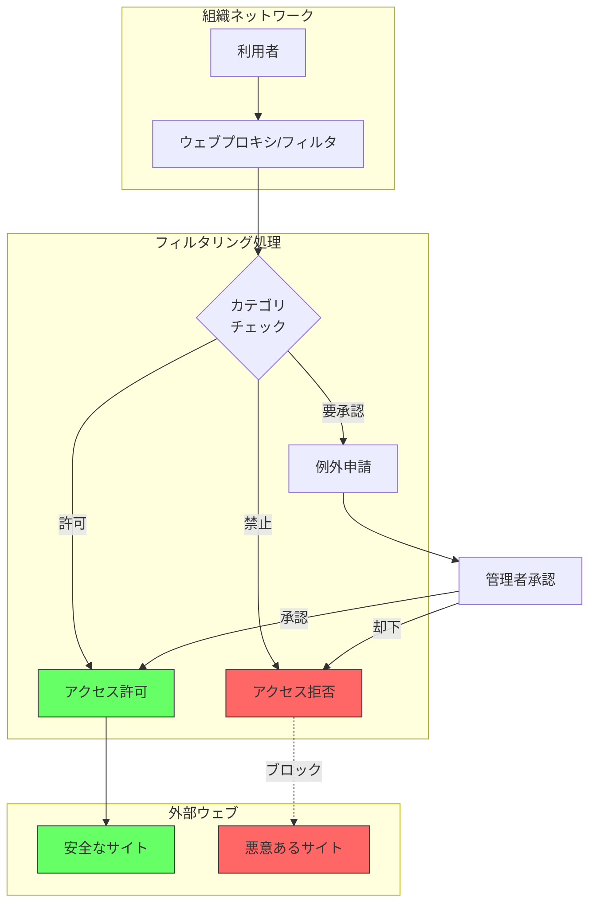
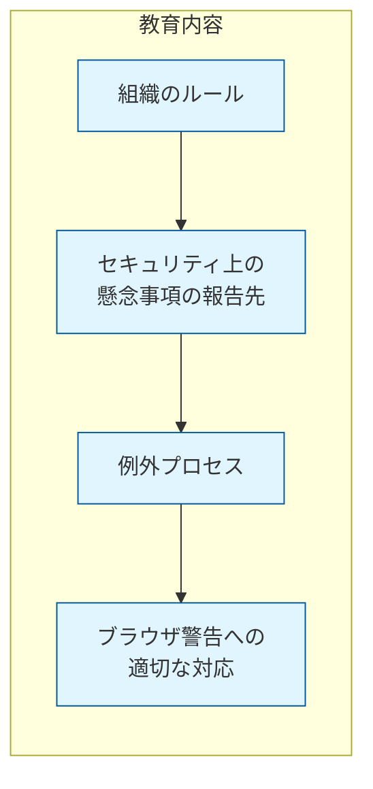
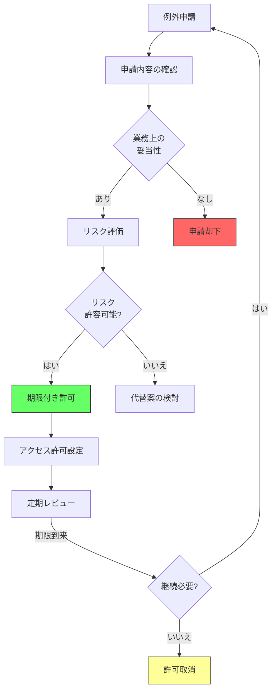

# A.8.23 ウェブフィルタリング

## 管理策の概要

| 項目 | 内容 |
|------|------|
| 管理策ID | A.8.23 |
| 管理策名称 | ウェブフィルタリング |
| 種別 | 技術的管理策 |
| 管理策タイプ | 予防的 |
| 情報セキュリティ特性 | 機密性、完全性、可用性 |
| サイバーセキュリティ概念 | 防御 |
| 運用能力 | システム・ネットワークセキュリティ |
| セキュリティドメイン | 保護 |
| ISO/IEC 27001:2022 | 附属書A |
| 新規/変更 | **2022年版で新規追加** |

## 目的

悪意のあるコンテンツへの露出を減らし、マルウェアによるシステム侵害を防止するとともに、許可されていないウェブリソースへのアクセスを防止する。

## 管理策

外部ウェブサイトへのアクセスを管理し、悪意のあるコンテンツへの露出を減らすこと。

## 実施のポイント

### ウェブフィルタリングの基本的なアプローチ

組織は、違法な情報を含むウェブサイトや、ウイルス・フィッシング素材を含むことが知られているウェブサイトに要員がアクセスするリスクを低減する必要があります。これを実現する一般的な手法として、対象ウェブサイトのIPアドレスまたはドメインをブロックする方法があります。



### ブロック対象とすべきウェブサイトの種類

組織は、要員がアクセスすべきウェブサイトとアクセスすべきでないウェブサイトの種類を特定する必要があります。以下のカテゴリのサイトへのアクセスブロックを検討してください。

| カテゴリ | 説明 | リスクレベル |
|----------|------|--------------|
| **情報アップロード機能を持つサイト** | 正当な業務上の理由がない限りブロック | 中 |
| **既知または疑わしい悪意のあるサイト** | マルウェア配布やフィッシングコンテンツを含むサイト | 高 |
| **C&Cサーバー** | マルウェアの指令・制御に使用されるサーバー | 最高 |
| **脅威インテリジェンスで特定されたサイト** | A.5.7で取得した情報に基づく悪意あるサイト | 高 |
| **違法コンテンツを共有するサイト** | 著作権侵害、違法素材等を含むサイト | 高 |

### 導入前の準備

```yaml
# ウェブフィルタリングポリシー設定例
web_filtering_policy:
  policy_name: "組織ウェブアクセスポリシー"
  version: "1.0"
  effective_date: "2024-04-01"
  
  # カテゴリ別アクセス制御
  category_rules:
    # 完全ブロック
    blocked:
      - malware_sites
      - phishing_sites
      - command_control_servers
      - illegal_content
      - adult_content
      
    # 業務時間外のみ許可
    limited:
      - social_media
      - streaming_media
      - gaming
      
    # 申請承認制
    approval_required:
      - file_sharing
      - cloud_storage
      - webmail
      
    # 常時許可
    allowed:
      - business_applications
      - news_media
      - government_sites
      - education_sites

  # 例外処理
  exception_process:
    request_method: "ITサービスデスク経由"
    approval_levels:
      - level_1: "直属上長"
      - level_2: "情報セキュリティ部門"
    max_duration_days: 30
    review_interval: "四半期"

  # ログ設定
  logging:
    enabled: true
    retention_days: 90
    alert_on_blocked: true
```

### 利用者向けルールと教育

管理策を導入する前に、組織はオンラインリソースの安全で適切な使用に関するルールを確立する必要があります。これらのルールには、望ましくないまたは不適切なウェブサイトやウェブベースアプリケーションへの制限を含めてください。

教育プログラムに含めるべき内容：



特に重要なのは、ブラウザがウェブサイトのセキュリティに関する警告を表示した場合に、利用者がその警告を無視して進まないよう教育することです。

## 実装例

### フィルタリング技術の種類

| 技術 | 説明 | 適用場面 |
|------|------|----------|
| **シグネチャベース** | 既知の悪意あるパターンを検出 | マルウェアサイトの検出 |
| **ヒューリスティック** | 振る舞いベースで未知の脅威を検出 | 新規脅威への対応 |
| **許可リスト** | 許可されたサイト/ドメインのリスト | 高セキュリティ環境 |
| **禁止リスト** | ブロックするサイト/ドメインのリスト | 一般的な保護 |
| **カスタム設定** | 組織固有の要件に基づく構成 | 業務特化型フィルタリング |

### DNSベースフィルタリングの実装

```yaml
# DNSフィルタリング設定例
dns_filtering:
  provider: "組織DNS"
  
  # ブロックカテゴリ
  block_categories:
    - category: "malware"
      action: "block"
      log: true
      
    - category: "phishing"  
      action: "block"
      log: true
      alert: true
      
    - category: "botnet_cnc"
      action: "block"
      log: true
      alert: true
      priority: "high"

  # 許可リスト（業務に必要なサイト）
  allowlist:
    - "*.company.example.com"
    - "partner-portal.example.com"
    
  # ブロック時の動作
  block_response:
    redirect_to: "internal-block-page.company.example.com"
    message: "このサイトは組織のセキュリティポリシーによりブロックされています"
    
  # ログ設定
  logging:
    format: "CEF"
    destination: "siem.company.example.com"
    include_user_identity: true
```

### プロキシサーバー設定例

```yaml
# プロキシサーバー設定
proxy_configuration:
  mode: "explicit_proxy"
  
  # SSL/TLS検査
  ssl_inspection:
    enabled: true
    certificate_authority: "internal-ca"
    bypass_categories:
      - "banking"
      - "healthcare"
    bypass_domains:
      - "*.gov.go.jp"
      
  # 認証設定
  authentication:
    method: "kerberos"
    fallback: "ntlm"
    
  # 帯域制御
  bandwidth_control:
    streaming_media:
      limit_mbps: 2
      priority: "low"
    business_apps:
      priority: "high"
```

## 運用上の考慮事項

### 例外処理プロセス

制限されたウェブリソースに正当な業務上の理由でアクセスが必要な場合の例外プロセスを確立してください。



### 監視とレビュー

```yaml
# 監視・レビュー設定
monitoring_review:
  # リアルタイム監視
  real_time_monitoring:
    blocked_attempts: true
    unusual_patterns: true
    high_risk_categories: true
    
  # レポート生成
  reports:
    daily:
      - blocked_site_summary
      - top_users_by_blocked_attempts
    weekly:
      - category_usage_trends
      - exception_request_summary
    monthly:
      - policy_effectiveness_review
      - false_positive_analysis
      
  # アラート条件
  alerts:
    - condition: "malware_site_access_attempt"
      severity: "high"
      notify: ["security-team@example.com"]
      
    - condition: "repeated_policy_violations"
      threshold: 10
      period: "1_hour"
      severity: "medium"
      notify: ["security-team@example.com", "hr@example.com"]
```

## 関連する管理策

| 管理策ID | 管理策名称 | 関連性 |
|----------|-----------|--------|
| [A.5.7](/controls/a-5-7) | 脅威インテリジェンス | ブロック対象サイトの情報源 |
| [A.8.7](/controls/a-8-7) | マルウェアに対する保護 | 補完的な保護手段 |
| [A.8.20](/controls/a-8-20) | ネットワークセキュリティ | ネットワーク層での保護 |
| [A.8.22](/controls/a-8-22) | ネットワークの分離 | ネットワークセグメンテーション |
| [A.6.3](/controls/a-6-3) | 情報セキュリティの意識向上、教育及び訓練 | 利用者教育 |

## 参考情報

- ISO/IEC 27002:2022 8.23
- NIST SP 800-53 SC-7（境界保護）
- CIS Controls v8 - Control 9（電子メールおよびウェブブラウザの保護）
